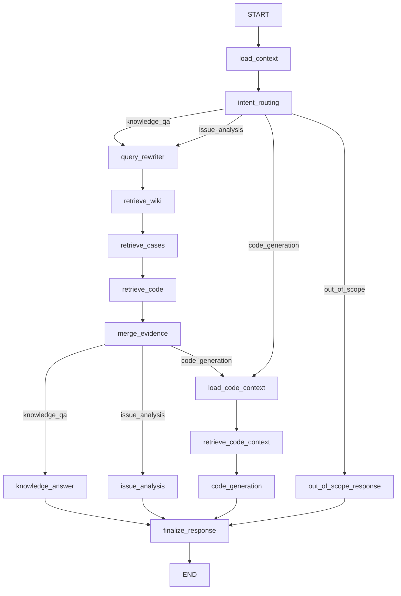

# 智能问答与问题分析系统（当前实现说明）

本文档描述仓库中当前工作流实现（以 `src/workflow/engine.py` 为准）。

## 1. 系统目标

系统支持以下四类结果：

- `knowledge_qa`：知识问答
- `issue_analysis`：问题分析
- `code_generation`：代码实现建议
- `out_of_scope`：领域外输入兜底

## 2. 核心设计原则

- 每轮重判意图：当前轮由 `intent_routing` 决定走哪条分支。
- 轻量跨轮记忆：仅保留模块与最近分析上下文，不维护会话阶段机。
- 多源检索统一融合：wiki / cases / code 统一进入融合层。
- 输出统一收口：所有分支都进入 `finalize_response` 组装消息。

## 3. 工作流拓扑

## 4. 当前节点职责

- 路由与上下文：`load_context`、`intent_routing`
- 检索链路：`query_rewriter`、`retrieve_wiki`、`retrieve_cases`、`retrieve_code`、`merge_evidence`
- 分析链路：`knowledge_answer`、`issue_analysis`
- 代码链路：`load_code_context`、`retrieve_code_context`、`code_generation`
- 响应收口：`out_of_scope_response`、`finalize_response`

## 5. 当前 WorkflowState（精简后）

`WorkflowState` 只保留当前实现必需字段，主要包括：

- 基础：`trace_id`、`session_id`、`user_query`、`history`
- 路由与输出：`route`、`status`、`response_kind`、`domain_relevance`
- 上下文：`module_name`、`module_hint`、`active_module_name`、`active_topic_source`
- 最近分析：`last_analysis_result`、`last_analysis_citations`
- 检索：`retrieval_queries`、`retrieval_plan`、`wiki_hits`、`case_hits`、`code_hits`、`citations`
- 结果：`analysis`、`answer`、`assistant_message`、`node_trace`

## 6. 已移除的旧阶段机制

当前实现已移除以下阶段/迁移字段：

- `confirm_code`
- `task_stage`
- `transition_type`
- `execution_path`
- `next_action`
- `active_task_stage`
- `pending_action`
- `source_message`

说明：是否进入代码生成由当轮输入意图决定，不再通过“确认阶段”推进。

## 7. API 入口（当前）

- `POST /api/messages`：主入口，发送用户输入并触发工作流。
- `GET /api/references/{trace_id}`：查看引用证据。
- `POST /api/messages/{message_id}/feedback`：提交反馈。
- `GET /api/observability/summary` / `GET /api/observability/alerts`：观测接口。

## 8. 文档索引

- 节点说明：`src/workflow/NODES.md`
- 总体设计：`docs/智能问答问题分析系统整体设计.md`
- 子系统设计：`docs/子系统设计/*.md`
