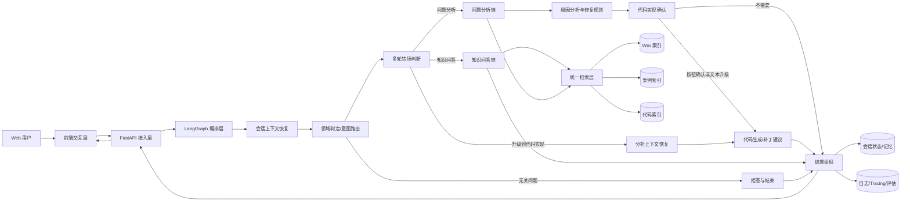
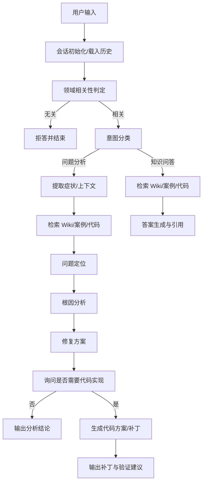
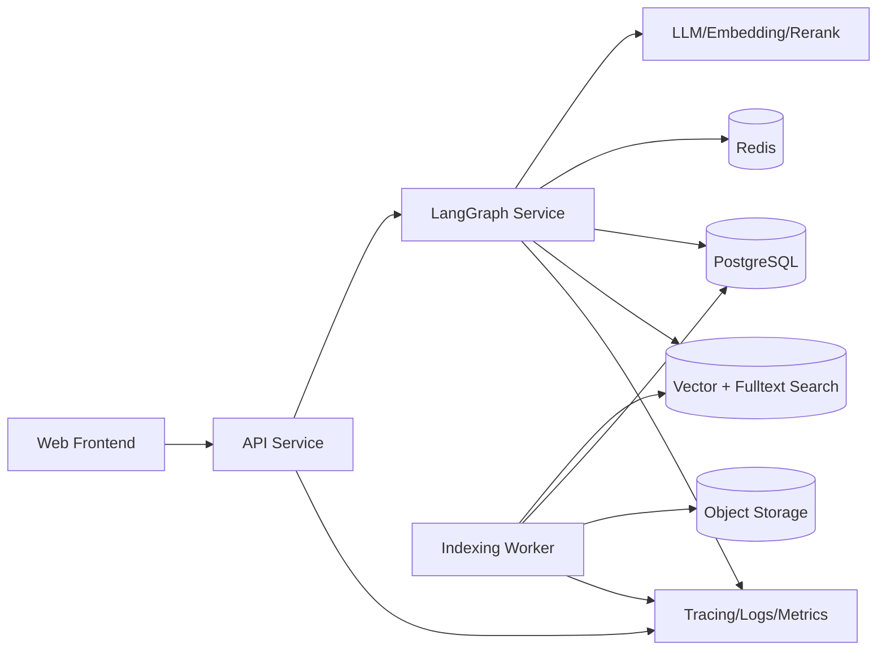

# 智能问答与问题分析系统整体设计

## 1. 建设目标

### 1.1 背景
当前系统已经具备较大规模的工程与知识资产：

- 约 20 万行代码库
- 约 100 篇业务知识库 Wiki
- 约 100 篇历史案例分析文档

这些资产覆盖了业务规则、系统实现、历史问题与修复经验，但它们目前分散在不同载体中，人工检索成本高、问题定位慢、跨团队知识复用弱。

### 1.2 目标
构建一个基于 `LangChain + LangGraph + Web UI` 的智能问答/问题分析系统，支持多轮交互，并在一次会话内完成以下能力：

1. 判断用户输入属于业务知识问答、具体问题分析，还是与系统无关。
2. 对无关输入进行礼貌拒答并结束当前流程。
3. 对具体问题进行文档与代码联合分析，给出模块定位、原因分析、修复方案，并询问是否需要进一步给出代码实现。
4. 对知识问答结合文档与代码给出带依据的回答。

### 1.3 设计原则

- `以证据为中心`：回答必须尽量绑定文档、案例、代码片段与模块路径。
- `先路由，后深挖`：先做意图识别与领域判定，避免无效推理。
- `每轮重判，跨轮记忆`：`intent` 按每轮输入重新判断，`task_stage` 按会话维度持续保存。
- `多源检索，分层分析`：业务文档、历史案例、代码仓统一检索，但分析链路按任务类型分流。
- `多轮可控`：每一步都要保留会话状态、证据链和中间结论，支持追问、澄清和恢复。
- `工程可运维`：日志、Tracing、评估、反馈闭环必须内建。

## 2. 范围定义

### 2.1 本期范围

- Web 端会话式问答与问题分析
- 基于 LangGraph 的图式编排
- Wiki、案例、代码仓的统一索引与检索
- 领域判定、意图分类、知识问答、问题分析、修复建议、代码实现确认
- 会话记忆、证据回溯、日志追踪、效果评估

### 2.2 非目标

- 完全自动修复并直接写回生产代码
- 取代现有工单系统或知识管理系统
- 对所有非结构化材料一次性实现零误差理解

## 3. 总体架构



### 3.1 分层说明

| 层级 | 组件 | 主要职责 |
| --- | --- | --- |
| 交互层 | Web UI | 会话展示、流式输出、澄清交互、证据查看、代码实现确认 |
| 接入层 | FastAPI | 鉴权、会话 API、流式响应、请求校验、限流 |
| 编排层 | LangGraph | 图状态管理、节点调度、条件分支、人工确认中断/恢复 |
| 智能层 | 分类/检索/分析/生成 | 领域判定、问答、问题分析、修复建议、代码生成 |
| 数据层 | 检索索引/状态存储 | 向量索引、全文索引、代码结构索引、会话状态 |
| 运维层 | 监控与评估 | 调用链追踪、质量评估、成本统计、反馈闭环 |

## 4. 核心业务流程

### 4.1 会话主流程



### 4.2 三类输入的处理策略

| 输入类型 | 判定方式 | 输出形式 |
| --- | --- | --- |
| 业务知识问答 | 领域相关 + QA 意图 | 直接回答，附文档/代码依据 |
| 具体问题分析 | 领域相关 + 分析意图 | 模块定位、原因、修复方案、是否需要代码实现 |
| 系统无关输入 | 低相关性或拒答策略命中 | 说明超出系统范围并结束当前流程 |

### 4.3 多轮阶段升级规则

系统不把整场会话固定成单一类型，而是采用“每轮重判 + 跨轮保阶段”的方式运行：

- 第一轮可以是 `knowledge_qa`
- 下一轮可以升级为 `issue_analysis`
- 在已经形成问题分析结果后，可以继续升级到 `confirm_code`
- 用户按钮确认，或在后续消息中明确提出“给我代码实现”时，才进入 `code_generation`

因此会话里允许出现如下阶段链路：

`knowledge_qa -> issue_analysis -> confirm_code -> code_generation`

同时也允许在任意阶段切换主题，新主题会重新启动一条问答或分析链路，但会保留原会话审计轨迹。

## 5. 关键设计决策

### 5.1 采用 LangGraph 而非单链路 Agent

- 需求存在明确分支：领域判断、知识问答、问题分析、代码确认。
- 多轮对话中存在中断点：需要在“是否生成代码”处挂起和恢复。
- 需要保留中间状态：如检索证据、候选模块、根因假设、用户确认结果、当前任务阶段。

因此更适合使用 `Stateful Graph` 管理流程，而不是单次 Prompt 串联。

### 5.2 多轮会话采用“意图”和“阶段”分离设计

- `intent`：描述当前这一轮输入想做什么，必须每轮重新判断。
- `task_stage`：描述整场会话当前已经推进到哪里，必须跨轮保存。

这样才能正确处理以下场景：

- 上一轮问“订单结算规则是什么”
- 下一轮问“那它报错 500 怎么排查”
- 再下一轮说“直接给我代码实现”

如果只保留 `intent` 而没有 `task_stage`，代码生成就会失去对前置分析结果的依赖约束。

### 5.3 检索必须拆为三类语料

- `Wiki` 适合回答业务规则、术语、流程、口径。
- `历史案例` 适合类比问题、复用修复经验。
- `代码仓` 适合定位模块、调用链、配置项和实现约束。

统一索引会降低召回质量，因此需要物理或逻辑隔离索引，再在编排层统一聚合。

### 5.4 领域判定采用双阶段策略

第一阶段使用轻量规则与向量相似度判断是否与系统领域大致相关；第二阶段使用 LLM 结合会话上下文进行细分类。这样可以降低不相关问题进入深度分析链路的成本。

### 5.5 问题分析必须约束为“证据驱动”

问题分析输出至少包含以下字段：

- 涉及模块
- 关键证据
- 根因判断
- 修复建议
- 风险与验证项
- 置信度

若证据不足，则优先追问而不是强行下结论。

## 6. 子系统划分

| 子系统 | 说明 | 对应文档 |
| --- | --- | --- |
| 接入与 Web 交互子系统 | 前端页面、流式响应、会话管理 | `docs/子系统设计/01-接入与Web交互子系统设计.md` |
| 智能编排与路由子系统 | LangGraph 状态图、节点编排、分类路由 | `docs/子系统设计/02-智能编排与路由子系统设计.md` |
| 知识与代码检索子系统 | Wiki/案例/代码的索引、召回、重排 | `docs/子系统设计/03-知识与代码检索子系统设计.md` |
| 问题分析与修复方案子系统 | 模块定位、根因分析、方案生成 | `docs/子系统设计/04-问题分析与修复方案子系统设计.md` |
| 代码实现确认与生成子系统 | 用户确认、补丁生成、验证建议 | `docs/子系统设计/05-代码实现确认与生成子系统设计.md` |
| 会话记忆与上下文管理子系统 | 历史会话、摘要记忆、证据缓存 | `docs/子系统设计/06-会话记忆与上下文管理子系统设计.md` |
| 数据接入与索引构建子系统 | 文档同步、代码解析、增量索引 | `docs/子系统设计/07-数据接入与索引构建子系统设计.md` |
| 观测评估与运维子系统 | 日志、Tracing、评测、告警 | `docs/子系统设计/08-观测评估与运维子系统设计.md` |

## 7. 核心技术方案

### 7.1 推荐技术栈

| 类别 | 建议 |
| --- | --- |
| 前端 | React + TypeScript，支持 SSE 或 WebSocket 流式展示 |
| 后端 API | FastAPI |
| 编排框架 | LangGraph |
| Agent/工具封装 | LangChain |
| 向量检索 | Milvus / pgvector / Elasticsearch 向量能力 |
| 全文检索 | Elasticsearch 或 OpenSearch |
| 关系/状态存储 | PostgreSQL |
| 缓存/队列 | Redis |
| 对象存储 | MinIO / S3 兼容存储 |
| 观测 | OpenTelemetry + Prometheus + Grafana |

### 7.2 模型分层建议

- `路由模型`：用于低成本分类、相关性判定、追问决策。
- `主推理模型`：用于知识问答、问题分析、修复方案生成。
- `Embedding 模型`：用于文档/案例/代码召回。
- `Rerank 模型`：用于重排多源检索结果。

为避免未来模型切换成本，建议通过 `Model Provider Adapter` 做统一封装。

## 8. 数据架构设计

### 8.1 数据对象

| 数据类型 | 来源 | 用途 |
| --- | --- | --- |
| Wiki 文档 | 知识库系统/Markdown | 业务知识问答 |
| 历史案例 | 故障复盘、工单总结 | 问题类比与修复经验复用 |
| 代码文件 | Git 仓库 | 模块定位、实现分析、代码生成上下文 |
| 代码结构元数据 | AST/符号分析 | 类、函数、调用关系检索 |
| 会话记录 | Web/API 交互 | 多轮记忆与审计 |
| 反馈数据 | 用户评分/人工标注 | 效果评估与 Prompt 优化 |

### 8.2 索引策略

- `Wiki 索引`：按章节或语义段切块，保留标题、标签、版本号。
- `案例索引`：按“现象/原因/修复/验证”结构化拆分。
- `代码索引`：按文件、类、函数、配置片段切块，并记录仓库路径、语言、模块、符号。
- `混合检索`：向量召回 + BM25 全文召回 + 规则过滤 + 重排。

## 9. API 设计概览

### 9.1 外部 API

| 接口 | 方法 | 说明 |
| --- | --- | --- |
| `/api/sessions` | `POST` | 创建会话 |
| `/api/sessions/{session_id}` | `GET` | 获取会话详情 |
| `/api/messages` | `POST` | 发送消息，支持流式返回 |
| `/api/messages/{message_id}/confirm-code` | `POST` | 确认是否生成代码实现 |
| `/api/references/{trace_id}` | `GET` | 查看本轮回答使用的证据 |
| `/api/admin/reindex` | `POST` | 触发全量或增量索引 |

### 9.2 关键返回结构

```json
{
  "session_id": "sess_001",
  "message_id": "msg_001",
  "intent": "issue_analysis",
  "status": "confirm_code",
  "answer": "初步定位问题位于订单结算模块……",
  "citations": [
    {
      "source_type": "code",
      "path": "services/settlement/engine.py",
      "score": 0.92
    }
  ],
  "analysis": {
    "module": "settlement-engine",
    "root_cause": "折扣金额为空时未做空值保护",
    "fix_plan": "在折扣计算入口补充空值兜底并添加单测",
    "need_user_confirmation": true,
    "task_stage": "confirm_code",
    "transition_type": "upgrade_from_qa_to_issue_analysis"
  }
}
```

## 10. 部署架构



### 10.1 角色拆分

- `API Service`：处理 Web 请求、鉴权、会话管理、流式输出。
- `LangGraph Service`：负责核心推理与任务编排。
- `Indexing Worker`：负责文档与代码的采集、解析、索引构建。
- `Storage Layer`：存储会话、索引、对象文件和缓存。

## 11. 安全与权限

- 对外接口必须接入统一身份认证。
- 会话数据与代码上下文应按租户/项目隔离。
- 代码生成结果只作为建议，不直接执行。
- 日志中避免落敏感代码全文，必要时做脱敏或摘要化。
- 支持证据来源审计，保证回答可追溯。

## 12. 质量评估体系

### 12.1 核心指标

- 路由准确率
- 无关问题拦截准确率
- 问答命中率
- 模块定位准确率
- 根因分析采纳率
- 修复建议采纳率
- 用户满意度
- 单次会话平均耗时
- 单次请求模型成本

### 12.2 评估集构成

- 业务问答样本集
- 历史问题分析样本集
- 无关问题样本集
- 代码定位样本集
- 修复方案对照样本集

## 13. 分阶段落地建议

### 阶段一：最小可用版本

- 完成 Web 会话页
- 完成领域判定、意图分类、知识问答主链路
- 完成 Wiki/案例/代码的基础索引
- 输出带引用回答

### 阶段二：问题分析增强

- 增加问题定位、根因分析、修复建议
- 引入案例相似度召回
- 增加追问、澄清和多轮阶段转场机制

### 阶段三：代码实现能力

- 增加“是否需要代码实现”中断节点
- 支持“按钮确认”和“文本确认”两种升级到代码实现的入口
- 生成补丁建议、测试建议、影响分析
- 接入开发态评审流程

### 阶段四：评估与运维闭环

- 接入 Tracing、指标看板、离线评测
- 建立反馈回流机制
- 持续优化 Prompt、检索策略和数据质量

## 14. 风险与应对

| 风险 | 表现 | 应对措施 |
| --- | --- | --- |
| 文档与代码版本不一致 | 回答与真实实现偏差 | 索引保留版本号和提交号，回答显示版本来源 |
| 检索召回不足 | 答非所问、分析漂移 | 混合检索 + 重排 + 追问机制 |
| 上下文过长 | 成本高、延迟大 | 分层摘要、证据压缩、模块级上下文裁剪 |
| 误判为无关问题 | 错误拒答 | 双阶段判定 + 低置信度回退追问 |
| 代码生成不可靠 | 建议无法落地 | 加入编译/测试建议与人工确认 |

## 15. 结论
该系统的核心不是“做一个能聊天的 Agent”，而是建立一套围绕企业代码与知识资产的 `检索 + 编排 + 分析 + 可追溯` 的智能工作流。整体设计上应优先保证路由准确、证据充分、状态可控和运维可观测，再逐步扩展到更强的问题分析与代码实现能力。
