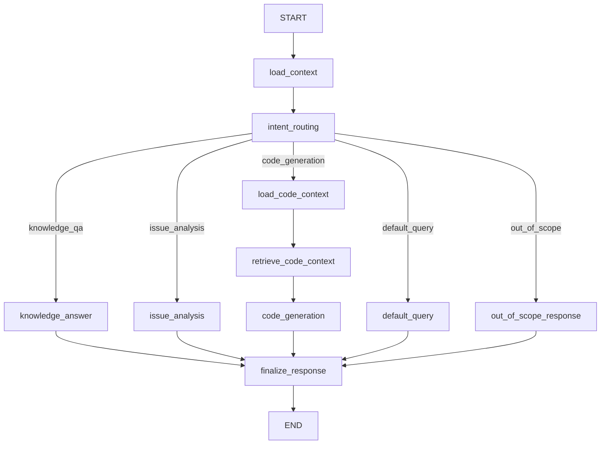

# DSP Agent - 领域智能问答与代码助手

基于 LangGraph 的领域智能问答系统，支持知识问答、问题分析、代码生成等场景。

## 特性

- **多路由分发**：自动识别用户意图，路由至知识问答、问题分析、代码生成或通用 Agent 处理
- **多源检索融合**：Wiki 文档、案例库、代码库统一检索与加权融合
- **通用 Agent 能力**：集成 LLM、MCP 工具、Skill 技能，支持复杂任务自动编排
- **可观测性**：完整的交互记录、反馈收集与告警机制
- **多领域支持**：通过 `domain/` 目录隔离不同业务领域的配置与知识

## 快速开始

### 环境要求

- Python 3.11+
- PostgreSQL 14+ (可选，用于持久化)

### 安装依赖

```bash
pip install -r requirements.txt
```

### 启动服务

Windows:
```powershell
.\start_agent.ps1
```

或指定参数：
```powershell
.\start_agent.ps1 -Port 8080 -DomainDir "domain/ad_engine"
```

服务启动后访问 http://127.0.0.1:8000

### 环境变量

主要配置项（详见 `start_agent.ps1`）：

| 变量名 | 说明 | 默认值 |
|--------|------|--------|
| `WORKFLOW_QA_LLM_BASE_URL` | LLM API 地址 | - |
| `WORKFLOW_QA_LLM_API_KEY` | LLM API 密钥 | - |
| `WORKFLOW_QA_LLM_MODEL` | 模型名称 | `deepseek-chat` |
| `WORKFLOW_DOMAIN_DIR` | 领域目录 | `domain/ad_engine` |
| `WORKFLOW_MCP_ENABLED` | 是否启用 MCP | `true` |
| `WORKFLOW_CHECKPOINTER_BACKEND` | Checkpointer 后端 | `postgres` |

## 架构概览

```
┌─────────────────────────────────────────────────────────────┐
│                      FastAPI Layer                          │
│  /api/messages  /api/sessions  /api/health  /api/feedback   │
└─────────────────────────────────────────────────────────────┘
                              │
                              ▼
┌─────────────────────────────────────────────────────────────┐
│                   Workflow Engine (LangGraph)               │
│                                                             │
│  load_context → intent_routing → [分支] → finalize_response │
│                                     │                        │
│              ┌──────────────────────┼──────────────────────┐│
│              │        │        │    │    │          │      ││
│              ▼        ▼        ▼    ▼    ▼          ▼      ││
│         knowledge  issue   code  default  out_of   agent   ││
│            _qa    analysis generation query   scope   loop  ││
└─────────────────────────────────────────────────────────────┘
                              │
                              ▼
┌─────────────────────────────────────────────────────────────┐
│                       Agent Layer                           │
│  ┌──────────┐  ┌──────────┐  ┌──────────┐  ┌──────────┐    │
│  │LLMClient │  │MCPClient │  │SkillRegistry│ │ToolRegistry│  │
│  └──────────┘  └──────────┘  └──────────┘  └──────────┘    │
└─────────────────────────────────────────────────────────────┘
                              │
                              ▼
┌─────────────────────────────────────────────────────────────┐
│                     Retrieval Layer                         │
│  ┌─────────────┐  ┌─────────────┐  ┌─────────────────┐     │
│  │WikiRetriever│  │CodeRetriever│  │WeightedFusion   │     │
│  └─────────────┘  └─────────────┘  └─────────────────┘     │
└─────────────────────────────────────────────────────────────┘
                              │
                              ▼
┌─────────────────────────────────────────────────────────────┐
│                     Storage Layer                           │
│  ┌────────────┐  ┌────────────┐  ┌─────────────────┐       │
│  │PostgreSQL  │  │SessionStore│  │ObservabilityStore│      │
│  │Checkpointer│  │            │  │                  │      │
│  └────────────┘  └────────────┘  └─────────────────┘       │
└─────────────────────────────────────────────────────────────┘
```

## 工作流拓扑


```mermaid
flowchart TD
    START --> load_context --> intent_routing

    intent_routing -->|knowledge_qa| knowledge_answer
    intent_routing -->|issue_analysis| issue_analysis
    intent_routing -->|code_generation| load_code_context
    intent_routing -->|default_query| default_query
    intent_routing -->|out_of_scope| out_of_scope_response

    load_code_context --> retrieve_code_context --> code_generation

    knowledge_answer --> finalize_response
    issue_analysis --> finalize_response
    code_generation --> finalize_response
    default_query --> finalize_response
    out_of_scope_response --> finalize_response

    finalize_response --> END
```

## 目录结构

```
.
├── src/                        # 生产代码
│   ├── api/                    # FastAPI 接口层
│   ├── init/                   # 组件初始化入口
│   ├── agent/                  # 通用 Agent 能力
│   │   ├── core/               # AgentLoop 核心
│   │   ├── llm/                # LLM 客户端
│   │   ├── mcp/                # MCP 客户端
│   │   ├── skills/             # 技能系统
│   │   └── tools/              # 工具注册中心
│   ├── workflow/               # 业务流程编排
│   │   ├── engine.py           # 主工作流
│   │   ├── state.py            # 状态定义
│   │   ├── nodes/              # 节点实现
│   │   ├── subgraph/           # 子图（knowledge_qa, issue_analysis）
│   │   └── common/             # 公共工具
│   ├── domain_profile/         # 领域配置管理
│   ├── retrievers/             # 检索器（向量、重排、融合）
│   ├── session/                # 会话存储
│   ├── observability/          # 可观测性
│   └── eval/                   # 离线评测
├── domain/                     # 领域数据
│   └── ad_engine/              # 广告引擎领域示例
│       ├── profile.json        # 领域配置（路由、检索、阈值）
│       ├── wiki/               # 知识文档
│       ├── codes/              # 代码检索语料
│       ├── skills/             # 技能配置
│       ├── mcp_servers/        # MCP Server 配置
│       ├── prompts/            # 提示词模板
│       └── eval/               # 评测数据集
├── tests/                      # 自动化测试
├── docs/                       # 设计文档
├── logs/                       # 运行日志
└── start_agent.ps1             # 启动脚本
```

## API 接口

| 端点 | 方法 | 说明 |
|------|------|------|
| `/api/messages` | POST | 发送用户消息，触发工作流 |
| `/api/sessions` | GET/POST | 会话管理 |
| `/api/sessions/{id}` | GET | 获取会话详情 |
| `/api/references/{trace_id}` | GET | 查询引用证据 |
| `/api/messages/{id}/feedback` | POST | 提交反馈 |
| `/api/health` | GET | 健康检查 |
| `/api/observability/summary` | GET | 观测摘要 |
| `/api/observability/alerts` | GET | 告警列表 |

### 消息请求示例

```bash
curl -X POST http://127.0.0.1:8000/api/messages \
  -H "Content-Type: application/json" \
  -d '{"session_id": "sess_xxx", "content": "出价胜率下降怎么排查？"}'
```

## 初始化流程

系统启动时按以下顺序初始化组件：

```
DomainProfile → LLMClient → SkillRegistry → MCPClient → Retrievers → ToolRegistry
```

所有组件通过全局单例访问：
```python
from domain_profile import get_domain_profile
from agent.llm.client import get_llm_client
from agent.skills import get_skill_registry
from agent.tools.registry import get_tool_registry
from agent.mcp import get_mcp_client
```

## 路由类型

| 路由 | 说明 | 处理流程 |
|------|------|----------|
| `knowledge_qa` | 知识问答 | 查询改写 → 多源检索 → 融合 → 生成回答 |
| `issue_analysis` | 问题分析 | 查询改写 → 检索 → 问题定位 → 分析建议 |
| `code_generation` | 代码生成 | 加载代码上下文 → 检索相关代码 → 生成代码 |
| `default_query` | 通用查询 | AgentLoop 自动编排工具调用 |
| `out_of_scope` | 领域外输入 | 返回兜底响应 |

## 领域配置

每个领域通过 `domain/<domain_id>/profile.json` 配置：

```json
{
  "profile_id": "ad_engine",
  "display_name": "广告引擎",
  "routing": {
    "default_module": "ad-serving-orchestrator",
    "modules": [...]
  },
  "retrieval": {
    "presets": { "hybrid": { "wiki_top_k": 4, "code_top_k": 4 } },
    "embedding": { "model": "BAAI/bge-base-zh-v1.5" },
    "reranker": { "model": "BAAI/bge-reranker-base" }
  },
  "domain_gate": {
    "domain_terms": ["广告", "投放", "召回", ...],
    "offtopic_terms": ["天气", "股票", ...]
  }
}
```

## 添加新领域

1. 创建目录 `domain/<new_domain>/`
2. 配置 `profile.json`（可参考 `domain/ad_engine/`）
3. 添加 `wiki/` 知识文档
4. 添加 `codes/` 代码语料（可选）
5. 配置 `prompts/` 提示词模板
6. 启动时指定 `WORKFLOW_DOMAIN_DIR=domain/<new_domain>`

## 检索配置

系统支持多源检索融合：

- **Wiki 检索**：文档语义检索 + BM25 + 重排
- **Code 检索**：代码语义检索 + 符号匹配
- **融合策略**：加权融合 + 意图偏向调整

关键参数（`profile.json` 中配置）：
```json
{
  "retrieval": {
    "hybrid_weights": { "bm25": 0.30, "embedding": 0.50, "lexical": 0.20 },
    "source_weights": { "wiki": 1.0, "code": 1.0 }
  }
}
```

## Checkpointer 持久化

支持两种 Checkpointer 后端：

| 后端 | 配置 | 说明 |
|------|------|------|
| `memory` | `WORKFLOW_CHECKPOINTER_BACKEND=memory` | 内存存储，重启丢失 |
| `postgres` | `WORKFLOW_CHECKPOINTER_BACKEND=postgres` | PostgreSQL 持久化 |

PostgreSQL 相关环境变量：
- `WORKFLOW_CHECKPOINTER_PG_DSN`: 数据库连接串
- `WORKFLOW_CHECKPOINTER_PG_SETUP`: 是否自动建表

## 测试与评测

```bash
# 运行测试
pytest tests/

# Wiki 检索评测
python -m src.eval.run_wiki_retrieval_eval

# 代码检索评测
python -m src.eval.run_code_retrieval_eval

# 回答质量评测
python -m src.eval.run_answer_eval
```

## 文档索引

- [节点说明](src/workflow/NODES.md)
- [总体设计](docs/智能问答问题分析系统整体设计.md)
- [Wiki 检索](docs/wiki_retrieve.md)
- [代码检索](docs/code_retrieve.md)
- [检索融合](docs/retrieve_merge.md)
- [Agent Loop](docs/agent_loop.md)
- [Agent 操作指南](docs/agent_loop_op.md)

## 开发规范

详见 [CLAUDE.md](CLAUDE.md)，核心要点：

1. **分层架构**：API 层不写业务推理，节点层不处理 HTTP
2. **配置优先**：阈值、TopK 放 `profile.json`，密钥放环境变量
3. **单例访问**：通过全局单例获取组件
4. **测试覆盖**：代码覆盖率 ≥ 85%

## License

MIT
