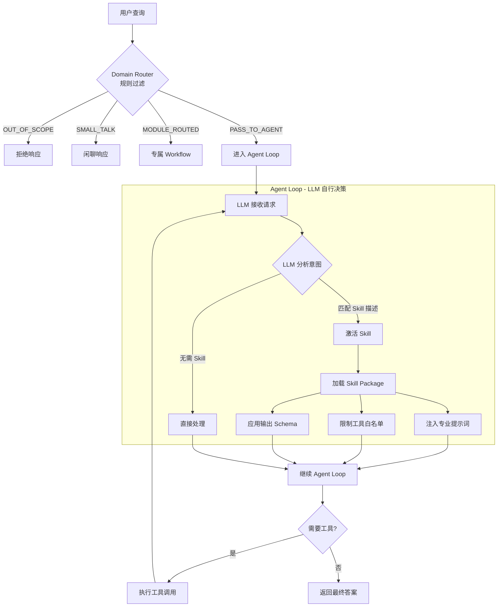

# 通用 Agent 底座 + Skill + MCP Tool 架构设计

## 1. 可行性分析

### 1.1 现有基础评估

| 组件 | 现状 | 完备度 | 说明 |
|------|------|--------|------|
| **LangGraph 编排** | 已实现 | 90% | `engine.py` 已有完整的图编排、Checkpoint、节点管理 |
| **Skills 模块** | 已实现 | 85% | 已有完整的 SkillLoader、SkillRegistry、SkillExecutor、SkillTool |
| **领域配置** | 已实现 | 80% | DomainProfile 支持模块路由、检索策略、提示词 |
| **LLM 客户端** | 已实现 | 95% | WorkflowLLMClient 支持多种模型、流式输出 |
| **MCP Tool** | **未实现** | 0% | 需要从零开始集成 |
| **通用 Agent Loop** | 部分实现 | 40% | 现有流程是固定节点链，缺少动态工具调用循环 |

### 1.2 技术可行性

**✅ 高度可行**：项目已具备核心基础设施，主要工作是：

1. **新建 `agent/` 模块**：独立实现 `Router → Agent Loop → Finalize` 架构
2. **参考 v1 实现**：类似功能参考 `workflow/` 目录实现，在 `agent/` 下独立重写
3. **集成 MCP 协议**：引入 MCP SDK，将私域系统封装为 MCP Tools
4. **统一 Tool 调用层**：将 Local Tools、Skill Tools、MCP Tools 统一管理

### 1.3 核心设计约束

| 约束 | 说明 |
|------|------|
| **代码隔离** | `agent/` **不复用** `workflow/` 目录中的代码，完全独立实现 |
| **参考实现** | 类似功能可**参考** `workflow/` 中的实现逻辑，在 `agent/` 下重写 |
| **目录语义** | 使用 `agent/` 目录名，与核心类名 `Agent*` 保持一致，无需 V2 后缀 |
| **v1 零修改** | `workflow/` 目录代码**不做任何修改**，保持向后兼容 |

### 1.4 风险与挑战

| 风险 | 影响 | 缓解策略 |
|------|------|----------|
| MCP 协议学习成本 | 中 | 先实现 1-2 个示例 MCP Server，建立最佳实践 |
| Agent Loop 稳定性 | 高 | 设置最大步数限制、工具调用超时、异常兜底 |
| 工具权限控制 | 中 | 通过 Skill 的 tool_whitelist 限制可用工具 |
| 向后兼容 | **低** | `agent/` 完全独立，**v1 代码零修改**，风险可控 |
| 代码重复 | 中 | 独立实现，可参考 v1 逻辑，保持架构清晰 |

---

## 2. 架构设计

### 2.1 整体架构图

**设计原则**：Router 仅做规则过滤（快速拦截），意图理解和工具决策完全交给 Agent Loop 中的 LLM。

```
┌─────────────────────────────────────────────────────────────────────────────┐
│                              用户 / 上层应用 / API                           │
└─────────────────────────────────────────────────────────────────────────────┘
                                      │
                                      ▼
┌─────────────────────────────────────────────────────────────────────────────┐
│                           通用 Agent 底座 (v2)                               │
│                                                                              │
│  ┌─────────────────────┐                                                    │
│  │   Domain Router     │  ← 规则层 (可选，可禁用)                            │
│  │   ┌───────────────┐ │                                                    │
│  │   │ 闲聊拦截      │ │  • 快速规则匹配 (关键词/正则)                       │
│  │   │ 领域门控      │ │  • 领域相关性判断                                   │
│  │   │ 模块分流      │ │  • 可完全禁用: enabled=false                        │
│  │   └───────────────┘ │                                                    │
│  └──────────┬──────────┘                                                    │
│             │                                                               │
│    ┌────────┼────────┬────────────┐                                         │
│    ↓        ↓        ↓            │                                         │
│ OUT_OF_   PASS_TO  MODULE      PASS_TO                                      │
│ SCOPE     AGENT    ROUTED      AGENT                                        │
│ (拒绝)    (默认)   (专属WF)    (Domain Router禁用时)                         │
│             │                     │                                         │
│             ↓                     ↓                                         │
│  ┌────────────────────────────────────────────────────┐    ┌──────────────┐ │
│  │                Agent Loop                          │───▶│   Finalize   │ │
│  │  ┌──────────────────────────────────────────────┐  │    │  结果整理    │ │
│  │  │              LLM Orchestrator                │  │    │  输出格式化  │ │
│  │  │  ┌────────────────────────────────────────┐  │  │    └──────────────┘ │
│  │  │  │  System Prompt 包含:                   │  │  │           │         │
│  │  │  │  • 领域背景 + 可用 Tool 描述            │  │  │           │         │
│  │  │  │  • 可用 Skill 描述 + 触发条件           │  │  │           │         │
│  │  │  │  • 使用指南                            │  │  │           │         │
│  │  │  └────────────────────────────────────────┘  │  │           │         │
│  │  │                                              │  │           │         │
│  │  │  LLM 自行决策:                               │  │           │         │
│  │  │  • 理解意图 → 选择 Tool / 直接回答           │  │           │         │
│  │  │  • Skill 触发 → 加载 Skill prompt           │  │           │         │
│  │  │  • 继续循环 → 直到任务完成                   │  │           │         │
│  │  └──────────────────────────────────────────────┘  │           │         │
│  └────────────────────────────────────────────────────┘           │         │
└─────────┼────────────────────────────────────────────────────────┼─────────┘
          │                          │                             │
          ▼                          ▼                             │
┌─────────────────────┐    ┌─────────────────────────────────────┐ │
│      Skill 层       │    │          统一 Tool 层                │ │
│  ┌───────────────┐  │    │  ┌───────────────────────────────┐  │ │
│  │ Skill Catalog │  │    │  │       Local Tools             │  │ │
│  │ Skill Loader  │──┼────┼─▶│  ┌─────────┐ ┌─────────────┐  │  │ │
│  │ Skill Package │  │    │  │  │  其  他  │ │SkillManager │  │  │ │
│  └───────────────┘  │    │  │  │  工  具  │ │ (Skill入口) │  │  │ │
└─────────────────────┘    │  └─────────┘ └─────────────┘  │  │ │
                           │  ┌───────────────────────────┐  │  │ │
                           │  │       MCP Tools           │  │  │ │
                           │  │  ┌─────────┐ ┌─────────┐  │  │  │ │
                           │  │  │Server A │ │Server B │  │  │  │ │
                           │  │  └─────────┘ └─────────┘  │  │  │ │
                           │  └───────────────────────────┘  │  │ │
                           └─────────────────────────────────┘  │ │
                                     │              │              │
          ┌──────────────────────────┼──────────────┼──────────────┘
          │                          │              │
          ▼                          ▼              ▼
┌─────────────────────────────────────────────────────────────────────────────┐
│                           平台治理层                                         │
│  ┌───────────────┐  ┌───────────────┐  ┌───────────────┐  ┌──────────────┐  │
│  │ State/Memory  │  │ Auth/Policy   │  │ Approval/HITL │  │Observability │  │
│  │ Checkpoint    │  │ Tool Whitelist│  │ Interrupt     │  │ Trace/Audit  │  │
│  └───────────────┘  └───────────────┘  └───────────────┘  └──────────────┘  │
└─────────────────────────────────────────────────────────────────────────────┘
          │                          │              │
          ▼                          ▼              ▼
┌─────────────────────────────────────────────────────────────────────────────┐
│                          私域系统 / 数据源                                   │
│  ┌─────────────┐    ┌─────────────┐    ┌─────────────┐    ┌──────────────┐  │
│  │  CodeHub    │    │  指标系统   │    │  工单系统   │    │  Wiki/知识库 │  │
│  │  Git/CR     │    │  数仓/BI    │    │  运维平台   │    │  内部API     │  │
│  └─────────────┘    └─────────────┘    └─────────────┘    └──────────────┘  │
└─────────────────────────────────────────────────────────────────────────────┘
```

### 2.2 核心组件职责

#### 2.2.1 通用 Agent 底座 (agent/)

| 组件 | 职责 | 实现方式 |
|------|------|----------|
| **Domain Router** | **规则层路由**：闲聊拦截、领域门控、模块分流 | 新建 `agent/core/router.py`，**纯规则实现，无 LLM 调用** |
| **Agent Loop** | **LLM 智能层**：意图理解 + Tool/Skill 决策 + 执行循环 | 新建 `agent/core/loop.py`，**LLM 自行决策** |
| **Finalize** | 结果整理、输出格式化 | 新建 `agent/core/finalize.py`，参考 v1 `finalize_response` |

**关键设计决策**：

1. **Domain Router (规则层)**
   - 职责：快速规则过滤，节省 LLM 调用成本
   - 特点：**纯规则实现，无 LLM 调用**，毫秒级响应
   - 可配置禁用：`enabled=false` 时直接进入 Agent Loop

2. **Agent Loop (LLM 层)**
   - 职责：**完全由 LLM 决策**，包括意图理解、Tool 选择、Skill 匹配
   - 特点：System Prompt 包含所有可用 Tool 和 Skill 的描述
   - 无需单独的 LLM Router：**Agent Loop 本身就是路由器**

3. **为什么不需要单独的 LLM Router？**
   - 现代 LLM (Claude/GPT-4) 本身具备强大的意图理解和工具选择能力
   - 单独的 LLM Router 会增加一次 LLM 调用，增加延迟和成本
   - Agent Loop 的 System Prompt 已包含完整的上下文信息

#### 2.2.2 Skill 层 (agent/skills/)

| 组件 | 职责 | 实现方式 |
|------|------|----------|
| **SkillRegistry** | Skill 注册中心 | 新建 `agent/skills/registry.py`，参考 v1 独立实现 |
| **SkillLoader** | Skill 加载器 | 新建 `agent/skills/loader.py`，参考 v1 独立实现 |
| **SkillExecutor** | Skill 执行器 | 新建 `agent/skills/executor.py`，参考 v1 独立实现 |
| **SkillManager** | Skill 管理工具 (本地工具) | 新建 `agent/skills/manager.py`，作为统一入口管理所有 Skill |
| **Skill** | Skill 数据结构 | 新建 `agent/skills/base.py`，参考 v1 独立实现 |

#### 2.2.3 统一 Tool 层 (agent/tools/)

| 组件 | 职责 | 实现方式 |
|------|------|----------|
| **ToolRegistry** | 工具注册中心 | 新建 `agent/tools/registry.py` |
| **Local Tools** | 本地业务工具 | 新建 `agent/tools/local_tools.py`，独立实现 |
| **MCP Tools** | 标准化外部能力 | 新建 `agent/mcp/` 模块 |
| **BaseTool** | 工具基类 | 新建 `agent/tools/base.py` |

---

## 3. 详细设计

### 3.1 新增目录结构

**设计原则**：
1. v2 架构**完全独立**，不修改现有 `workflow/` 目录代码
2. v2 **不复用** v1 代码，参考 v1 实现逻辑后独立重写
3. 使用 `agent/` 目录名，与核心类名 `Agent*` 保持一致，**无需 V2 后缀**

```
src/
├── workflow/                       # 现有：v1 Workflow (保持不变，不做任何修改)
│   ├── engine.py
│   ├── nodes/
│   ├── skills/                     # v1 Skill 系统 (v2 参考，不复用)
│   ├── llm/                        # v1 LLM 客户端 (v2 参考，不复用)
│   ├── retrievers/
│   ├── common/                     # v1 通用工具 (v2 参考，不复用)
│   ├── session/
│   └── observability/
│
├── agent/                          # 新增：v2 通用 Agent 架构 (完全独立实现)
│   ├── __init__.py
│   │
│   ├── engine.py                   # AgentEngine
│   ├── state.py                    # AgentState
│   ├── service.py                  # AgentService (入口服务)
│   │
│   ├── core/                       # Agent 核心模块
│   │   ├── __init__.py
│   │   ├── router.py               # DomainRouter (规则层路由，无 LLM)
│   │   ├── loop.py                 # AgentLoop (LLM + 工具调用循环)
│   │   └── finalize.py             # AgentFinalize (结果整理)
│   │
│   ├── tools/                      # 统一 Tool 层
│   │   ├── __init__.py
│   │   ├── registry.py             # ToolRegistry (统一工具注册中心)
│   │   ├── local_tools.py          # 本地工具 (独立实现)
│   │   └── base.py                 # Tool 基类定义
│   │
│   ├── mcp/                        # MCP 集成模块
│   │   ├── __init__.py
│   │   ├── client.py               # MCPClient (MCP 客户端)
│   │   ├── tool_adapter.py         # MCPToolAdapter (MCP → LangChain Tool)
│   │   └── config_loader.py        # MCP Server 配置加载
│   │
│   ├── skills/                     # Agent Skill 系统 (参考 v1 独立实现)
│   │   ├── __init__.py
│   │   ├── base.py                 # Skill, SkillCatalogItem 数据结构
│   │   ├── registry.py             # SkillRegistry
│   │   ├── loader.py               # SkillLoader
│   │   ├── executor.py             # SkillExecutor
│   │   └── manager.py              # SkillManager (作为本地工具注册)
│   │
│   ├── llm/                        # Agent LLM 客户端 (参考 v1 独立实现)
│   │   ├── __init__.py
│   │   ├── client.py               # LLMClient (参考 v1 WorkflowLLMClient)
│   │   └── prompts.py              # 提示词工具
│   │
│   └── common/                     # Agent 通用工具 (参考 v1 独立实现)
│       ├── __init__.py
│       ├── domain_profile.py       # DomainProfile
│       ├── logging.py              # 日志工具
│       └── utils.py                # 工具函数
│
├── api/
│   ├── main.py                     # 现有 v1 API (保持不变)
│   └── v2/                         # 新增：v2 API
│       ├── __init__.py
│       └── routes.py               # /v2/messages 接口
│
domain/
├── ad_engine/
│   ├── skills/                     # 现有：领域技能定义 (保持不变)
│   │   └── ...
│   │
│   ├── mcp_servers/                # 新增：领域 MCP Server 配置
│   │   ├── servers.yaml            # MCP Server 连接配置
│   │   └── README.md
│   │
│   └── profile.json                # 扩展：增加 agent 配置节点
```

**目录与类名对照**：

| 目录 | 核心类名 | 说明 |
|------|----------|------|
| `agent/` | `AgentService`, `AgentEngine`, `AgentState` | 入口服务 |
| `agent/core/` | `DomainRouter`, `AgentLoop`, `AgentFinalize` | 核心循环 (规则路由 + LLM 循环) |
| `agent/skills/` | `SkillRegistry`, `SkillLoader`, `SkillExecutor` | Skill 系统 |
| `agent/tools/` | `ToolRegistry`, `LocalTool`, `SkillTool` | 工具系统 |
| `agent/mcp/` | `MCPClient`, `MCPToolAdapter` | MCP 集成 |
| `agent/llm/` | `LLMClient` | LLM 客户端 |
| `agent/common/` | `DomainProfile` | 领域配置 |

**v1 vs v2 命名对比**：

| v1 (workflow/) | v2 (agent/) | 说明 |
|----------------|-------------|------|
| `WorkflowService` | `AgentService` | 服务入口 |
| `WorkflowState` | `AgentState` | 状态定义 |
| `WorkflowEngine` | `AgentEngine` | 引擎 |
| `SkillRegistry` | `SkillRegistry` | 同名，目录区分 |
| `ToolRegistry` | `ToolRegistry` | 同名，目录区分 |

### 3.2 API 版本路由配置

通过环境变量控制 API 使用 v1 (Workflow) 还是 v2 (Agent) 后端。

#### 3.2.1 配置项

| 环境变量 | 默认值 | 说明 |
|----------|--------|------|
| `API_BACKEND_VERSION` | `v1` | 后端版本 (`v1` 或 `v2`) |
| `API_DEBUG_VERBOSE` | `false` | 是否开启详细调试日志 |
| `API_V2_FALLBACK_TO_V1` | `true` | v2 失败时是否回退到 v1 |

#### 3.2.2 配置模块

```python
# src/api/config.py
from dataclasses import dataclass
from enum import Enum

class BackendVersion(str, Enum):
    V1 = "v1"  # Workflow (现有实现)
    V2 = "v2"  # Agent (新架构)

@dataclass
class ApiConfig:
    backend_version: BackendVersion = BackendVersion.V1
    debug_verbose: bool = False
    v2_fallback_to_v1: bool = True

    @classmethod
    def from_env(cls) -> "ApiConfig":
        # 从环境变量加载配置
        ...
```

#### 3.2.3 API 端点

| 端点 | 后端 | 说明 |
|------|------|------|
| `POST /api/messages` | v1 (Workflow) | 现有接口，固定节点链 |
| `POST /v2/messages` | v2 (Agent) | 新接口，动态 Agent Loop |
| `GET /api/config` | - | 获取当前 API 配置 |

#### 3.2.4 使用方式

```bash
# 使用 v1 后端 (默认)
export API_BACKEND_VERSION=v1
python -m uvicorn api.main:app

# 使用 v2 后端
export API_BACKEND_VERSION=v2
export AGENT_LLM_MODEL=gpt-4o
export AGENT_LLM_API_KEY=your-key
python -m uvicorn api.main:app

# v2 失败时回退到 v1
export API_BACKEND_VERSION=v2
export API_V2_FALLBACK_TO_V1=true
python -m uvicorn api.main:app
```

#### 3.2.5 健康检查

```bash
GET /api/health

# 响应示例 (v2 模式)
{
  "status": "ok",
  "workflow_backend": "langgraph",
  "api_backend_version": "v2",
  "api_debug_verbose": false,
  "agent_service": {
    "backend": "agent_service",
    "llm_model": "gpt-4o",
    "tools": {"total_tools": 5}
  }
}
```

### 3.3 v1 与 v2 的关系

```
┌─────────────────────────────────────────────────────────────────────────┐
│                              API Layer                                   │
│  ┌─────────────────────┐              ┌─────────────────────────────┐   │
│  │   /api/messages     │              │      /v2/messages           │   │
│  │   (v1 现有接口)      │              │      (v2 新接口)            │   │
│  └──────────┬──────────┘              └──────────────┬──────────────┘   │
└─────────────┼─────────────────────────────────────────┼─────────────────┘
              │                                         │
              ▼                                         ▼
┌─────────────────────────────┐       ┌─────────────────────────────────────┐
│     workflow/ (v1)          │       │           agent/ (v2)               │
│  ┌───────────────────────┐  │       │  ┌───────────────────────────────┐  │
│  │ WorkflowService       │  │       │  │ AgentService                  │  │
│  │ (固定节点链)          │  │       │  │ (动态 Agent Loop)             │  │
│  └───────────────────────┘  │       │  └───────────────────────────────┘  │
│                             │       │                 │                    │
│  - engine.py                │       │                 ▼                    │
│  - nodes/                   │       │  ┌───────────────────────────────┐  │
│  - skills/                  │       │  │ tools/registry.py             │  │
│  - llm/                     │  参考  │  │ (统一工具层)                  │  │
│  - common/ ─────────────────┼───────┼─▶└───────────────────────────────┘  │
│                             │ 重写   │                 │                    │
│  (完全独立，不做任何修改)   │       │                 ▼                    │
│                             │       │  ┌───────────────────────────────┐  │
│                             │       │  │ mcp/ (MCP 工具层)             │  │
│                             │       │  └───────────────────────────────┘  │
└─────────────────────────────┘       └─────────────────────────────────────┘

实现策略：
- v2 **不复用** v1 代码，完全独立实现
- v2 可**参考** v1 的实现逻辑，在 `agent/` 下重写为支持 v2 的版本
- v1 代码**不做任何修改**，保持向后兼容
- 目录名 `agent/` 与核心类名 `Agent*` 保持一致，无需 V2 后缀
```

### 3.4 参考 v1 实现独立版本

**原则**：v2 参考 v1 的设计思路，但独立实现，不复用代码。

```python
# agent/skills/registry.py
"""Agent Skill 注册中心 - 参考 v1 实现，独立重写"""

# 不从 v1 导入，而是在 agent 中独立实现
# from workflow.skills import SkillRegistry  # ❌ 不复用 v1 代码

from agent.skills.base import Skill, SkillCatalogItem

class SkillRegistry:
    """Agent Skill 注册中心

    参考 workflow/skills/registry.py 的设计思路，但独立实现：
    - 支持动态工具调用
    - 支持工具白名单
    - 支持 Agent Loop 集成
    """

    def __init__(self):
        self.skills: dict[str, Skill] = {}
        self._catalog_cache: list[SkillCatalogItem] = []
        # ... 独立实现

    def load_from_directory(self, domain_root: Path) -> int:
        """加载 Skill - 参考 v1 逻辑，独立实现"""
        # 参考 v1 SkillLoader 的实现思路，重写
        ...

    def get_skill(self, skill_id: str) -> Skill | None:
        """获取 Skill"""
        ...

    def get_catalog(self) -> list[SkillCatalogItem]:
        """获取 Catalog (给 LLM 选择)"""
        ...
```

```python
# agent/llm/client.py
"""Agent LLM 客户端 - 参考 v1 实现，独立重写"""

# 参考 workflow/llm/llm_client.py 的设计，独立实现
class LLMClient:
    """Agent LLM 客户端

    参考 v1 WorkflowLLMClient 的设计，但独立实现：
    - 支持 async 原生调用
    - 支持工具调用的流式响应
    - 支持 Agent Loop 的消息格式
    """

    def __init__(self, config: LLMConfig):
        self.config = config
        # ... 独立实现

    async def ainvoke_with_tools(
        self,
        messages: list[dict],
        tools: list[dict],
        **kwargs,
    ) -> LLMResponse:
        """异步调用 LLM (带工具)"""
        ...
```

### 3.4 Domain Router 设计 (规则层)

**核心原则**：Domain Router 是**纯规则层**，不做 LLM 调用，用于快速过滤和分流。

#### 3.4.1 架构定位

```
┌─────────────────────────────────────────────────────────────────┐
│                        用户请求                                  │
└─────────────────────────────────────────────────────────────────┘
                              ↓
┌─────────────────────────────────────────────────────────────────┐
│                 Domain Router (规则层，可选)                     │
│  ┌───────────────────────────────────────────────────────────┐  │
│  │  职责：                                                    │  │
│  │  • 快速规则匹配（关键词、正则、词汇表）                      │  │
│  │  • 领域相关性判断 (domain_gate)                             │  │
│  │  • 闲聊/无关请求拦截                                        │  │
│  │  • 领域模块分流 (modules)                                   │  │
│  │  • 可通过配置关闭: enabled=false → 直接进入 AgentLoop       │  │
│  └───────────────────────────────────────────────────────────┘  │
│  配置来源: domain_profile.json → domain_gate, routing, modules   │
└─────────────────────────────────────────────────────────────────┘
                              ↓
         ┌────────────────────┼────────────────────┐
         ↓                    ↓                    ↓
    OUT_OF_SCOPE         PASS_TO_AGENT       MODULE_ROUTED
    (拒绝响应)           (默认路径)          (专属workflow)
                              ↓
┌─────────────────────────────────────────────────────────────────┐
│                      Agent Loop (LLM 层)                         │
│  LLM 自行决策：意图理解 + Tool 选择 + Skill 匹配 + 执行          │
└─────────────────────────────────────────────────────────────────┘
```

#### 3.4.2 输出类型

```python
class DomainRouteType(str, Enum):
    """Domain Router 输出类型"""
    # 拒绝类
    OUT_OF_SCOPE = "out_of_scope"      # 领域外，直接拒绝/转交
    SMALL_TALK = "small_talk"          # 闲聊，直接响应

    # 通过类
    PASS_TO_AGENT = "pass_to_agent"    # 通用请求，交给 Agent Loop
    MODULE_ROUTED = "module_routed"    # 命中特定模块，走专属 workflow
```

#### 3.4.3 配置结构

从 `domain_profile.json` 读取配置：

```json
{
  "domain_gate": {
    "enabled": true,                    // 是否启用 Domain Router
    "threshold": 0.5,                   // 领域相关性阈值
    "domain_terms": ["广告", "投放", ...],
    "offtopic_terms": ["天气", "股票", ...],
    "small_talk_exact": ["哈", "你好", ...],
    "small_talk_substr": ["晚安", "早安", ...],

    // 模块分流配置
    "module_routing": {
      "enabled": true,                  // 是否启用模块分流
      "strategy": "keyword_first"       // keyword_first | symbol_match
    }
  },
  "routing": {
    "default_module": "ad-serving-orchestrator",
    "module_infer_strategy": "keyword_then_symbol"
  },
  "modules": [
    {
      "name": "ad-recall",
      "keywords": ["召回", "recall", "候选"],
      "route_priority": 20
    }
  ]
}
```

#### 3.4.4 DomainRouter 类设计

```python
# src/agent/core/router.py

@dataclass
class DomainRouterConfig:
    """Domain Router 配置

    从 domain_profile.json 的 domain_gate 和 routing 节点加载。
    """
    # 开关
    enabled: bool = True                    # 是否启用 Domain Router

    # 领域门控
    threshold: float = 0.5                  # 领域相关性阈值
    domain_terms: tuple[str, ...] = ()      # 领域词汇
    offtopic_terms: tuple[str, ...] = ()    # 领域外词汇
    small_talk_exact: tuple[str, ...] = ()  # 闲聊精确匹配
    small_talk_substr: tuple[str, ...] = () # 闲聊子串匹配

    # 模块分流
    module_routing_enabled: bool = True     # 是否启用模块分流
    modules: list[dict] = field(default_factory=list)

    @classmethod
    def from_profile(cls, profile: dict) -> "DomainRouterConfig":
        """从 domain_profile 加载配置"""
        gate = profile.get("domain_gate", {})
        routing = profile.get("routing", {})
        modules = profile.get("modules", [])

        return cls(
            enabled=gate.get("enabled", True),
            threshold=gate.get("threshold", 0.5),
            domain_terms=tuple(gate.get("domain_terms", [])),
            offtopic_terms=tuple(gate.get("offtopic_terms", [])),
            small_talk_exact=tuple(gate.get("small_talk_exact", [])),
            small_talk_substr=tuple(gate.get("small_talk_substr", [])),
            module_routing_enabled=routing.get("enabled", True),
            modules=modules,
        )


@dataclass
class DomainRouterResult:
    """Domain Router 结果"""
    route: DomainRouteType
    domain_relevance: float = 0.0
    matched_module: str | None = None      # 命中的模块名 (MODULE_ROUTED)
    rejection_reason: str = ""              # 拒绝原因 (OUT_OF_SCOPE)
    quick_response: str | None = None       # 快速响应 (闲聊/拒绝)


class DomainRouter:
    """私域规则路由器

    职责：
    1. 快速判断请求是否属于领域范围 (纯规则，无 LLM)
    2. 拦截闲聊和无关请求
    3. 分流到特定领域模块 (可选)

    特点：
    - 纯规则实现，毫秒级响应
    - 可完全禁用 (enabled=false)
    - 配置来源于 domain_profile.json
    """

    def __init__(self, config: DomainRouterConfig):
        self.config = config

        logger.info(
            f"[DomainRouter] 初始化完成, "
            f"enabled={config.enabled}, "
            f"threshold={config.threshold}, "
            f"domain_terms={len(config.domain_terms)}, "
            f"modules={len(config.modules)}"
        )

    def route(self, user_query: str) -> DomainRouterResult:
        """执行规则路由 (同步，无 LLM 调用)

        Args:
            user_query: 用户查询

        Returns:
            DomainRouterResult: 路由结果
        """
        # 如果禁用，直接通过到 Agent
        if not self.config.enabled:
            return DomainRouterResult(route=DomainRouteType.PASS_TO_AGENT)

        normalized = self._normalize(user_query)

        # 1. 闲聊检测
        if self._is_small_talk(normalized):
            logger.debug(f"[DomainRouter] 闲聊: {user_query[:50]}")
            return DomainRouterResult(
                route=DomainRouteType.SMALL_TALK,
                quick_response="您好，我是广告引擎助手，有什么可以帮您的？"
            )

        # 2. 领域相关性计算
        relevance, reason = self._compute_relevance(normalized, user_query)

        # 3. 领域外判断
        if relevance < self.config.threshold:
            logger.debug(f"[DomainRouter] 领域外: relevance={relevance:.2f}")
            return DomainRouterResult(
                route=DomainRouteType.OUT_OF_SCOPE,
                domain_relevance=relevance,
                rejection_reason=reason,
                quick_response="抱歉，这个问题超出了我的专业领域（广告引擎）。"
            )

        # 4. 模块分流 (可选)
        if self.config.module_routing_enabled:
            matched_module = self._match_module(user_query, normalized)
            if matched_module:
                logger.info(f"[DomainRouter] 模块分流: {matched_module}")
                return DomainRouterResult(
                    route=DomainRouteType.MODULE_ROUTED,
                    domain_relevance=relevance,
                    matched_module=matched_module,
                )

        # 5. 通过到 Agent Loop
        logger.info(f"[DomainRouter] 通过: relevance={relevance:.2f}")
        return DomainRouterResult(
            route=DomainRouteType.PASS_TO_AGENT,
            domain_relevance=relevance,
        )

    def _is_small_talk(self, normalized: str) -> bool:
        """检查是否为闲聊"""
        # 精确匹配
        if normalized in self.config.small_talk_exact:
            return True
        # 子串匹配
        if any(token in normalized for token in self.config.small_talk_substr):
            return True
        # 笑声模式
        if _LAUGH_LIKE_RE.fullmatch(normalized):
            return True
        return False

    def _compute_relevance(self, normalized: str, original: str) -> tuple[float, str]:
        """计算领域相关性"""
        domain_hits = sum(1 for t in self.config.domain_terms if t in normalized)
        off_hits = sum(1 for t in self.config.offtopic_terms if t in normalized)
        code_hint = bool(_CODE_HINT_RE.search(original))

        relevance = min(1.0, domain_hits * 0.25 + (0.25 if code_hint else 0.0))
        if domain_hits > 0:
            relevance = max(relevance, 0.5)
        if off_hits > 0 and domain_hits == 0 and not code_hint:
            relevance = max(0.0, relevance - 0.3)

        return relevance, f"domain_hits={domain_hits}"

    def _match_module(self, original: str, normalized: str) -> str | None:
        """匹配领域模块"""
        for module in self.config.modules:
            keywords = module.get("keywords", [])
            if any(kw in normalized or kw in original for kw in keywords):
                return module.get("name")
        return None
```

#### 3.4.5 与 Agent Loop 的集成

```python
# src/agent/service.py

class AgentService:
    """Agent 服务入口"""

    def __init__(
        self,
        domain_router: DomainRouter,
        agent_loop: AgentLoop,
        ...
    ):
        self.domain_router = domain_router
        self.agent_loop = agent_loop

    async def arun(
        self,
        user_query: str,
        session_id: str,
        trace_id: str,
        history: list[dict],
    ) -> AgentResponse:
        """执行 Agent 请求"""

        # Step 1: Domain Router (规则层，同步)
        domain_result = self.domain_router.route(user_query)

        # 处理拒绝类结果
        if domain_result.route == DomainRouteType.OUT_OF_SCOPE:
            return AgentResponse(
                status="rejected",
                content=domain_result.quick_response,
                ...
            )

        if domain_result.route == DomainRouteType.SMALL_TALK:
            return AgentResponse(
                status="completed",
                content=domain_result.quick_response,
                ...
            )

        # 处理模块分流
        if domain_result.route == DomainRouteType.MODULE_ROUTED:
            # 走专属 workflow (可选实现)
            return await self._run_module_workflow(
                module=domain_result.matched_module,
                user_query=user_query,
                ...
            )

        # Step 2: Agent Loop (LLM 层，异步)
        # LLM 自行决策：意图理解 + Tool 选择 + Skill 匹配
        return await self.agent_loop.run(
            query=user_query,
            state=state,
            ...
        )
```

#### 3.4.6 配置开关总结

| 配置项 | 默认值 | 说明 |
|--------|--------|------|
| `domain_gate.enabled` | `true` | 是否启用 Domain Router |
| `domain_gate.threshold` | `0.5` | 领域相关性阈值 |
| `domain_gate.module_routing.enabled` | `true` | 是否启用模块分流 |

**禁用 Domain Router**：
```json
{
  "domain_gate": {
    "enabled": false
  }
}
```
此时所有请求直接进入 Agent Loop，完全由 LLM 决策。

---

### 3.5 Agent Loop 核心设计

**核心原则**：Agent Loop 本身就是路由器，LLM 自行决策意图理解、Tool 选择、Skill 匹配。

```python
# src/agent/core/loop.py

class AgentLoop:
    """Agent 循环 (LLM 智能层)

    核心职责：
    1. 接收 Domain Router 过滤后的请求
    2. LLM 自行决策：意图理解 + Tool 选择 + Skill 匹配
    3. 执行工具调用
    4. 循环直到任务完成或达到限制

    关键设计：
    - System Prompt 包含所有可用 Tool 和 Skill 的描述
    - LLM 根据用户意图自行选择调用哪个 Tool 或 Skill
    - 无需单独的 LLM Router：Agent Loop 本身就是路由器
    """

    def __init__(
        self,
        llm_client: "LLMClient",
        tool_registry: "ToolRegistry",
        max_steps: int = 10,
        timeout_seconds: int = 120,
    ):
        self.llm_client = llm_client
        self.tool_registry = tool_registry
        self.max_steps = max_steps
        self.timeout_seconds = timeout_seconds

    async def run(
        self,
        query: str,
        skill: "Skill | None",
        state: "AgentState",
    ) -> "AgentLoopResult":
        """执行 Agent 循环

        Args:
            query: 用户查询
            skill: 当前激活的 Skill (可选)
            state: Agent 状态

        Returns:
            AgentLoopResult: 包含最终答案、工具调用记录等
        """
        # 1. 根据 Skill 获取可用工具
        tools = self._get_available_tools(skill)

        # 2. 构建系统提示词
        system_prompt = self._build_system_prompt(skill)

        # 3. 循环执行
        messages = [{"role": "user", "content": query}]
        tool_calls_history = []

        for step in range(self.max_steps):
            # 3.1 调用 LLM
            response = await self.llm_client.ainvoke_with_tools(
                messages=messages,
                system_prompt=system_prompt,
                tools=tools,
            )

            # 3.2 检查是否完成
            if not response.tool_calls:
                # LLM 返回最终答案
                return AgentLoopResult(
                    success=True,
                    answer=response.content,
                    tool_calls=tool_calls_history,
                    steps=step + 1,
                )

            # 3.3 执行工具调用
            for tool_call in response.tool_calls:
                tool_result = await self._execute_tool(tool_call, skill)

                # 记录工具调用
                tool_calls_history.append({
                    "tool": tool_call.name,
                    "arguments": tool_call.args,
                    "result": tool_result,
                })

                # 添加工具结果到消息
                messages.append({
                    "role": "assistant",
                    "tool_calls": [tool_call],
                })
                messages.append({
                    "role": "tool",
                    "content": tool_result,
                    "tool_call_id": tool_call.id,
                })

        # 达到最大步数
        return AgentLoopResult(
            success=False,
            answer="任务执行超时，请简化问题或分步提问",
            tool_calls=tool_calls_history,
            steps=self.max_steps,
        )

    def _get_available_tools(self, skill: StandardSkill | None) -> list[BaseTool]:
        """获取当前可用的工具列表

        优先级：
        1. Skill 定义的 tool_whitelist
        2. 默认工具集
        """
        if skill and skill.execution.get("tool_whitelist"):
            return self.tool_registry.get_tools(
                tool_names=skill.execution["tool_whitelist"]
            )
        return self.tool_registry.get_default_tools()

    def _build_system_prompt(self, skill: StandardSkill | None) -> str:
        """构建系统提示词

        组合：
        1. 基础 Agent 指令
        2. Skill 专业提示词
        3. 输出格式要求
        """
        base_prompt = self._get_base_agent_prompt()

        if skill and skill.prompt_template:
            return f"{base_prompt}\n\n## 专业指引\n{skill.prompt_template}"

        return base_prompt
```

### 3.6 Tool Registry 设计

```python
# src/agent/tools/registry.py

class ToolRegistry:
    """统一工具注册中心 (独立实现)

    管理两类工具：
    1. Local Tools: 本地 Python 工具 (包括 skill_manager)
    2. MCP Tools: MCP 协议工具

    设计说明：
    - skill_manager 作为一个本地工具，内部管理所有 Skill
    - LLM 通过调用 skill_manager 来执行 Skill，参数为 skill_name 和 skill_args
    - 这种设计的优势：
      * 工具列表稳定，不因 Skill 数量变化而膨胀
      * 动态扩展：可以热加载新 Skill 而不需要重新注册工具
      * 统一入口：便于添加日志、监控、缓存等横切关注点
    """

    def __init__(self):
        self._local_tools: dict[str, "BaseTool"] = {}
        self._mcp_tools: dict[str, "MCPToolAdapter"] = {}
        self._tool_groups: dict[str, list[str]] = {}  # 工具分组

    def register_local_tool(self, tool: "BaseTool") -> None:
        """注册本地工具 (包括 skill_manager)"""
        self._local_tools[tool.name] = tool

    def register_mcp_tool(self, mcp_tool: "MCPToolAdapter") -> None:
        """注册 MCP 工具"""
        self._mcp_tools[mcp_tool.name] = mcp_tool

    def get_tools(
        self,
        tool_names: list[str] | None = None,
        groups: list[str] | None = None,
    ) -> list["BaseTool"]:
        """获取工具列表

        Args:
            tool_names: 指定工具名称列表
            groups: 指定工具分组

        Returns:
            工具列表 (统一为 LangChain BaseTool 格式)
        """
        result = []

        # 按名称获取
        if tool_names:
            for name in tool_names:
                if name in self._local_tools:
                    result.append(self._local_tools[name])
                elif name in self._mcp_tools:
                    result.append(self._mcp_tools[name].to_langchain_tool())
            return result

        # 按分组获取
        if groups:
            for group in groups:
                if group in self._tool_groups:
                    result.extend(self.get_tools(tool_names=self._tool_groups[group]))
            return result

        # 返回默认工具集
        return self.get_default_tools()

    def get_default_tools(self) -> list[BaseTool]:
        """获取默认工具集"""
        return list(self._local_tools.values())

    def get_all_tool_schemas(self) -> list[dict]:
        """获取所有工具的 OpenAI Schema"""
        schemas = []
        for tool in self._local_tools.values():
            schemas.append(tool.to_openai_schema())
        for tool in self._mcp_tools.values():
            schemas.append(tool.get_openai_schema())
        return schemas
```

### 3.6 SkillManager 设计 (Skill 管理工具)

**设计理念**：SkillManager 作为一个**本地工具**，统一管理所有 Skill 的调用。

```python
# src/agent/skills/manager.py

from langchain_core.tools import BaseTool
from pydantic import BaseModel, Field
from agent.skills.registry import SkillRegistry
from agent.skills.executor import SkillExecutor


class SkillManagerArgs(BaseModel):
    """SkillManager 参数模型"""
    skill_name: str = Field(
        ...,
        description="要调用的 Skill 名称"
    )
    arguments: dict = Field(
        default_factory=dict,
        description="传递给 Skill 的参数"
    )


class SkillManager(BaseTool):
    """Skill 管理工具

    作为一个本地工具，统一管理所有 Skill 的调用。

    设计优势：
    1. 工具列表稳定：不因 Skill 数量变化而膨胀
    2. 动态扩展：可以热加载新 Skill 而不需要重新注册工具
    3. 统一入口：便于添加日志、监控、缓存等横切关注点
    4. 权限控制：可以在统一层面做权限/频率控制

    使用方式：
        LLM 调用: skill_manager(skill_name="code_review", arguments={"pr_id": 123})
    """

    name: str = "skill_manager"
    description: str = """调用预定义的技能来处理特定任务。

可用技能列表会根据上下文动态变化，调用此工具时请提供：
- skill_name: 技能名称
- arguments: 传递给技能的参数

示例：
{"skill_name": "code_review", "arguments": {"pr_id": 123, "scope": "security"}}
"""
    args_schema: type[BaseModel] = SkillManagerArgs

    def __init__(
        self,
        skill_registry: SkillRegistry,
        skill_executor: SkillExecutor,
    ):
        super().__init__()
        self._registry = skill_registry
        self._executor = skill_executor

    def _run(self, skill_name: str, arguments: dict = None) -> str:
        """同步执行 Skill"""
        import asyncio
        return asyncio.run(self._arun(skill_name, arguments))

    async def _arun(self, skill_name: str, arguments: dict = None) -> str:
        """异步执行 Skill

        Args:
            skill_name: Skill 名称
            arguments: Skill 参数

        Returns:
            Skill 执行结果
        """
        arguments = arguments or {}

        # 1. 查找 Skill
        skill = self._registry.get_skill(skill_name)
        if not skill:
            available = self._registry.list_skill_names()
            return f"错误：未找到 Skill '{skill_name}'。可用的 Skill: {available}"

        # 2. 执行 Skill
        try:
            result = await self._executor.execute(skill, arguments)
            return result
        except Exception as e:
            return f"Skill '{skill_name}' 执行失败: {str(e)}"

    def get_available_skills(self) -> list[str]:
        """获取当前可用的 Skill 列表"""
        return self._registry.list_skill_names()

    def get_skill_description(self, skill_name: str) -> str | None:
        """获取指定 Skill 的描述"""
        skill = self._registry.get_skill(skill_name)
        return skill.description if skill else None


# 注册示例
def setup_skill_manager(
    tool_registry: "ToolRegistry",
    skill_registry: SkillRegistry,
    skill_executor: SkillExecutor,
) -> None:
    """设置 SkillManager 并注册到工具注册中心

    Args:
        tool_registry: 工具注册中心
        skill_registry: Skill 注册中心
        skill_executor: Skill 执行器
    """
    skill_manager = SkillManager(skill_registry, skill_executor)
    tool_registry.register_local_tool(skill_manager)
```

**对比：新旧设计差异**

| 方面 | 旧设计 (SkillTool) | 新设计 (SkillManager) |
|-----|------------------|---------------------|
| **工具数量** | N 个 Skill = N 个工具 | 固定 1 个 skill_manager |
| **LLM 选择** | LLM 直接看到每个 Skill | LLM 调用 skill_manager，传入 skill_name |
| **动态性** | 需要注册新工具 | 只需更新内部映射 |
| **Schema 暴露** | 每个 Skill 独立 Schema | 统一 Schema + 动态参数 |
| **权限控制** | 每个 Skill 独立控制 | 统一入口便于控制 |
| **适用场景** | Skill 数量少且固定 | Skill 数量多或动态变化 |

### 3.7 MCP Tool 适配器设计

```python
# src/agent/mcp/tool_adapter.py

class MCPToolAdapter:
    """MCP Tool 适配器 (独立实现)

    将 MCP 协议的工具转换为 LangChain Tool 格式，
    使 Agent Loop 可以统一调用。
    """

    def __init__(
        self,
        mcp_client: "MCPClient",
        tool_name: str,
        tool_schema: dict,
    ):
        self.mcp_client = mcp_client
        self.tool_name = tool_name
        self.tool_schema = tool_schema

    @property
    def name(self) -> str:
        return self.tool_name

    @property
    def description(self) -> str:
        return self.tool_schema.get("description", "")

    def get_openai_schema(self) -> dict:
        """转换为 OpenAI 工具 Schema"""
        return {
            "type": "function",
            "function": {
                "name": self.tool_name,
                "description": self.description,
                "parameters": self.tool_schema.get("inputSchema", {}),
            }
        }

    def to_langchain_tool(self) -> "BaseTool":
        """转换为 LangChain Tool"""
        from langchain_core.tools import BaseTool
        from pydantic import create_model

        # 动态创建参数模型
        params = self.tool_schema.get("inputSchema", {}).get("properties", {})
        required = self.tool_schema.get("inputSchema", {}).get("required", [])

        # 创建 Pydantic 模型
        fields = {}
        for param_name, param_def in params.items():
            param_type = self._get_python_type(param_def.get("type", "string"))
            if param_name in required:
                fields[param_name] = (param_type, ...)
            else:
                fields[param_name] = (param_type | None, None)

        args_schema = create_model(f"{self.tool_name}Args", **fields)

        class MCPToolWrapper(BaseTool):
            name: str = self.tool_name
            description: str = self.description
            args_schema: type = args_schema
            _adapter: MCPToolAdapter = self

            def _run(self, **kwargs) -> str:
                return self._adapter.invoke_sync(kwargs)

            async def _arun(self, **kwargs) -> str:
                return await self._adapter.invoke_async(kwargs)

        return MCPToolWrapper()

    async def invoke_async(self, arguments: dict) -> str:
        """异步调用 MCP 工具"""
        result = await self.mcp_client.call_tool(
            tool_name=self.tool_name,
            arguments=arguments,
        )
        return self._format_result(result)

    def invoke_sync(self, arguments: dict) -> str:
        """同步调用 MCP 工具"""
        import asyncio
        loop = asyncio.get_event_loop()
        return loop.run_until_complete(self.invoke_async(arguments))

    def _format_result(self, result: dict) -> str:
        """格式化 MCP 工具返回结果"""
        import json
        if result.get("isError"):
            return json.dumps({
                "success": False,
                "error": result.get("content", [{}])[0].get("text", "Unknown error"),
            }, ensure_ascii=False)

        content = result.get("content", [])
        if content and content[0].get("type") == "text":
            return content[0].get("text", "")

        return json.dumps(result, ensure_ascii=False)

    def _get_python_type(self, json_type: str) -> type:
        """将 JSON Schema 类型转换为 Python 类型"""
        type_map = {
            "string": str,
            "integer": int,
            "number": float,
            "boolean": bool,
            "array": list,
            "object": dict,
        }
        return type_map.get(json_type, str)
```

### 3.8 MCP Client 设计

```python
# src/agent/mcp/client.py

class MCPClient:
    """MCP 协议客户端 (独立实现)

    负责与 MCP Server 建立连接、发现工具、调用工具。
    """

    def __init__(self, server_configs: dict[str, dict]):
        """
        Args:
            server_configs: MCP Server 配置字典
                {
                    "codehub": {
                        "command": "python",
                        "args": ["-m", "mcp_servers.codehub"],
                        "env": {...}
                    },
                    "metrics": {
                        "url": "http://metrics-api/mcp"
                    }
                }
        """
        self.server_configs = server_configs
        self._sessions: dict[str, "MCPSession"] = {}
        self._tools: dict[str, dict] = {}  # tool_name -> (server_name, tool_schema)

    async def initialize(self) -> None:
        """初始化所有 MCP Server 连接"""
        for server_name, config in self.server_configs.items():
            session = await self._connect_server(server_name, config)
            self._sessions[server_name] = session

            # 发现工具
            tools = await session.list_tools()
            for tool in tools:
                self._tools[tool["name"]] = (server_name, tool)

    async def _connect_server(
        self,
        server_name: str,
        config: dict,
    ) -> "MCPSession":
        """连接 MCP Server"""
        if "command" in config:
            # Stdio 模式
            return await self._connect_stdio(server_name, config)
        elif "url" in config:
            # HTTP/SSE 模式
            return await self._connect_http(server_name, config)
        else:
            raise ValueError(f"Invalid MCP server config: {server_name}")

    async def list_tools(self) -> list[dict]:
        """获取所有可用工具"""
        return [
            {"name": name, **schema}
            for name, (_, schema) in self._tools.items()
        ]

    async def call_tool(
        self,
        tool_name: str,
        arguments: dict,
    ) -> dict:
        """调用 MCP 工具"""
        if tool_name not in self._tools:
            raise ValueError(f"Tool not found: {tool_name}")

        server_name, _ = self._tools[tool_name]
        session = self._sessions[server_name]

        return await session.call_tool(tool_name, arguments)

    def get_tool_adapters(self) -> list[MCPToolAdapter]:
        """获取所有工具的适配器"""
        return [
            MCPToolAdapter(self, tool_name, tool_schema)
            for tool_name, (_, tool_schema) in self._tools.items()
        ]
```

---

## 4. 运行时流程

### 4.1 完整请求流程

**设计说明**：
- Domain Router (规则层) 仅做快速规则过滤，**不调用 LLM**
- Agent Loop (LLM 层) 由 LLM 自行决策意图理解、Tool 选择、Skill 匹配

```mermaid
sequenceDiagram
    participant User as 用户
    participant API as API (/v2/messages)
    participant DR as Domain Router
    participant Loop as Agent Loop
    participant LLM as LLM
    participant Tools as Tool Registry
    participant Skill as Skill Registry
    participant MCP as MCP Client
    participant Sys as 私域系统

    User->>API: POST /v2/messages
    API->>DR: 规则路由

    Note over DR: 纯规则，无 LLM 调用

    DR->>DR: 1. 闲聊检测
    DR->>DR: 2. 领域相关性判断
    DR->>DR: 3. 模块分流 (可选)

    alt 领域外 / 闲聊
        DR-->>API: 直接响应 / 拒绝
        API-->>User: 快速响应
    else 模块分流
        DR->>DR: 走专属 workflow
    else 通过到 Agent
        DR->>Loop: 进入 Agent Loop

        Note over Loop: LLM 自行决策<br/>意图理解 + Tool 选择 + Skill 匹配

        loop 最大 N 步
            Loop->>Tools: 获取可用工具
            Loop->>Skill: 获取 Skill 描述
            Tools-->>Loop: Tool List + Skill Desc

            Loop->>LLM: 调用 LLM (带 Tools + Skills)
            LLM-->>Loop: Response + Tool Calls

            alt 需要调用工具
                Loop->>Tools: 执行工具
                Tools->>MCP: 调用 MCP Tool
                MCP->>Sys: 访问私域系统
                Sys-->>MCP: 返回数据
                MCP-->>Tools: 工具结果
                Tools-->>Loop: 工具结果
            else 无需工具调用
                Loop-->>API: 最终答案
            end
        end

        API-->>User: 响应
    end
```

### 4.2 Skill 激活流程

**设计说明**：
- Domain Router 不负责 Skill 匹配
- Skill 激活完全由 Agent Loop 中的 LLM 自行决策
- System Prompt 包含所有可用 Skill 的描述和触发条件



**关键变化**：
1. **Domain Router 不做 Skill 匹配**：只做规则过滤
2. **LLM 自行决定 Skill**：根据 System Prompt 中的 Skill 描述
3. **减少 LLM 调用**：去掉单独的 LLM Router 层

---

## 5. 与现有系统集成

### 5.1 兼容性设计原则

**核心原则**：v2 完全独立，v1 零修改

| 现有组件 (v1) | v2 集成方式 | v1 改动量 |
|---------------|-------------|-----------|
| `workflow/` 目录 | **不修改任何文件** | **零** |
| `WorkflowService` | v2 新建 `AgentService` | **零** |
| `WorkflowState` | v2 新建 `AgentState` | **零** |
| `DomainProfile` | 通过 JSON 扩展字段 | **零** (只扩展配置) |
| `SkillRegistry` | 通过 `SkillAdapter` 复用 | **零** |
| `SkillExecutor` | 通过适配器调用 | **零** |
| `finalize_response` | v2 重新实现 | **零** |
| `api/main.py` | 新增 v2 router 挂载 | **低** (仅挂载新路由) |

### 5.2 参考 v1 模块的实现边界

```
v1 (workflow/)                    v2 (agent/)
─────────────────────────────────────────────────────────────
skills/                           skills/
├── SkillRegistry      ── 参考 ──▶  SkillRegistry (独立实现)
├── SkillExecutor      ── 参考 ──▶  SkillExecutor (独立实现)
├── SkillTool          ── 参考 ──▶  SkillTool (独立实现)
└── StandardSkill      ── 参考 ──▶  Skill (独立实现)

llm/
├── WorkflowLLMClient  ── 参考 ──▶  LLMClient (独立实现)
└── llm_prompt_utils   ── 参考 ──▶  prompts.py (独立实现)

common/
├── domain_profile     ── 参考 ──▶  DomainProfile (独立实现)
├── runtime_logging    ── 参考 ──▶  logging.py (独立实现)
└── func_utils         ── 参考 ──▶  utils.py (独立实现)

retrievers/
├── wiki_retriever     ── 参考 ──▶  封装为 Local Tool
└── code_retriever     ── 参考 ──▶  封装为 Local Tool
```

### 5.3 API 设计

```python
# api/main.py (v1 主入口，只新增 v2 路由挂载)

from fastapi import FastAPI
from api.v2.routes import router as v2_router

app = FastAPI()

# v1 API (保持不变)
# ... 现有 v1 路由 ...

# v2 API (新增挂载)
app.include_router(v2_router, prefix="/v2", tags=["v2"])

# api/v2/routes.py (新增文件)

from fastapi import APIRouter, Depends
from agent.service import AgentService

router = APIRouter()

@router.post("/messages")
async def create_message_v2(
    request: MessageRequestV2,
    service: AgentService = Depends(get_agent_service),
):
    """
    v2 版本消息接口

    特性：
    - 支持 Agent 模式 (动态工具调用循环)
    - 支持 Skill 激活 (专业领域能力)
    - 支持 MCP 工具 (标准化私域接入)

    请求示例：
    {
        "session_id": "session-123",
        "message": "查一下 CTR 预估模块的代码变更记录",
        "history": [],
        "options": {
            "max_steps": 10,
            "skill_whitelist": ["query_code", "query_metrics"]
        }
    }
    """
    result = await service.run(
        session_id=request.session_id,
        trace_id=request.trace_id,
        user_query=request.message,
        history=request.history,
        options=request.options,
    )
    return result.to_dict()

@router.get("/health")
async def health_check():
    """v2 健康检查"""
    return {"status": "ok", "version": "v2"}

@router.get("/tools")
async def list_tools(
    service: AgentService = Depends(get_agent_service),
):
    """列出所有可用工具"""
    return service.tool_registry.get_all_tool_schemas()
```

---

## 6. 实施计划

### 6.1 分阶段实施

| 阶段 | 内容 | 工期 | 依赖 | 产出目录 |
|------|------|------|------|----------|
| **Phase 1: 基础架构** | Agent Loop + Tool Registry + Service | 1-2 周 | 无 | `agent/` |
| **Phase 2: MCP 集成** | MCP Client + Tool Adapter | 1 周 | Phase 1 | `agent/mcp/` |
| **Phase 3: Skill 适配** | Skill 与 Agent 集成 | 1 周 | Phase 1 | `agent/skills/` |
| **Phase 4: 示例 MCP Server** | CodeHub / 指标系统 | 1-2 周 | Phase 2 | `domain/*/mcp_servers/` |
| **Phase 5: API 与测试** | v2 API + 端到端测试 | 1 周 | Phase 1-4 | `api/v2/` |

### 6.2 Phase 1 详细任务：基础架构

**目标**：创建 `agent/` 目录，实现核心 Agent 架构（独立实现，参考 v1 设计）

```
任务清单：
├── 1. 创建目录结构
│   └── agent/
│       ├── __init__.py
│       ├── engine.py                 # AgentEngine
│       ├── state.py                  # AgentState
│       └── service.py                # AgentService
│
├── 2. 实现 AgentState (state.py)
│   ├── 会话上下文 (session_id, trace_id, history)
│   ├── 路由结果 (route, active_skill, tool_whitelist)
│   ├── 执行状态 (messages, tool_calls, steps)
│   └── 输出结果 (answer, citations, debug_info)
│
├── 3. 实现 ToolRegistry (tools/registry.py)
│   ├── register_local_tool()
│   ├── register_mcp_tool()
│   ├── get_tools(whitelist)
│   └── get_all_tool_schemas()
│
├── 4. 实现 AgentLoop (core/loop.py)
│   ├── run() - 主循环
│   ├── _invoke_llm() - 调用 LLM
│   ├── _execute_tool() - 执行工具
│   └── _check_completion() - 检查完成
│
├── 5. 实现 DomainRouter (core/router.py)
│   ├── route() - 规则路由 (纯规则，无 LLM)
│   ├── _is_small_talk() - 闲聊检测
│   ├── _compute_relevance() - 领域相关性计算
│   └── _match_module() - 模块分流 (可选)
│
├── 6. 实现 LLMClient (llm/client.py)
│   ├── 参考 v1 WorkflowLLMClient 设计
│   ├── 支持 async 原生调用
│   └── 支持工具调用的流式响应
│
└── 7. 编写单元测试
    ├── test_state.py
    ├── test_registry.py
    ├── test_loop.py
    └── test_router.py
```

### 6.3 Phase 2 详细任务：MCP 集成

**目标**：实现 MCP 协议支持，将 MCP Tools 统一到 Tool Registry

```
任务清单：
├── 1. 集成 MCP Python SDK
│   └── pip install mcp
│
├── 2. 实现 MCPClient (mcp/client.py)
│   ├── initialize() - 初始化连接
│   ├── _connect_stdio() - Stdio 模式连接
│   ├── _connect_http() - HTTP/SSE 模式连接
│   ├── list_tools() - 发现工具
│   └── call_tool() - 调用工具
│
├── 3. 实现 MCPToolAdapter (mcp/tool_adapter.py)
│   ├── to_langchain_tool() - 转换为 LangChain Tool
│   ├── get_openai_schema() - 获取 OpenAI Schema
│   └── invoke_async() - 异步调用
│
├── 4. 实现 MCPServerConfigLoader (mcp/config_loader.py)
│   ├── load_from_yaml() - 从 YAML 加载配置
│   └── load_from_domain() - 从领域目录加载
│
└── 5. 编写单元测试
    ├── test_mcp_client.py
    └── test_mcp_adapter.py
```

### 6.4 Phase 3 详细任务：Skill 独立实现

**目标**：在 `agent/` 中独立实现 Skill 系统，支持两种类型：Prompt 和 Execution

**详细设计文档**：参见 [phase3_skill_design.md](./phase3_skill_design.md)

**核心设计决策**：
1. **两种 Skill 类型**：`prompt`（模板渲染）和 `execution`（命令执行）
2. **统一执行方式**：Execution Skill 只支持 Command，handler.py 也是 Command 的一种
3. **移除工具白名单**：由 Agent Loop 统一管理工具权限

```
任务清单：
├── 1. 实现 Skill 数据结构 (skills/base.py)
│   ├── SkillTrigger - 触发配置
│   ├── ExecutionConfig - 执行配置（Command）
│   ├── Skill - 技能定义（prompt | execution）
│   └── SkillCatalogItem - 目录项
│
├── 2. 实现 SkillRegistry (skills/registry.py)
│   ├── 关键词索引 + 正则索引
│   ├── 候选筛选算法
│   └── Catalog 缓存
│
├── 3. 实现 SkillLoader (skills/loader.py)
│   ├── YAML front matter 解析
│   ├── Prompt 模板提取
│   └── Execution 配置解析
│
├── 4. 实现 SkillExecutor (skills/executor.py)
│   ├── Prompt: Jinja2 模板渲染
│   ├── Execution: Command 执行
│   ├── 环境变量解析 (${VAR})
│   └── 输出解析 (json/text/raw)
│
├── 5. 实现 SkillManager (skills/manager.py)
│   ├── 作为 LangChain Tool 注册
│   ├── 动态描述生成
│   └── 执行入口和结果格式化
│
└── 6. 编写单元测试和示例
    ├── tests/agent/skills/
    └── domain/ad_engine/skills/ (示例 Skill)
```

**估算时间**：5 天

### 6.5 Phase 4 详细任务：示例 MCP Server

**目标**：实现 1-2 个典型私域系统的 MCP Server

```
任务清单：
├── 1. CodeHub MCP Server
│   ├── tools/list_code_changes - 查询代码变更
│   ├── tools/get_file_content - 获取文件内容
│   ├── tools/search_code - 代码搜索
│   └── 配置: domain/ad_engine/mcp_servers/codehub.yaml
│
├── 2. 指标系统 MCP Server
│   ├── tools/query_metric - 查询指标
│   ├── tools/get_metric_trend - 获取趋势
│   └── 配置: domain/ad_engine/mcp_servers/metrics.yaml
│
└── 3. 端到端测试
    └── test_mcp_e2e.py
```

### 6.6 Phase 5 详细任务：API 与测试

**目标**：提供 v2 API，完成端到端测试

```
任务清单：
├── 1. 实现 v2 API (api/v2/routes.py)
│   ├── POST /v2/messages
│   ├── GET /v2/health
│   └── GET /v2/tools (工具列表)
│
├── 2. 扩展 profile.json
│   ├── v2.agent.max_steps
│   ├── v2.agent.timeout_seconds
│   └── v2.mcp.servers
│
├── 3. 端到端测试
│   ├── test_api_v2.py
│   ├── test_agent_loop_e2e.py
│   └── test_skill_mcp_integration.py
│
└── 4. 性能优化
    ├── 工具调用缓存
    ├── LLM 响应流式处理
    └── 连接池优化
```

### 6.7 文件创建清单

**Phase 1 完成后应创建的文件**：

```
src/agent/
├── __init__.py                    # 模块入口
├── engine.py                      # AgentEngine
├── state.py                       # AgentState
├── service.py                     # AgentService
│
├── core/
│   ├── __init__.py
│   ├── router.py                  # AgentRouter
│   ├── loop.py                    # AgentLoop
│   └── finalize.py                # AgentFinalize
│
├── tools/
│   ├── __init__.py
│   ├── base.py                    # BaseTool
│   ├── registry.py                # ToolRegistry
│   └── local_tools.py             # Local Tools (独立实现)
│
├── skills/
│   ├── __init__.py
│   ├── base.py                    # Skill, SkillCatalogItem
│   ├── registry.py                # SkillRegistry
│   ├── loader.py                  # SkillLoader
│   ├── executor.py                # SkillExecutor
│   └── manager.py                 # SkillManager (作为本地工具注册)
│
├── llm/
│   ├── __init__.py
│   ├── client.py                  # LLMClient
│   └── prompts.py                 # 提示词工具
│
├── common/
│   ├── __init__.py
│   ├── domain_profile.py          # DomainProfile
│   ├── logging.py                 # 日志工具
│   └── utils.py                   # 工具函数
│
└── mcp/
    └── __init__.py                # (Phase 2 实现)

src/api/v2/
├── __init__.py
└── routes.py                      # (Phase 5 实现)

domain/ad_engine/mcp_servers/
├── README.md
└── servers.yaml                   # (Phase 4 实现)
```

**Phase 2 完成后新增的文件**：

```
src/agent/mcp/
├── __init__.py
├── client.py                      # MCPClient
├── tool_adapter.py                # MCPToolAdapter
├── session.py                     # MCPSession
└── config_loader.py               # MCPServerConfigLoader
```

**Phase 3 完成后新增的文件**：

```
src/agent/skills/
├── __init__.py                    # 模块导出
├── base.py                        # Skill 数据结构 (2 种类型)
├── registry.py                    # SkillRegistry (关键词/正则索引)
├── loader.py                      # SkillLoader (SKILL.md 解析)
├── executor.py                    # SkillExecutor (Prompt 渲染 / Command 执行)
└── manager.py                     # SkillManager (LangChain Tool)

tests/agent/skills/
├── __init__.py
├── conftest.py                    # 测试 fixtures
├── test_base.py                   # 数据结构测试
├── test_registry.py               # 注册中心测试
├── test_loader.py                 # 加载器测试
├── test_executor.py               # 执行器测试
└── test_manager.py                # 管理工具测试

domain/ad_engine/skills/           # 示例 Skill
├── ad_copy_generator/             # Prompt Skill 示例
│   └── SKILL.md
├── query_metrics/                 # Execution Skill 示例 (curl)
│   └── SKILL.md
├── code_search/                   # Execution Skill 示例 (Python)
│   └── SKILL.md
└── git_info/                      # Execution Skill 示例 (系统命令)
    └── SKILL.md
```

---

## 7. 示例代码

### 7.1 完整使用示例

```python
# 初始化 v2 Agent Service
from pathlib import Path

# v2 组件 (全部从 agent 导入，不复用 workflow)
from agent import AgentService, ToolRegistry
from agent.mcp import MCPClient
from agent.skills import SkillRegistry, SkillLoader, SkillTool
from agent.llm import LLMClient

# 1. 初始化 LLM 客户端
llm_client = LLMClient.from_env(prefix="AGENT_LLM")

# 2. 初始化 Skill 系统
skill_loader = SkillLoader(domain_root=Path("domain/ad_engine"))
skill_loader.load_all()
skill_registry = SkillRegistry()
skill_registry.register_from_loader(skill_loader)

# 3. 初始化 MCP Client
mcp_client = MCPClient(server_configs={
    "codehub": {
        "command": "python",
        "args": ["-m", "domain.ad_engine.mcp_servers.codehub"],
    }
})
await mcp_client.initialize()

# 4. 初始化 Tool Registry
tool_registry = ToolRegistry()

# 注册本地工具 (独立实现)
from agent.tools.local_tools import web_search_tool, code_retriever_tool
tool_registry.register_local_tool(web_search_tool)
tool_registry.register_local_tool(code_retriever_tool)

# 注册 SkillManager 作为本地工具 (统一管理所有 Skill)
skill_manager = SkillManager(skill_registry=skill_registry, skill_executor=skill_executor)
tool_registry.register_local_tool(skill_manager)

# 注册 MCP 工具
for adapter in mcp_client.get_tool_adapters():
    tool_registry.register_mcp_tool(adapter)

# 5. 初始化 Agent Service
agent_service = AgentService(
    llm_client=llm_client,
    tool_registry=tool_registry,
    skill_registry=skill_registry,
    max_steps=10,
    timeout_seconds=120,
)

# 6. 执行请求
result = await agent_service.run(
    session_id="session-123",
    trace_id="trace-456",
    user_query="查一下 CTR 预估模块的代码变更记录",
    history=[],
)

print(result.answer)
```

### 7.2 Skill 配置示例

#### 7.2.1 Prompt Skill 示例

```yaml
# domain/ad_engine/skills/ad_copy_generator/SKILL.md
---
skill_id: ad_copy_generator
display_name: 广告文案生成器
description: 根据产品信息生成广告文案
version: 1.0.0
tags: [文案, 创意]

skill_type: prompt

trigger:
  keywords: [生成文案, 写广告, 文案创作]
  patterns: ["帮我.*写.*文案"]
  priority: 20

params:
  product_name:
    type: string
    description: 产品名称
    required: true
  target_audience:
    type: string
    description: 目标受众
    required: true
  style:
    type: string
    enum: [formal, casual, creative]
    default: creative

examples:
  - user: "帮我给新款手机写个广告文案"
    params:
      product_name: "新款智能手机"
      target_audience: "年轻人"
---

你是一位资深广告文案创意总监。

**产品名称**: {{ product_name }}
**目标受众**: {{ target_audience }}
**风格**: {{ style }}

请生成 50-100 字的广告文案。
```

#### 7.2.2 Execution Skill 示例

```yaml
# domain/ad_engine/skills/query_metrics/SKILL.md
---
skill_id: query_metrics
display_name: 指标查询
description: 查询广告系统指标数据
version: 1.0.0
tags: [指标, 数据]

skill_type: execution

trigger:
  keywords: [CTR, CVR, RPM, 指标, 查询]
  patterns: ["查.*指标", "获取.*数据"]
  priority: 30

params:
  metric_type:
    type: string
    description: 指标类型
    enum: [CTR, CVR, RPM, IMPRESSION]
    required: true
  date_range:
    type: string
    description: 时间范围
    default: "today"

execution:
  command:
    - "curl"
    - "-s"
    - "https://api.example.com/metrics"
    - "-H"
    - "Authorization: Bearer ${API_TOKEN}"
    - "-d"
    - "metric={{ metric_type }}"
    - "-d"
    - "date={{ date_range }}"
  env:
    API_TOKEN: "${METRICS_API_TOKEN}"
  timeout: 30
  output: json
  extract: "data"

examples:
  - user: "查一下昨天的 CTR"
    params:
      metric_type: CTR
      date_range: yesterday
---

查询广告指标数据，支持 CTR、CVR、RPM 等指标。
```

---

## 8. 总结

### 8.1 核心价值

1. **通用性**：一套底座支持多种私域场景，无需为每个业务重新造 Agent
2. **可扩展**：通过 Skill 注入专业能力，通过 MCP Tool 接入私域系统
3. **可治理**：工具白名单、审批流程、审计日志一应俱全
4. **向后兼容**：`agent/` 完全独立，**v1 代码零修改**，风险可控
5. **独立演进**：参考 v1 设计思路独立实现，可自由演进不受 v1 约束

### 8.2 关键成功因素

1. **MCP 协议成熟度**：需要投入资源建设 MCP Server 生态
2. **Skill 质量**：Skill 提示词和工具定义的质量直接影响 Agent 效果
3. **LLM 工具调用能力**：选择支持 Function Calling 的优质模型
4. **监控与迭代**：建立完善的可观测性体系，持续优化

### 8.3 下一步行动

1. **确认技术选型**：MCP SDK 版本、LLM 模型选择
2. **创建 `agent/` 目录**：按 Phase 1 任务清单创建基础架构
3. **实现 AgentLoop 核心**：完成动态工具调用循环
4. **设计示例 MCP Server**：选择 1-2 个典型私域系统作为试点
5. **建立评测体系**：设计 v2 版本的评测用例和指标

---

## 9. 执行计划详解

### 9.1 Phase 总览

```
┌─────────────────────────────────────────────────────────────────────────────┐
│                           v2 Agent 实施路线图                                │
├─────────────────────────────────────────────────────────────────────────────┤
│                                                                             │
│  Phase 1          Phase 2          Phase 3          Phase 4          Phase 5│
│  基础架构         MCP 集成         Skill 系统       示例 Server      API & 测试│
│  ┌─────┐         ┌─────┐         ┌─────┐         ┌─────┐         ┌─────┐   │
│  │     │────────▶│     │────────▶│     │────────▶│     │────────▶│     │   │
│  └─────┘         └─────┘         └─────┘         └─────┘         └─────┘   │
│  1-2 周           1 周            5 天            1-2 周           1 周     │
│                                                                             │
│  产出:            产出:            产出:            产出:            产出:    │
│  agent/          agent/mcp/      agent/skills/   domain/*/        api/v2/  │
│  核心循环         MCP 客户端       Skill 系统      mcp_servers/     测试用例 │
│                                                                             │
└─────────────────────────────────────────────────────────────────────────────┘
```

---

### 9.2 Phase 1: 基础架构 (1-2 周)

**目标**：搭建 `agent/` 目录结构，实现核心 Agent 循环

**前置条件**：
- 无

**任务清单**：

| 序号 | 任务 | 文件路径 | 说明 |
|------|------|----------|------|
| 1.1 | 创建目录结构 | `src/agent/` | 初始化模块目录 |
| 1.2 | 实现 AgentState | `agent/state.py` | 状态管理，支持 Checkpoint |
| 1.3 | 实现 ToolRegistry | `agent/tools/registry.py` | 统一工具注册中心 |
| 1.4 | 实现 BaseTool | `agent/tools/base.py` | 工具基类定义 |
| 1.5 | 实现 AgentLoop | `agent/core/loop.py` | 核心 Agent 循环 |
| 1.6 | 实现 DomainRouter | `agent/core/router.py` | 规则路由 (闲聊拦截+领域门控+模块分流) |
| 1.7 | 实现 AgentFinalize | `agent/core/finalize.py` | 结果整理 |
| 1.8 | 实现 AgentEngine | `agent/engine.py` | LangGraph 图编排 |
| 1.9 | 实现 AgentService | `agent/service.py` | 服务入口 |
| 1.10 | 实现 LLMClient | `agent/llm/client.py` | LLM 客户端 |
| 1.11 | 实现 DomainProfile | `agent/common/domain_profile.py` | 领域配置 |
| 1.12 | 编写单元测试 | `tests/agent/` | 核心模块测试 |

**详细任务说明**：

#### 1.1 创建目录结构

```bash
mkdir -p src/agent/{core,tools,skills,mcp,llm,common}
touch src/agent/__init__.py
touch src/agent/{engine,state,service}.py
touch src/agent/core/{__init__,router,loop,finalize}.py
touch src/agent/tools/{__init__,base,registry,local_tools}.py
touch src/agent/skills/{__init__,base,registry,loader,executor,tool}.py
touch src/agent/mcp/__init__.py
touch src/agent/llm/{__init__,client,prompts}.py
touch src/agent/common/{__init__,domain_profile,logging,utils}.py
```

#### 1.2 实现 AgentState

```python
# agent/state.py
"""Agent 状态定义 - 参考 v1 WorkflowState，独立实现"""

from typing import Any, TypedDict
from langgraph.checkpoint.base import BaseCheckpointSaver

class AgentState(TypedDict, total=False):
    """Agent 状态

    参考 v1 WorkflowState 设计，但独立实现以支持：
    - 动态工具调用循环
    - Skill 激活状态
    - 工具调用历史
    """
    # 会话上下文
    trace_id: str
    session_id: str
    user_query: str
    history: list[dict[str, Any]]

    # 路由结果
    route: str                    # 路由目标
    active_skill_id: str | None   # 激活的 Skill ID
    tool_whitelist: list[str]     # 可用工具白名单

    # Agent Loop 状态
    messages: list[dict[str, Any]]  # 对话消息
    tool_calls: list[dict[str, Any]]  # 工具调用记录
    current_step: int             # 当前步数
    is_complete: bool             # 是否完成

    # 输出结果
    answer: str
    citations: list[dict[str, Any]]
    debug_info: dict[str, Any]
```

#### 1.5 实现 AgentLoop

```python
# agent/core/loop.py
"""Agent 循环 - 核心实现"""

from agent.state import AgentState
from agent.tools.registry import ToolRegistry
from agent.llm.client import LLMClient

class AgentLoop:
    """Agent 循环

    参考 v1 节点逻辑，独立实现动态工具调用循环。
    """

    def __init__(
        self,
        llm_client: LLMClient,
        tool_registry: ToolRegistry,
        max_steps: int = 10,
        timeout_seconds: int = 120,
    ):
        self.llm_client = llm_client
        self.tool_registry = tool_registry
        self.max_steps = max_steps
        self.timeout_seconds = timeout_seconds

    async def run(self, state: AgentState) -> AgentState:
        """执行 Agent 循环"""
        # 1. 获取可用工具
        tools = self.tool_registry.get_tools(
            whitelist=state.get("tool_whitelist")
        )

        # 2. 循环执行
        for step in range(self.max_steps):
            state["current_step"] = step + 1

            # 2.1 调用 LLM
            response = await self.llm_client.ainvoke_with_tools(
                messages=state["messages"],
                tools=tools,
            )

            # 2.2 检查是否完成
            if not response.tool_calls:
                state["is_complete"] = True
                state["answer"] = response.content
                break

            # 2.3 执行工具调用
            for tool_call in response.tool_calls:
                tool_result = await self._execute_tool(tool_call, state)
                state["tool_calls"].append({
                    "tool": tool_call.name,
                    "arguments": tool_call.args,
                    "result": tool_result,
                })

        return state
```

**验收标准**：
- [ ] AgentLoop 可以完成基本的 LLM 调用
- [ ] ToolRegistry 支持工具注册和获取
- [ ] AgentState 支持 Checkpoint 持久化
- [ ] 单元测试覆盖率 > 80%

---

### 9.3 Phase 2: MCP 集成 (1 周)

**目标**：实现 MCP 协议支持，将 MCP Tools 统一到 Tool Registry

**前置条件**：
- Phase 1 完成
- AgentLoop 可正常工作

**任务清单**：

| 序号 | 任务 | 文件路径 | 说明 |
|------|------|----------|------|
| 2.1 | 集成 MCP Python SDK | `requirements.txt` | 添加 mcp 依赖 |
| 2.2 | 实现 MCPClient | `agent/mcp/client.py` | MCP 客户端 |
| 2.3 | 实现 MCPSession | `agent/mcp/session.py` | 会话管理 |
| 2.4 | 实现 MCPToolAdapter | `agent/mcp/tool_adapter.py` | 工具适配器 |
| 2.5 | 实现 MCPServerConfigLoader | `agent/mcp/config_loader.py` | 配置加载 |
| 2.6 | 编写单元测试 | `tests/agent/mcp/` | MCP 模块测试 |

**详细任务说明**：

#### 2.1 集成 MCP Python SDK

```bash
pip install mcp
# 更新 requirements.txt
echo "mcp>=1.0.0" >> requirements.txt
```

#### 2.2 实现 MCPClient

```python
# agent/mcp/client.py
"""MCP 客户端 - 独立实现"""

from mcp import ClientSession, StdioServerParameters
from mcp.client.stdio import stdio_client

class MCPClient:
    """MCP 客户端

    支持 Stdio 和 HTTP/SSE 两种连接模式。
    """

    def __init__(self, server_configs: dict[str, dict]):
        self.server_configs = server_configs
        self._sessions: dict[str, ClientSession] = {}
        self._tools: dict[str, dict] = {}

    async def initialize(self) -> None:
        """初始化所有 MCP Server 连接"""
        for server_name, config in self.server_configs.items():
            session = await self._connect_server(server_name, config)
            self._sessions[server_name] = session

            # 发现工具
            tools = await session.list_tools()
            for tool in tools.tools:
                self._tools[tool.name] = {
                    "server_name": server_name,
                    "schema": tool,
                }

    async def call_tool(self, tool_name: str, arguments: dict) -> dict:
        """调用 MCP 工具"""
        if tool_name not in self._tools:
            raise ValueError(f"Tool not found: {tool_name}")

        server_name = self._tools[tool_name]["server_name"]
        session = self._sessions[server_name]

        result = await session.call_tool(tool_name, arguments)
        return result

    def get_tool_adapters(self) -> list["MCPToolAdapter"]:
        """获取所有工具的适配器"""
        from agent.mcp.tool_adapter import MCPToolAdapter
        return [
            MCPToolAdapter(self, tool_name, tool_info["schema"])
            for tool_name, tool_info in self._tools.items()
        ]
```

**验收标准**：
- [ ] MCPClient 可以连接 Stdio 模式的 MCP Server
- [ ] MCPToolAdapter 可以将 MCP Tool 转换为 LangChain Tool
- [ ] AgentLoop 可以通过 ToolRegistry 调用 MCP 工具
- [ ] 单元测试覆盖率 > 80%

---

### 9.4 Phase 3: Skill 独立实现 (5 天)

**目标**：在 `agent/` 中独立实现 Skill 系统，支持 Prompt 和 Execution 两种类型

**详细设计文档**：参见 [phase3_skill_design.md](./phase3_skill_design.md)

**前置条件**：
- Phase 1 完成
- AgentLoop 和 ToolRegistry 可正常工作

**任务清单**：

| 序号 | 任务 | 文件路径 | 估算时间 |
|------|------|----------|----------|
| 3.1 | 实现 Skill 数据结构 | `agent/skills/base.py` | 0.5 天 |
| 3.2 | 实现 SkillRegistry | `agent/skills/registry.py` | 0.5 天 |
| 3.3 | 实现 SkillLoader | `agent/skills/loader.py` | 1 天 |
| 3.4 | 实现 SkillExecutor | `agent/skills/executor.py` | 1 天 |
| 3.5 | 实现 SkillManager | `agent/skills/manager.py` | 0.5 天 |
| 3.6 | 编写单元测试 | `tests/agent/skills/` | 1 天 |
| 3.7 | 创建示例 Skill | `domain/ad_engine/skills/` | 0.5 天 |

**核心设计**：

#### 两种 Skill 类型

| 类型 | 说明 | 执行方式 | 返回 |
|------|------|----------|------|
| **prompt** | 模板渲染 | Jinja2 渲染 | prompt 字符串 |
| **execution** | 命令执行 | CLI 命令 | 结构化数据 |

#### Execution Skill Spec 示例

```yaml
execution:
  command:                        # 字符串或数组
    - "curl"
    - "-s"
    - "https://api.example.com/metrics"
    - "-d"
    - "metric={{ metric_type }}"
  env:                            # 环境变量
    API_TOKEN: "${METRICS_API_TOKEN}"
  timeout: 30                     # 超时秒数
  output: json                    # json | text | raw
  extract: "data"                 # JSON 提取路径
```

#### SkillManager 集成

```python
# 作为 LangChain Tool 注册到 ToolRegistry
skill_manager = SkillManager(registry, executor)
tool_registry.register(skill_manager)

# Agent Loop 通过 tool_calls 调用
# LLM 决策 → skill_manager → SkillExecutor → 返回结果
```

**验收标准**：
- [ ] SkillLoader 可以加载 SKILL.md 格式
- [ ] SkillRegistry 可以匹配关键词触发 Skill
- [ ] SkillManager 可以作为 LangChain Tool 被调用
- [ ] Prompt Skill 正确渲染 Jinja2 模板
- [ ] Execution Skill 正确执行 Command
- [ ] 支持 ${ENV_VAR} 环境变量引用
- [ ] 支持 json/text/raw 输出解析
- [ ] 单元测试覆盖率 > 80%

---

### 9.5 Phase 4: 示例 MCP Server (1-2 周)

**目标**：实现 1-2 个典型私域系统的 MCP Server，验证架构可行性

**前置条件**：
- Phase 2 完成
- MCPClient 可正常工作

**任务清单**：

| 序号 | 任务 | 文件路径 | 说明 |
|------|------|----------|------|
| 4.1 | 创建 MCP Server 目录 | `domain/ad_engine/mcp_servers/` | 目录结构 |
| 4.2 | 实现 CodeHub MCP Server | `domain/ad_engine/mcp_servers/codehub/` | 代码仓库工具 |
| 4.3 | 实现指标系统 MCP Server | `domain/ad_engine/mcp_servers/metrics/` | 指标查询工具 |
| 4.4 | 编写配置文件 | `domain/ad_engine/mcp_servers/servers.yaml` | Server 配置 |
| 4.5 | 编写集成测试 | `tests/integration/test_mcp_servers.py` | 端到端测试 |

**详细任务说明**：

#### 4.2 实现 CodeHub MCP Server

```python
# domain/ad_engine/mcp_servers/codehub/server.py
"""CodeHub MCP Server - 代码仓库工具"""

from mcp.server import Server
from mcp.server.stdio import stdio_server

server = Server("codehub")

@server.list_tools()
async def list_tools():
    return [
        Tool(
            name="search_code",
            description="搜索代码库中的代码",
            inputSchema={
                "type": "object",
                "properties": {
                    "query": {"type": "string", "description": "搜索关键词"},
                    "file_pattern": {"type": "string", "description": "文件模式"},
                },
                "required": ["query"],
            },
        ),
        Tool(
            name="get_file_content",
            description="获取文件内容",
            inputSchema={
                "type": "object",
                "properties": {
                    "file_path": {"type": "string", "description": "文件路径"},
                },
                "required": ["file_path"],
            },
        ),
        Tool(
            name="list_commits",
            description="获取代码提交记录",
            inputSchema={
                "type": "object",
                "properties": {
                    "branch": {"type": "string", "description": "分支名"},
                    "limit": {"type": "integer", "description": "数量限制"},
                },
            },
        ),
    ]

@server.call_tool()
async def call_tool(name: str, arguments: dict):
    if name == "search_code":
        # 实现代码搜索逻辑
        result = await search_code_impl(arguments["query"])
        return result
    elif name == "get_file_content":
        # 实现获取文件内容逻辑
        result = await get_file_content_impl(arguments["file_path"])
        return result
    # ...

async def main():
    async with stdio_server() as (read_stream, write_stream):
        await server.run(read_stream, write_stream)

if __name__ == "__main__":
    import asyncio
    asyncio.run(main())
```

#### 4.4 编写配置文件

```yaml
# domain/ad_engine/mcp_servers/servers.yaml
servers:
  codehub:
    description: "代码仓库 MCP Server"
    command: "python"
    args:
      - "-m"
      - "domain.ad_engine.mcp_servers.codehub.server"
    env:
      CODE_ROOT: "${CODE_ROOT:-./codes}"
    enabled: true

  metrics:
    description: "指标系统 MCP Server"
    command: "python"
    args:
      - "-m"
      - "domain.ad_engine.mcp_servers.metrics.server"
    env:
      METRICS_API_URL: "${METRICS_API_URL:-http://localhost:8080}"
    enabled: true
```

**验收标准**：
- [ ] CodeHub MCP Server 可以独立运行
- [ ] AgentLoop 可以通过 MCP 调用 CodeHub 工具
- [ ] 端到端测试通过

---

### 9.6 Phase 5: API 与测试 (1 周)

**目标**：提供 v2 API 接口，完成端到端测试和性能优化

**前置条件**：
- Phase 1-4 完成
- 所有核心模块可正常工作

**任务清单**：

| 序号 | 任务 | 文件路径 | 说明 |
|------|------|----------|------|
| 5.1 | 实现 v2 API 路由 | `src/api/v2/routes.py` | /v2/messages 接口 |
| 5.2 | 挂载 v2 路由 | `src/api/main.py` | 仅新增挂载代码 |
| 5.3 | 扩展 profile.json | `domain/ad_engine/profile.json` | 添加 agent 配置 |
| 5.4 | 编写集成测试 | `tests/integration/test_agent_e2e.py` | 端到端测试 |
| 5.5 | 编写评测脚本 | `agent/eval/run_eval.py` | 评测用例 |
| 5.6 | 性能优化 | - | 工具调用缓存、流式响应 |

**详细任务说明**：

#### 5.1 实现 v2 API 路由

```python
# src/api/v2/routes.py
"""v2 API 路由"""

from fastapi import APIRouter, Depends
from pydantic import BaseModel

from agent.service import AgentService

router = APIRouter()

class MessageRequestV2(BaseModel):
    session_id: str
    message: str
    history: list[dict] = []
    options: dict = {}

class MessageResponseV2(BaseModel):
    answer: str
    citations: list[dict]
    tool_calls: list[dict]
    debug_info: dict

@router.post("/messages", response_model=MessageResponseV2)
async def create_message(
    request: MessageRequestV2,
    service: AgentService = Depends(get_agent_service),
):
    """v2 版本消息接口"""
    result = await service.run(
        session_id=request.session_id,
        trace_id=generate_trace_id(),
        user_query=request.message,
        history=request.history,
        options=request.options,
    )
    return MessageResponseV2(
        answer=result.answer,
        citations=result.citations,
        tool_calls=result.tool_calls,
        debug_info=result.debug_info,
    )

@router.get("/health")
async def health_check():
    """健康检查"""
    return {"status": "ok", "version": "v2"}

@router.get("/tools")
async def list_tools(
    service: AgentService = Depends(get_agent_service),
):
    """列出所有可用工具"""
    return service.tool_registry.get_all_tool_schemas()
```

#### 5.2 挂载 v2 路由

```python
# src/api/main.py (仅新增挂载代码)
from api.v2.routes import router as v2_router

# ... 现有代码 ...

# 新增 v2 路由挂载
app.include_router(v2_router, prefix="/v2", tags=["v2"])
```

#### 5.3 扩展 profile.json

```json
{
  "profile_id": "ad_engine",
  "display_name": "广告引擎领域",
  // ... 现有配置 ...

  "agent": {
    "max_steps": 10,
    "timeout_seconds": 120,
    "llm": {
      "model": "claude-3-5-sonnet",
      "temperature": 0.7
    },
    "mcp_servers": "domain/ad_engine/mcp_servers/servers.yaml"
  }
}
```

**验收标准**：
- [ ] POST /v2/messages 接口可正常调用
- [ ] GET /v2/health 返回正确状态
- [ ] GET /v2/tools 返回工具列表
- [ ] 端到端测试通过
- [ ] 评测脚本可运行

---

### 9.7 里程碑检查清单

| 里程碑 | 检查项 | 状态 |
|--------|--------|------|
| **Phase 1 完成** | AgentLoop 可独立运行 | ⬜ |
| | ToolRegistry 支持本地工具 | ⬜ |
| | 单元测试覆盖率 > 80% | ⬜ |
| **Phase 2 完成** | MCPClient 可连接 MCP Server | ⬜ |
| | MCP 工具可通过 ToolRegistry 调用 | ⬜ |
| **Phase 3 完成** | SkillLoader 可加载 SKILL.md | ⬜ |
| | Prompt Skill 正确渲染模板 | ⬜ |
| | Execution Skill 正确执行 Command | ⬜ |
| | SkillManager 可作为 Tool 调用 | ⬜ |
| | 单元测试覆盖率 > 80% | ⬜ |
| **Phase 4 完成** | 至少 1 个 MCP Server 可用 | ⬜ |
| | 端到端测试通过 | ⬜ |
| **Phase 5 完成** | v2 API 可正常调用 | ⬜ |
| | 评测脚本可运行 | ⬜ |
| | 性能达标 (P99 < 30s) | ⬜ |

---

### 9.8 风险与缓解

| 风险 | 概率 | 影响 | 缓解措施 |
|------|------|------|----------|
| MCP SDK 兼容性问题 | 中 | 高 | Phase 2 初期做 POC 验证 |
| LLM 工具调用不稳定 | 中 | 高 | 增加重试机制，设置超时 |
| Skill 触发准确率低 | 中 | 中 | 优化关键词匹配，引入语义匹配 |
| 性能不达标 | 低 | 中 | 工具调用并行化，响应流式化 |


