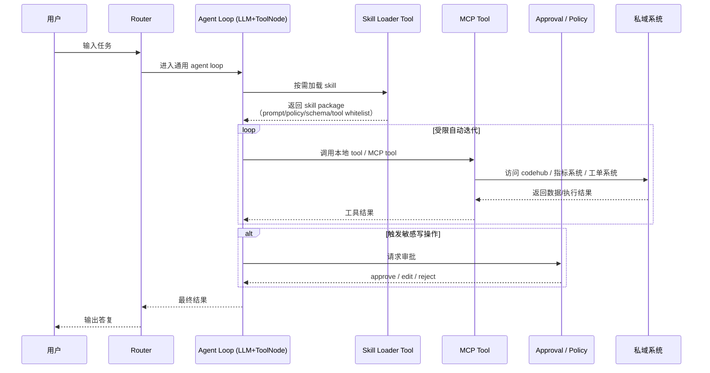

可以，下面这版就是你前面讨论的那种：**通用 agent 底座 + skill + MCP tool**。
它符合现在比较主流的职责分层：**LangGraph 负责编排与治理，skills 负责按需加载专业上下文，MCP tools 负责连接私域系统和执行外部动作。** LangGraph 官方把重点放在 orchestration、durable execution、human-in-the-loop；LangChain 的 skills 模式强调“单个 agent 保持控制，只在需要时加载 specialized prompts and knowledge”；MCP 的 tools 则是可被模型发现和调用的标准化外部能力，同时强调授权与人工控制。 ([LangChain文档][1])

## 分层架构图

```mermaid
flowchart TB
    U[用户 / 上层应用 / API]

    subgraph L1[通用 Agent 底座]
        R[Router<br/>意图识别 / 任务归类]
        A[Agent Loop<br/>LLM + ToolNode]
        F[Finalize<br/>结果整理 / 输出]
    end

    subgraph L2[Skill 层]
        SC[Skill Catalog<br/>skill 清单 / 元数据]
        SL[Skill Loader Tool<br/>按需加载 skill]
        SP[Skill Package<br/>prompt / policy / output schema / tool whitelist]
    end

    subgraph L3[私域工具层]
        LT[Local Tools<br/>本地业务工具<br/>(含 SkillManager)]
        MT[MCP Tools<br/>标准 MCP 工具]
    end

    subgraph L4[私域系统 / 数据源]
        CH[CodeHub / Git / CR 平台]
        BI[指标系统 / 数仓 / BI]
        TK[工单 / 运维 / Wiki / 其他内部系统]
    end

    subgraph L0[平台治理层]
        ST[State / Memory / Checkpoint]
        AU[Auth / Tool Policy / Whitelist]
        AP[Approval / HITL / Interrupt]
        OB[Observability / Trace / Audit Log]
    end

    U --> R
    R --> A
    A --> F

    A --> SL
    SL --> SC
    SL --> SP
    SP -.影响当前回合.-> A

    A --> LT
    A --> MT

    LT --> TK
    MT --> CH
    MT --> BI
    MT --> TK

    R -.读写.-> ST
    A -.读写.-> ST
    F -.读写.-> ST

    A -.受控于.-> AU
    A -.敏感操作进入.-> AP
    R -.记录.-> OB
    A -.记录.-> OB
    F -.记录.-> OB
```

## 这一层怎么理解

### 1. 通用 Agent 底座

这层尽量不带私域细节，只保留最稳定的共性能力：

* `Router`：判断这是不是代码审查、指标分析、知识问答之类的任务
* `Agent Loop`：LLM 根据当前上下文决定是否调用 tool、调用哪个 tool、何时停止
* `Finalize`：把中间结果整理成最终答复

这就是你前面说的 `router -> agent_loop -> finalize` 底座。它更像通用 agent，而不是某个业务专用流程。LangGraph 的 workflow/agent 文档也把这类“动态决定工具使用”的模式归到 agent。 ([LangChain文档][2])

### 2. Skill 层

这层不是执行器，而是**专业能力包**：

* `Skill Catalog`：有哪些 skill
* `Skill Loader Tool`：在需要时把某个 skill 加载进来
* `Skill Package`：skill 的内容本体，比如

  * 专业提示词
  * 分析规则
  * 输出格式
  * 推荐工具
  * 工具白名单
  * 风险等级

它的意义是：**不为每个业务都重新造一个 agent，只是在同一个 agent 上按需挂载专业上下文。** 这正是 skills 模式的核心。 ([LangChain文档][3])

### 3. 私域工具层

这一层分成两类：

* `Local Tools`：本地 Python/服务内工具
  - **SkillManager**: 作为统一入口管理所有 Skill，LLM 通过 `skill_manager(skill_name, args)` 调用
  - **其他本地工具**: 状态处理、规则计算、数据清洗等内部逻辑
* `MCP Tools`：标准 MCP 工具，适合接入 codehub、指标系统、工单系统、知识库等外部能力

**设计要点**：SkillManager 作为一个本地工具，内部管理所有 Skill。这种设计的优势：
1. **工具列表稳定** - 不因 Skill 数量变化而膨胀
2. **动态扩展** - 可以热加载新 Skill 而不需要重新注册工具
3. **统一入口** - 便于添加日志、监控、缓存等横切关注点

MCP 的价值在于：把外部系统能力标准化成工具，让模型可以发现和调用。 ([Model Context Protocol][4])

### 4. 平台治理层

这一层虽然不直接参与业务逻辑，但非常关键：

* `State / Memory / Checkpoint`：保存上下文和中间结果
* `Auth / Tool Policy / Whitelist`：限制当前 skill 能看到哪些工具
* `Approval / HITL / Interrupt`：写操作、危险操作前做人审
* `Observability / Audit`：记录 trace、工具调用、审计日志

LangGraph 官方把 durable execution、memory、human-in-the-loop 作为核心能力；MCP 也强调授权与用户控制。 ([LangChain文档][1])

---

## 运行时流程图

下面这张图更像“实际一次请求是怎么跑的”。



---

## 这套架构的设计原则

### 底座尽量通用

不要把“代码审查”“查指标”“提交工单”分别做成三套 agent 主流程。
主流程尽量统一成：

`router -> agent_loop -> finalize`

### skill 只放“领域差异”

skill 里主要放：

* 专业提示
* 分析策略
* 输出 schema
* 推荐工具
* 风险策略

不要把太多平台治理逻辑塞进 skill。

### tool 只放“可执行动作”

tool 里主要放：

* 查数据
* 读 diff
* 写评论
* 提交工单
* 搜索知识库

### 治理放在底座外层

像这些事最好永远不要只靠 skill 文本约束：

* 工具白名单
* 最大步数
* 提交前审批
* 审计与日志
* 权限注入

---

## 你可以直接照这个分工来落地

### Agent 底座负责

* Router
* Agent loop
* Checkpoint / state
* Approval / interrupt
* Observability

### Skill 负责

* 领域 prompt
* 领域规则
* 输出模板
* 工具使用建议
* 工具白名单声明

### MCP tool 负责

* 连 codehub
* 连指标系统
* 连工单系统
* 连 wiki / 内部 API

---

## 一句总结

**这套分层的核心就是：用通用 agent 底座承载共性执行逻辑，用 skill 注入私域认知，用 MCP tool 接入私域动作能力。** 这样既能保持底座通用，又能把你的业务能力持续扩展进去。 ([LangChain文档][1])

我也可以继续给你补一张 **“代码审查场景” 映射到这张通用架构图上的实例图**。

[1]: https://docs.langchain.com/oss/python/langgraph/overview?utm_source=chatgpt.com "LangGraph overview - Docs by LangChain"
[2]: https://docs.langchain.com/oss/python/langgraph/workflows-agents?utm_source=chatgpt.com "Workflows and agents"
[3]: https://docs.langchain.com/oss/python/langchain/multi-agent/skills?utm_source=chatgpt.com "Skills - Docs by LangChain"
[4]: https://modelcontextprotocol.io/specification/2025-06-18/server/tools?utm_source=chatgpt.com "Tools"
