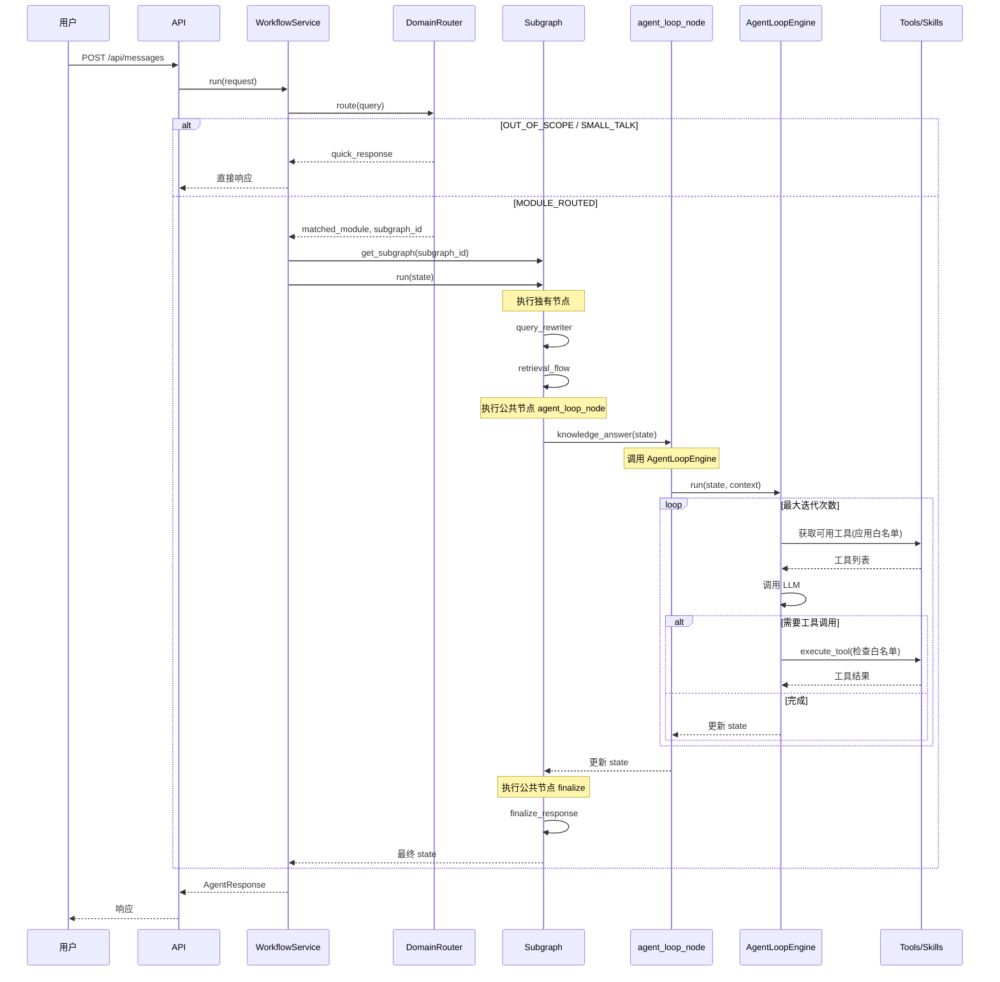

# Agent Loop 嵌入模式架构设计

## 1. 概述

### 1.1 设计目标

将 Agent Loop 设计为可嵌入的 LLM 节点，支持在专属 Workflow 中复用，实现：

1. **流程可控**：关键步骤（如检索）按固定顺序执行
2. **权限隔离**：不同 Subgraph 有不同的 tool/skill 白名单
3. **复用性**：Agent Loop 作为公共节点嵌入到任意 Subgraph
4. **渐进式升级**：可逐步将 v1 节点升级为 Agent Loop 模式

### 1.2 核心理念

```
┌─────────────────────────────────────────────────────────────────────────────┐
│                          设计核心理念                                        │
├─────────────────────────────────────────────────────────────────────────────┤
│                                                                              │
│   Agent Loop 是一个公共节点，可被多个 Subgraph 复用                          │
│                                                                              │
│   ┌─────────────┐     ┌─────────────────────────────────────────────────┐   │
│   │   Router    │ ──▶ │              Workflow Engine                    │   │
│   │  (规则层)   │     │  ┌─────────────────────────────────────────┐    │   │
│   └─────────────┘     │  │ Fixed Node → Agent Loop → Fixed Node    │    │   │
│                       │  │         ↑                               │    │   │
│                       │  │   (来自 common_nodes)                    │    │   │
│                       │  └─────────────────────────────────────────┘    │   │
│                       │              ↓                                   │   │
│                       │         tool/skill 约束                          │   │
│                       └─────────────────────────────────────────────────┘   │
│                                                                              │
└─────────────────────────────────────────────────────────────────────────────┘
```

---

## 2. 架构设计

### 2.1 整体架构图

```
┌─────────────────────────────────────────────────────────────────────────────┐
│                              用户 / API                                      │
└─────────────────────────────────────────────────────────────────────────────┘
                                      │
                                      ▼
┌─────────────────────────────────────────────────────────────────────────────┐
│                           Workflow 入口层                                    │
│  ┌───────────────────────────────────────────────────────────────────────┐  │
│  │                         WorkflowService                                │  │
│  │  - 请求预处理                                                          │  │
│  │  - 路由决策 (DomainRouter)                                             │  │
│  │  - Subgraph 编排                                                       │  │
│  └───────────────────────────────────────────────────────────────────────┘  │
└─────────────────────────────────────────────────────────────────────────────┘
                                      │
         ┌────────────────────────────┼────────────────────────────┐
         │                            │                            │
         ▼                            ▼                            ▼
┌─────────────────┐       ┌─────────────────────┐       ┌─────────────────┐
│  control_response │       │  knowledge_qa_flow  │       │ issue_analysis  │
│   (控制响应)      │       │   (知识问答流程)     │       │   (问题分析)    │
│                  │       │                      │       │                 │
│ - out_of_scope   │       │ - query_rewriter    │       │ - load_context  │
│ - finalize ◀─────┼───────│ - retrieval_flow    │       │ - agent_loop ◀──┼──┐
│                  │       │ - agent_loop ◀──────┼───────│ - finalize ◀────┼──┤
│                  │       │ - finalize ◀────────┼───────│                 │  │
└─────────────────┘       └─────────────────────┘       └─────────────────┘  │
         │                            │                            │          │
         │                            │                            │          │
         └────────────────────────────┼────────────────────────────┘          │
                                      │                                       │
                                      ▼                                       │
┌─────────────────────────────────────────────────────────────────────────────┐
│                           Common Nodes (公共节点)                            │
│  ┌─────────────┐  ┌─────────────┐  ┌─────────────┐  ┌─────────────┐         │
│  │finalize_node│  │out_of_scope │  │agent_loop   │  │evidence_    │         │
│  │             │  │_node        │  │_node ◀──────┼───────────────────────────┘
│  │             │  │             │  │             │  │merger      │         │
│  └─────────────┘  └─────────────┘  └─────────────┘  └─────────────┘         │
│                                         │                                    │
└─────────────────────────────────────────┼───────────────────────────────────┘
                                          │
                                          ▼
┌─────────────────────────────────────────────────────────────────────────────┐
│                         Agent Loop Engine 核心层                             │
│  ┌───────────────────────────────────────────────────────────────────────┐  │
│  │                         AgentLoopEngine                               │  │
│  │  ┌─────────────┐  ┌─────────────┐  ┌─────────────┐  ┌─────────────┐  │  │
│  │  │  Tool 模块  │  │  Skill 模块 │  │   LLM 模块  │  │  约束模块   │  │  │
│  │  │  Registry   │  │  Registry   │  │   Client    │  │  Whitelist  │  │  │
│  │  └─────────────┘  └─────────────┘  └─────────────┘  └─────────────┘  │  │
│  └───────────────────────────────────────────────────────────────────────┘  │
└─────────────────────────────────────────────────────────────────────────────┘
                                          │
                                          ▼
┌─────────────────────────────────────────────────────────────────────────────┐
│                              基础设施层                                      │
│  ┌───────────────┐  ┌───────────────┐  ┌───────────────┐  ┌──────────────┐  │
│  │ State/Memory  │  │ MCP Client    │  │ Observability │  │    Skills    │  │
│  │ Checkpoint    │  │ Tool Adapter  │  │ Trace/Audit   │  │   Loader     │  │
│  └───────────────┘  └───────────────┘  └───────────────┘  └──────────────┘  │
└─────────────────────────────────────────────────────────────────────────────┘
```

### 2.2 核心组件职责

| 组件 | 目录 | 职责 |
|------|------|------|
| **WorkflowService** | `src/workflow/service.py` | 系统入口，路由决策，Subgraph 编排 |
| **Subgraph** | `src/workflow/subgraph/` | 特定场景的子图（knowledge_qa、issue_analysis） |
| **CommonNodes** | `src/workflow/common_nodes/` | 公共节点（finalize、agent_loop_node 等） |
| **AgentLoopEngine** | `src/agent/engine.py` | Agent Loop 核心引擎（被 agent_loop_node 调用） |
| **ToolRegistry** | `src/agent/tools/` | 工具注册和管理 |
| **SkillRegistry** | `src/agent/skills/` | 技能注册和管理（从 workflow/skills 迁移） |
| **LLMClient** | `src/agent/core/llm_client.py` | LLM 客户端（从 workflow/llm 迁移） |
| **Retrievers** | `src/retrievers/` | 检索器（Wiki、代码，共享） |
| **Session** | `src/session/` | 会话存储（共享） |
| **Observability** | `src/observability/` | 可观测性（共享） |

### 2.3 组件关系图

```
┌─────────────────────────────────────────────────────────────────────────────┐
│                            组件依赖关系                                      │
├─────────────────────────────────────────────────────────────────────────────┤
│                                                                              │
│   WorkflowService                                                            │
│        │                                                                     │
│        ├── DomainRouter (规则路由)                                           │
│        │                                                                     │
│        ├── SubgraphRegistry (子图注册中心)                                    │
│        │        │                                                            │
│        │        ├── KnowledgeQAEngine                                        │
│        │        │        │                                                   │
│        │        │        ├── 独有节点 (nodes/)                               │
│        │        │        │                                                   │
│        │        │        └── CommonNodes ─────────────────┐                 │
│        │        │                                          │                 │
│        │        └── IssueAnalysisEngine                    │                 │
│        │                 │                                 │                 │
│        │                 ├── 独有节点 (nodes/)              │                 │
│        │                 │                                 │                 │
│        │                 └── CommonNodes ─────────────────┤                 │
│        │                                                   │                 │
│        └── CommonNodes ────────────────────────────────────┘                 │
│                 │                                                            │
│                 ├── finalize_node                                            │
│                 ├── out_of_scope_node                                        │
│                 ├── evidence_merger                                          │
│                 │                                                            │
│                 └── agent_loop_node ◀─────────────────────┐                 │
│                          │                                │                  │
│                          ▼                                │                  │
│                 AgentLoopEngine ◀─────────────────────────┘                  │
│                          │                                                   │
│                          ├── ToolRegistry                                    │
│                          ├── SkillRegistry                                   │
│                          └── LLMClient                                       │
│                                                                              │
└─────────────────────────────────────────────────────────────────────────────┘
```

---

## 3. 目录结构设计

### 3.1 完整目录结构

```
src/
├── workflow/                           # Workflow 层（系统入口）
│   ├── __init__.py
│   ├── service.py                      # WorkflowService（入口服务）
│   ├── engine.py                       # WorkflowEngine（LangGraph 主图编排）
│   ├── state.py                        # WorkflowState（状态定义）
│   ├── router.py                       # DomainRouter（规则路由）
│   │
│   ├── subgraph/                       # Subgraph 子图目录
│   │   ├── __init__.py
│   │   ├── base.py                     # BaseSubgraph（子图基类）
│   │   ├── registry.py                 # SubgraphRegistry（子图注册中心）
│   │   │
│   │   ├── knowledge_qa/               # 知识问答场景
│   │   │   ├── __init__.py
│   │   │   ├── config.py               # KnowledgeQAConfig（配置定义）
│   │   │   ├── engine.py               # KnowledgeQAEngine（子图引擎）
│   │   │   │
│   │   │   └── nodes/                  # 知识问答独有节点
│   │   │       ├── __init__.py
│   │   │       ├── query_rewriter.py   # 查询重写节点
│   │   │       └── retrieval_flow.py   # 检索流程节点
│   │   │
│   │   └── issue_analysis/             # 问题分析场景
│   │       ├── __init__.py
│   │       ├── config.py               # IssueAnalysisConfig（配置定义）
│   │       ├── engine.py               # IssueAnalysisEngine（子图引擎）
│   │       │
│   │       └── nodes/                  # 问题分析独有节点
│   │           ├── __init__.py
│   │           └── context_loader.py   # 上下文加载节点
│   │
│   ├── common_nodes/                   # 公共节点
│   │   ├── __init__.py
│   │   ├── finalize_response.py        # 结果整理节点
│   │   ├── out_of_scope_response.py    # 超范围响应节点
│   │   ├── evidence_merger.py          # 证据合并节点
│   │   │
│   │   └── agent_loop_node/            # 【关键】Agent Loop 节点
│   │       ├── __init__.py             # 导出 create_agent_loop_node
│   │       ├── node.py                 # 节点实现
│   │       └── context.py              # NodeExecutionContext
│   │
│   ├── retrievers/                     # 检索器
│   │   ├── __init__.py
│   │   ├── wiki_retriever.py
│   │   └── code_retriever.py
│   │
│   ├── common/                         # 通用工具
│   │   ├── __init__.py
│   │   ├── domain_profile.py
│   │   ├── evidence.py
│   │   └── func_utils.py
│   │
│   ├── llm/                            # LLM 客户端
│   │   ├── __init__.py
│   │   ├── llm_client.py
│   │   └── llm_prompt_utils.py
│   │
│   ├── session/                        # 会话存储
│   │   └── ...
│   │
│   └── observability/                  # 可观测性
│       └── ...
│
├── agent/                              # Agent Loop 核心引擎层
│   ├── __init__.py
│   ├── engine.py                       # AgentLoopEngine（核心引擎）
│   ├── state.py                        # AgentLoopState（状态定义）
│   ├── config.py                       # AgentLoopConfig（配置定义）
│   │
│   ├── core/                           # 核心模块
│   │   ├── __init__.py
│   │   ├── executor.py                 # LoopExecutor（循环执行器）
│   │   ├── tool_caller.py              # ToolCaller（工具调用器）
│   │   └── prompt_builder.py           # PromptBuilder（提示词构建器）
│   │
│   ├── tools/                          # 工具管理
│   │   ├── __init__.py
│   │   ├── registry.py                 # ToolRegistry
│   │   ├── base.py                     # BaseTool
│   │   └── local_tools.py              # 本地工具实现
│   │
│   ├── skills/                         # 技能管理
│   │   ├── __init__.py
│   │   ├── base.py                     # Skill
│   │   ├── registry.py                 # SkillRegistry
│   │   ├── loader.py                   # SkillLoader
│   │   ├── executor.py                 # SkillExecutor
│   │   └── manager.py                  # SkillManager
│   │
│   └── mcp/                            # MCP 集成
│       ├── __init__.py
│       ├── client.py                   # MCPClient
│       └── tool_adapter.py             # MCPToolAdapter
│
├── api/                                # API 层
│   └── main.py
│
└── bootstrap/                          # 启动引导
    └── ...
```

### 3.2 目录职责说明

| 目录 | 职责 | 说明 |
|------|------|------|
| `workflow/subgraph/` | 场景子图 | 特定场景的完整流程封装 |
| `workflow/subgraph/*/nodes/` | 独有节点 | 场景特定的节点实现 |
| `workflow/common_nodes/` | 公共节点 | 可被多个 Subgraph 复用的节点 |
| `workflow/common_nodes/agent_loop_node/` | Agent Loop 节点 | **核心**：可配置的 LLM 节点 |
| `agent/` | 核心引擎 | Agent Loop 执行逻辑（被节点调用） |

---

## 4. 核心设计

### 4.1 agent_loop_node 设计

`agent_loop_node` 是一个**公共节点基类**，位于 `common_nodes/agent_loop_node/`，提供 LLM + Skill 调用的基础能力。

`knowledge_answer` 和 `issue_analysis` 继承此基类，定制场景特定的提示词、校验和 Fallback 逻辑。

详细设计见：[agent_loop_node_refactor.md](./agent_loop_node_refactor.md)

```python
# 继承关系
BaseAgentLoopNode (common_nodes/agent_loop_node/base.py)
    ├── KnowledgeAnswerNode (nodes/analysis/knowledge_answer/node.py)
    └── IssueAnalysisNode (nodes/analysis/issue_analysis/node.py)
```

**启动时初始化**：组件在 WorkflowEngine 构造时完成初始化，避免延迟初始化。

```python
# src/workflow/engine.py

class WorkflowEngine:
    def __init__(self):
        # 1. 初始化 LLM 客户端
        self._llm_client = self._init_llm_client()

        # 2. 初始化 Skill 组件（启动时完成）
        self._skill_registry, self._skill_executor = self._init_skill_components()

        # 3. 初始化节点（注入依赖）
        self._nodes = self._init_nodes()
```

### 4.2 Subgraph 使用 agent_loop_node

```python
# src/workflow/subgraph/knowledge_qa/engine.py

from langgraph.graph import StateGraph
from workflow.subgraph.base import BaseSubgraph
from workflow.common_nodes.agent_loop_node import create_agent_loop_node, NodeExecutionContext
from workflow.common_nodes.finalize_response import run as finalize_response


class KnowledgeQAEngine(BaseSubgraph):
    """知识问答子图引擎"""

    def _build_graph(self) -> StateGraph:
        graph = StateGraph(dict)

        # 获取节点
        nodes = self.get_nodes()

        # 添加节点
        for node_name in self.config.nodes:
            graph.add_node(node_name, nodes[node_name])

        # 添加边
        node_list = self.config.nodes
        for i in range(len(node_list) - 1):
            graph.add_edge(node_list[i], node_list[i + 1])

        # 设置入口和出口
        graph.set_entry_point(node_list[0])
        graph.set_finish_point(node_list[-1])

        return graph.compile()

    def get_nodes(self) -> dict:
        """获取所有节点"""
        # 1. 独有节点
        from .nodes.query_rewriter import run as query_rewriter
        from .nodes.retrieval_flow import run as retrieval_flow

        # 2. 创建 agent_loop_node（公共节点）
        knowledge_answer_node = create_agent_loop_node(
            engine=self.agent_loop_engine,
            node_name="knowledge_answer",
            context=NodeExecutionContext(
                tool_whitelist=self.config.available_tools,
                skill_whitelist=self.config.available_skills,
                system_prompt_append=self.config.node_configs.get("knowledge_answer", {}).get(
                    "system_prompt_append"
                ),
                max_iterations=self.config.node_configs.get("knowledge_answer", {}).get(
                    "max_iterations", 3
                ),
                inject_evidence=True,
                output_format="markdown",
            )
        )

        return {
            # 独有节点
            "query_rewriter": query_rewriter,
            "retrieval_flow": retrieval_flow,
            # 公共节点
            "knowledge_answer": knowledge_answer_node,
            "finalize_response": finalize_response,
        }
```

### 4.3 三层约束机制

```
┌─────────────────────────────────────────────────────────────────────────────┐
│                           约束机制层次图                                     │
├─────────────────────────────────────────────────────────────────────────────┤
│                                                                              │
│   第 1 层：全局约束（ToolRegistry / SkillRegistry）                          │
│   ┌─────────────────────────────────────────────────────────────────────┐   │
│   │  所有已注册的工具和技能的超集                                          │   │
│   └─────────────────────────────────────────────────────────────────────┘   │
│                                    │                                        │
│                                    ▼                                        │
│   第 2 层：Subgraph 约束（场景级）                                           │
│   ┌─────────────────────────────────────────────────────────────────────┐   │
│   │  knowledge_qa:                                                       │   │
│   │    available_tools: [skill_manager, code_retriever, wiki_search]     │   │
│   │    available_skills: [query_code, query_wiki]                        │   │
│   └─────────────────────────────────────────────────────────────────────┘   │
│                                    │                                        │
│                                    ▼                                        │
│   第 3 层：Node 约束（节点级）                                               │
│   ┌─────────────────────────────────────────────────────────────────────┐   │
│   │  create_agent_loop_node(context=NodeExecutionContext(               │   │
│   │      tool_whitelist=[...],     # 继承 Subgraph，可进一步收窄         │   │
│   │      skill_whitelist=[...],    # 继承 Subgraph，可进一步收窄         │   │
│   │  ))                                                                  │   │
│   └─────────────────────────────────────────────────────────────────────┘   │
│                                                                              │
└─────────────────────────────────────────────────────────────────────────────┘
```

---

## 5. 运行时流程

### 5.1 完整请求流程



---

## 6. 配置设计

### 6.1 Domain Profile 扩展

```json
// domain/ad_engine/profile.json
{
  "profile_id": "ad_engine",
  "display_name": "广告引擎",

  "modules": [
    {
      "name": "knowledge-qa",
      "display_name": "知识问答",
      "keywords": ["怎么", "如何", "什么是", "为什么"],
      "route_priority": 10,
      "subgraph": "knowledge_qa"
    },
    {
      "name": "issue-analysis",
      "display_name": "问题分析",
      "keywords": ["报错", "异常", "失败", "排查"],
      "route_priority": 20,
      "subgraph": "issue_analysis"
    }
  ],

  "subgraphs": {
    "knowledge_qa": {
      "available_tools": ["skill_manager", "code_retriever", "wiki_search"],
      "available_skills": ["query_code", "query_wiki"],
      "node_configs": {
        "knowledge_answer": {
          "system_prompt_append": "你是企业知识问答助手...",
          "max_iterations": 3
        }
      }
    },
    "issue_analysis": {
      "available_tools": ["skill_manager", "code_retriever", "metrics_query"],
      "available_skills": ["analyze_error", "query_metrics"],
      "node_configs": {
        "issue_analysis": {
          "system_prompt_append": "你是问题分析专家...",
          "max_iterations": 5
        }
      }
    }
  }
}
```

---

## 7. 实施计划

### 7.1 分阶段实施

| 阶段 | 内容 | 工期 | 产出 |
|------|------|------|------|
| **Phase 1** | 目录结构重组 | 2 天 | 新目录结构 |
| **Phase 2** | AgentLoopEngine 实现 | 3 天 | `agent/engine.py` |
| **Phase 3** | agent_loop_node 实现 | 2 天 | `common_nodes/agent_loop_node/` |
| **Phase 4** | Subgraph 框架实现 | 3 天 | `workflow/subgraph/` |
| **Phase 5** | 集成测试 | 2 天 | 端到端测试用例 |

---

## 8. 总结

### 8.1 核心设计要点

1. **agent_loop_node 是公共节点**：位于 `common_nodes/`，可被多个 Subgraph 复用
2. **AgentLoopEngine 是核心引擎**：位于 `agent/`，被节点调用执行循环
3. **三层约束机制**：全局 → Subgraph → Node
4. **配置驱动**：通过 `profile.json` 定义场景配置

### 8.2 关键 API

| API | 用途 |
|-----|------|
| `create_agent_loop_node()` | 创建 Agent Loop 节点（公共节点） |
| `AgentLoopEngine.run()` | 执行 Agent Loop 循环（核心引擎） |
| `NodeExecutionContext` | 节点执行上下文配置 |
| `SubgraphRegistry.create()` | 创建子图实例 |
