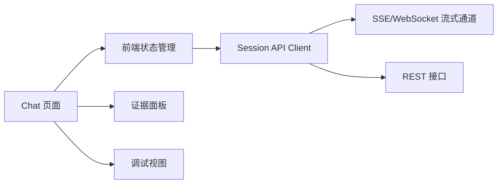

# 接入与 Web 交互子系统设计

## 1. 目标
为用户提供统一的会话式 Web 入口，承载多轮问答、问题分析、澄清补问、证据查看和代码实现确认，并将前端交互状态稳定映射到后端 LangGraph 工作流。

## 2. 职责范围

- 展示会话历史与当前对话线程
- 支持用户输入问题、补充上下文、上传附件或粘贴日志
- 接收并渲染流式回答
- 展示引用证据、命中模块、分析结论、修复建议
- 在“是否需要代码实现”节点向用户发起确认，并兼容用户通过下一轮文本直接确认
- 提供异常提示、超时重试、会话恢复能力

## 3. 架构设计



### 3.1 页面组成

| 区域 | 作用 |
| --- | --- |
| 会话列表区 | 查看历史会话、切换线程、新建会话 |
| 对话主面板 | 展示用户消息、系统回答、流式进度 |
| 证据侧边栏 | 查看引用的 Wiki、案例、代码片段 |
| 分析结果卡片 | 展示模块、根因、方案、风险、置信度 |
| 操作区 | 确认生成代码、补充上下文、复制结果 |
| 调试面板 | 查看 trace_id、耗时、召回源、节点执行情况 |

## 4. 状态机设计

### 4.1 前端会话状态

- `idle`：空闲，等待用户输入
- `submitting`：消息已发送，等待服务端接收
- `routing`：服务端进行领域判定与意图分类
- `clarifying`：等待用户补充环境、报错信息、业务上下文
- `retrieving`：正在检索文档、案例、代码
- `answering`：正在生成回答
- `confirm_code`：等待用户确认是否需要代码实现
- `generating_code`：正在生成补丁或实现建议
- `completed`：本轮完成
- `out_of_scope`：问题被判定为无关
- `error`：发生异常

### 4.2 交互原则

- 流式返回中允许展示阶段性状态，如“已完成代码检索”“已定位候选模块”。
- 若服务端要求澄清，前端以结构化表单或补问气泡展示，而不是简单文本堆叠。
- “生成代码实现”必须作为显式用户操作，不自动进入。
- 当用户未点击按钮而是直接输入“给我代码”“先不用代码”时，前端仍按普通消息发送，由后端工作流做阶段转场。

## 5. API 约定

### 5.1 关键接口

| 接口 | 方法 | 说明 |
| --- | --- | --- |
| `/api/sessions` | `POST` | 新建会话 |
| `/api/sessions/{session_id}` | `GET` | 获取会话与历史消息 |
| `/api/messages` | `POST` | 发送用户消息，支持流式 |
| `/api/messages/{message_id}/confirm-code` | `POST` | 对代码实现请求做确认 |
| `/api/references/{trace_id}` | `GET` | 查询本轮证据详情 |

### 5.2 流式事件

建议定义统一事件协议：

```json
{
  "event": "analysis_progress",
  "trace_id": "trace_123",
  "payload": {
    "stage": "module_localization",
    "message": "已定位 2 个高相关模块"
  }
}
```

常见事件类型：

- `routing_result`
- `clarification_request`
- `retrieval_summary`
- `analysis_progress`
- `answer_chunk`
- `confirm_code`
- `completed`
- `error`

## 6. 前端数据模型

```json
{
  "sessionId": "sess_001",
  "messages": [
    {
      "id": "msg_001",
      "role": "assistant",
      "type": "analysis",
      "status": "confirm_code",
      "content": "初步判断问题位于库存锁定模块。",
      "citations": [],
      "actions": [
        {
          "type": "confirm_code_generation",
          "label": "需要代码实现"
        }
      ]
    }
  ]
}
```

## 7. 关键实现点

### 7.1 流式输出

- 推荐优先使用 `SSE`，实现简单，适合单向事件流。
- 若后续需要更复杂的双向控制，再切换到 `WebSocket`。

### 7.2 证据展示

- 文档证据显示标题、段落摘要、版本号。
- 案例证据显示问题现象、根因摘要、最终方案。
- 代码证据显示文件路径、符号名、代码片段摘要，而不是直接无控制展示大段源码。

### 7.3 调试能力

为方便开发和 Prompt 调优，建议在调试模式下展示：

- `trace_id`
- 命中的路由类型
- 检索源及得分
- 每个节点耗时
- 模型与 token 使用量

## 8. 异常与降级

- 网络抖动时允许断线重连并继续消费流式事件。
- 后端超时则展示阶段性失败信息，并允许“一键重试本轮”。
- 若证据查询失败，主回答可先展示，证据区域单独降级。

## 9. 安全要求

- 接口必须带用户身份信息与项目作用域。
- 前端不直接存储敏感源码全文。
- 调试信息仅对授权用户开放。

## 10. 验收标准

- 支持连续多轮会话与历史恢复
- 支持显示路由、证据、分析结果与代码确认动作
- 支持流式输出与异常重试
- 支持区分知识问答、问题分析和无关问题三种结果
