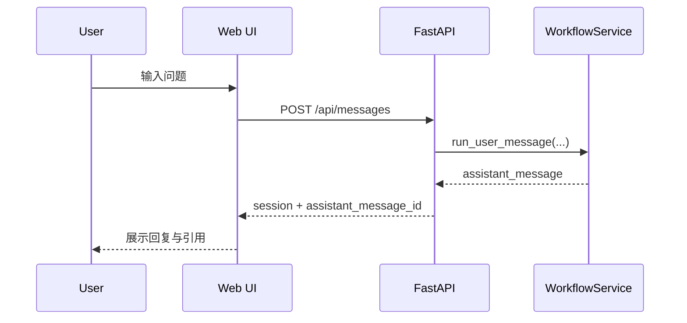

# 01-接入与Web交互子系统设计（按当前实现）

## 1. 角色与边界

该子系统负责：

- Web 会话交互
- FastAPI 接口暴露
- 将用户输入交给 `WorkflowService`
- 返回统一 assistant 消息结构

不负责：

- 业务路由策略
- 检索与分析细节
- 代码修复落库/提交

## 2. 当前接口

- `POST /api/sessions`：创建会话
- `GET /api/sessions`：会话列表
- `GET /api/sessions/{session_id}`：会话详情
- `POST /api/messages`：发送用户消息（主入口）
- `GET /api/references/{trace_id}`：查看证据引用
- `POST /api/messages/{message_id}/feedback`：反馈
- `GET /api/observability/summary`：观测汇总
- `GET /api/observability/alerts`：观测告警

## 3. 消息流



## 4. assistant 消息结构（当前）

```json
{
  "role": "assistant",
  "kind": "knowledge_qa | issue_analysis | code_generation | out_of_scope",
  "intent": "knowledge_qa | issue_analysis | code_generation | out_of_scope",
  "status": "completed | out_of_scope",
  "content": "Markdown 文本",
  "trace_id": "trace_xxx",
  "citations": [],
  "analysis": {},
  "actions": []
}
```

## 5. 关键变更（相对旧方案）

- 已移除 `confirm_code` 交互阶段。
- 已移除 `POST /api/messages/{message_id}/confirm-code` 接口。
- 是否生成代码由每轮用户输入直接决定，不依赖“确认按钮推进”。
