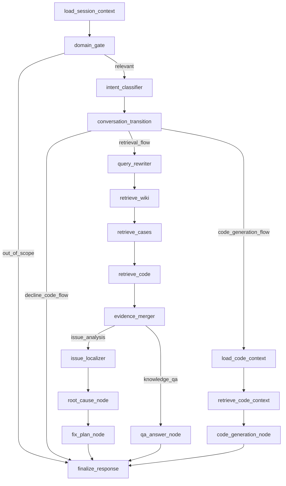

# 智能编排与路由子系统设计

## 1. 目标
基于 LangGraph 构建可控的状态图，负责整个系统的会话编排、领域判定、意图路由、节点执行、中断恢复和最终结果组织。

## 2. 设计原则

- 图状态必须显式可序列化
- 所有分支都必须能解释“为什么这样走”
- 低置信度优先追问，不直接给出强结论
- 需要用户确认的节点必须支持中断和恢复
- `intent` 必须按每轮输入重新判断，不能把整场会话固定成单一类型
- `task_stage` 必须跨轮保存，用于表达当前会话处于问答、分析、确认还是代码实现阶段

## 3. Graph 状态模型

```python
class AgentState(TypedDict):
    session_id: str
    trace_id: str
    user_query: str
    history: list
    route: str
    execution_path: str
    transition_type: str
    task_stage: str
    active_task_stage: str
    active_topic: str
    active_module_name: str
    active_qa_context: dict | None
    active_issue_context: dict | None
    last_analysis_result: dict | None
    pending_action: str
    domain_relevance: float
    retrieval_queries: list
    wiki_hits: list
    case_hits: list
    code_hits: list
    citations: list
    analysis: dict | None
    answer: str
    next_action: str
```

## 4. 节点设计

### 4.1 主节点列表

| 节点 | 作用 |
| --- | --- |
| `load_session_context` | 载入会话历史、摘要记忆、用户上下文 |
| `domain_gate` | 判断输入是否与系统领域相关 |
| `intent_classifier` | 区分知识问答、问题分析、无关输入 |
| `conversation_transition` | 判断当前轮是延续、升级到分析、升级到代码实现，还是切换主题 |
| `query_rewriter` | 生成多路检索查询 |
| `retrieve_wiki` | 检索业务知识 |
| `retrieve_cases` | 检索历史案例 |
| `retrieve_code` | 检索代码与符号 |
| `evidence_merger` | 多源结果去重、融合、重排 |
| `qa_answer_node` | 生成知识问答回答 |
| `issue_localizer` | 定位问题模块 |
| `root_cause_node` | 分析原因并验证证据 |
| `fix_plan_node` | 输出修复方案、验证项，并把状态推进到 `confirm_code` |
| `code_generation_node` | 生成补丁、伪代码或实现建议 |
| `finalize_response` | 组织统一结构输出 |

### 4.2 图结构



## 5. 路由策略

### 5.1 领域判定

建议采用双层机制：

1. `轻量过滤`：关键词词典、模块词表、向量粗召回。
2. `LLM 二判`：结合会话上下文判断是否属于系统业务、代码、运维、历史案例相关问题。

若两层都低置信，则直接走 `out_of_scope`；若冲突，则进入澄清节点。

### 5.2 意图分类

输出固定枚举：

- `knowledge_qa`
- `issue_analysis`
- `out_of_scope`

禁止在下游节点重复自由判断，避免链路漂移。

### 5.3 多轮转场机制

`conversation_transition` 节点负责把“本轮意图”和“上一轮阶段”拼起来判断真正执行路径。

典型场景包括：

- `start_knowledge_qa`
- `continue_knowledge_qa`
- `upgrade_from_qa_to_issue_analysis`
- `continue_issue_analysis`
- `upgrade_to_code_generation`
- `code_request_without_analysis`
- `switch_topic`

其中最重要的约束是：

- 文本里即便明确提出“给我代码”，如果没有前置分析结果，也不能直接进 `code_generation`
- 必须先回到 `issue_analysis`，补齐模块定位、根因和修复方案

### 5.4 澄清机制

在以下情况触发澄清：

- 问题分析缺少报错信息、业务场景、影响范围
- 知识问答缺少限定条件
- 会话中的代词指代不明

追问最多 2 轮，超限后给出“基于当前信息的保守结论”。

## 6. 输出结构标准化

### 6.1 知识问答输出

```json
{
  "intent": "knowledge_qa",
  "answer": "……",
  "citations": [],
  "confidence": 0.86,
  "next_action": "completed"
}
```

### 6.2 问题分析输出

```json
{
  "intent": "issue_analysis",
  "answer": "……",
  "analysis": {
    "module": "settlement-engine",
    "root_cause": "……",
    "fix_plan": [],
    "risks": [],
    "verification_steps": [],
    "task_stage": "confirm_code",
    "transition_type": "upgrade_from_qa_to_issue_analysis"
  },
  "citations": [],
  "next_action": "confirm_code"
}
```

## 7. 中断与恢复

`confirm_code_node` 必须支持持久化挂起：

- 将当前 `AgentState` 序列化到状态存储
- 返回 `next_action=confirm_code`
- 用户确认后以 `resume` 方式从该节点继续

这正是 LangGraph 相比简单链路的关键价值。

同时为了兼容自然对话，系统还应支持另一种恢复方式：

- 用户不点按钮，而是在下一轮直接输入“给我代码实现”
- 工作流从 `last_analysis_result` 恢复，并进入 `code_generation_flow`
- 若用户输入“先不用代码”，则输出控制型响应并结束当前升级链路

## 8. 失败处理

- 某一路检索失败时，不中断全图，标记降级并继续。
- 模型调用失败可按节点重试，避免整轮重跑。
- 若多次重试仍失败，统一走 `finalize_response` 输出可解释失败信息。

## 9. 可观测性要求

每个节点都必须记录：

- 开始时间和结束时间
- 输入摘要与输出摘要
- 模型与 token 使用量
- 命中证据数量
- 异常与重试次数

## 10. 验收标准

- 能稳定区分三类输入
- 支持多轮转场、中断、恢复
- 输出结构统一，便于前端渲染
- 任一节点失败不导致整条链路不可用
