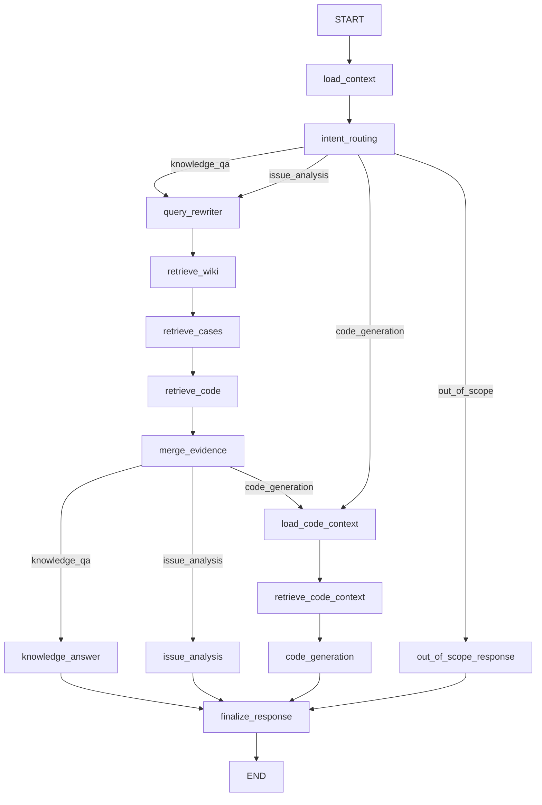

# 02-智能编排与路由子系统设计（按当前实现）

## 1. 设计目标

- 每轮重新判断用户意图
- 在统一图中编排检索、分析、代码建议
- 对多源证据做统一融合
- 统一输出 assistant 消息

## 2. 当前图结构

## 3. 节点分层

- 路由层：`load_context`、`intent_routing`
- 检索层：`query_rewriter`、`retrieve_wiki`、`retrieve_cases`、`retrieve_code`、`merge_evidence`
- 任务层：`knowledge_answer`、`issue_analysis`、`load_code_context`、`retrieve_code_context`、`code_generation`
- 响应层：`out_of_scope_response`、`finalize_response`

## 4. 路由判定

`intent_routing` 输出以下之一：

- `knowledge_qa`
- `issue_analysis`
- `code_generation`
- `out_of_scope`

判定依据：

- 领域相关性（domain gate profile）
- 文本信号（问答 / 故障 / 代码请求）
- 上下文（是否有最近分析结果）

## 5. WorkflowState（当前）

当前保留字段（摘录）：

- 会话：`trace_id`、`session_id`、`user_query`、`history`
- 路由：`route`、`status`、`response_kind`、`domain_relevance`
- 上下文：`module_name`、`module_hint`、`active_module_name`、`active_topic_source`
- 分析记忆：`last_analysis_result`、`last_analysis_citations`
- 检索：`retrieval_queries`、`retrieval_plan`、`wiki_hits`、`case_hits`、`code_hits`、`citations`
- 结果：`analysis`、`answer`、`assistant_message`、`node_trace`

## 6. 已移除机制

以下机制不再用于路由或状态推进：

- `task_stage`
- `transition_type`
- `execution_path`
- `next_action`
- `active_task_stage`
- `pending_action`
- `confirm_code` 阶段

## 7. 关键实现文件

- 图定义：`src/workflow/engine.py`
- 路由：`src/workflow/nodes/routing_context/intent_routing/__init__.py`
- 上下文：`src/workflow/nodes/routing_context/load_context/__init__.py`
