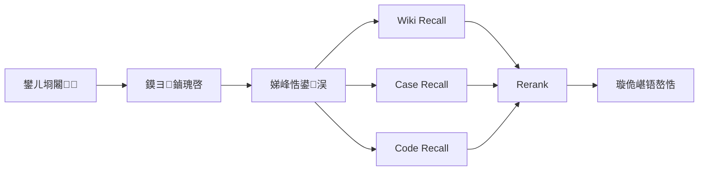

# 鐭ヨ瘑涓庝唬鐮佹绱㈠瓙绯荤粺璁捐

## 1. 鐩爣
涓虹煡璇嗛棶绛斿拰闂鍒嗘瀽鎻愪緵缁熶竴鐨勫婧愭绱㈣兘鍔涳紝瑕嗙洊 Wiki銆佸巻鍙叉渚嬪拰浠ｇ爜浠擄紝纭繚鍙洖缁撴灉鏃㈢浉鍏冲張鍙拷婧€?
## 2. 鏁版嵁婧愬垎绫?
| 鏁版嵁婧?| 鍐呭鐗圭偣 | 涓昏鐢ㄩ€?|
| --- | --- | --- |
| Wiki | 缁撴瀯娓呮櫚銆佸亸涓氬姟瀹氫箟鍜岃鍒?| 涓氬姟闂瓟銆佹湳璇В閲娿€佹祦绋嬭鏄?|
| 鍘嗗彶妗堜緥 | 鎻忚堪鏁呴殰鐜拌薄銆佸師鍥犮€佷慨澶嶅拰楠岃瘉 | 鐩镐技闂绫绘瘮銆佷慨澶嶇粡楠屽鐢?|
| 浠ｇ爜浠?| 瀹炵幇缁嗚妭銆侀厤缃€佽皟鐢ㄥ叧绯?| 妯″潡瀹氫綅銆佸疄鐜板垎鏋愩€佹柟妗堢害鏉?|

## 3. 鎬讳綋鏋舵瀯



## 4. 绱㈠紩璁捐

### 4.1 Wiki 绱㈠紩

- 鍒囧潡绮掑害锛氭寜鏍囬銆佷簩绾ф爣棰樸€佽涔夋钀?- 鍏冩暟鎹細鏂囨。鏍囬銆佺煡璇嗗垎绫汇€佹爣绛俱€佺増鏈€佹洿鏂版椂闂?- 妫€绱㈡柟寮忥細鍚戦噺 + BM25

### 4.2 鍘嗗彶妗堜緥绱㈠紩

寤鸿灏嗘渚嬫媶涓虹粨鏋勫寲瀛楁锛?
- 闂鐜拌薄
- 褰卞搷鑼冨洿
- 鏍瑰洜
- 淇鏂规
- 楠岃瘉姝ラ
- 鍏宠仈妯″潡

杩欐牱鍙互璁┾€滄寜鐜拌薄鎵惧師鍥犫€濆拰鈥滄寜妯″潡鎵炬渚嬧€濋兘鍏峰杈冨ソ鏁堟灉銆?
### 4.3 浠ｇ爜绱㈠紩

浠ｇ爜绱㈠紩涓嶈兘鍙仛鏂囨湰鍒囧潡锛岃嚦灏戝簲鍖呭惈涓夊眰淇℃伅锛?
1. `鏂囦欢绾х储寮昤锛氭枃浠惰矾寰勩€佺洰褰曘€佽瑷€銆佹ā鍧楀綊灞?2. `绗﹀彿绾х储寮昤锛氱被銆佸嚱鏁般€佹柟娉曘€侀厤缃」銆丼QL銆佸父閲?3. `鍏崇郴绾х储寮昤锛氳皟鐢ㄩ摼銆佸紩鐢ㄩ摼銆佸鍏ュ叧绯汇€侀厤缃緷璧?
### 4.4 浠ｇ爜鍏冩暟鎹缓璁?
| 瀛楁 | 璇存槑 |
| --- | --- |
| `repo` | 浠撳簱鍚?|
| `branch` | 鍒嗘敮鎴栫増鏈?|
| `path` | 鏂囦欢璺緞 |
| `language` | 璇█ |
| `module` | 涓氬姟妯″潡 |
| `symbol_name` | 绗﹀彿鍚?|
| `symbol_type` | class/function/config/sql |
| `signature` | 鏂规硶绛惧悕 |
| `neighbors` | 璋冪敤/寮曠敤閭诲眳 |

## 5. 妫€绱㈡祦绋?
### 5.1 鏌ヨ鏀瑰啓

鏍规嵁鎰忓浘绫诲瀷鐢熸垚妫€绱㈣鍙ワ細

- 瀵圭煡璇嗛棶绛旓紝鎻愬彇涓氬姟鏈銆侀檺瀹氭潯浠躲€佸悓涔夎瘝銆?- 瀵归棶棰樺垎鏋愶紝鎻愬彇鎶ラ敊鍏抽敭璇嶃€佹ā鍧楀悕銆侀厤缃」銆佸叧閿棩蹇椼€?- 瀵逛唬鐮佹绱紝琛ュ厖绫诲悕銆佸嚱鏁板悕銆佹枃浠跺悕銆佸紓甯哥爜绛夌壒寰併€?
### 5.2 娣峰悎鍙洖

姣忕被鏁版嵁婧愯嚦灏戝悓鏃惰繘琛岋細

- 鍚戦噺鍙洖
- 鍏抽敭璇嶅彫鍥?- 鍏冩暟鎹繃婊?
### 5.3 閲嶆帓绛栫暐

鍙寜浠ヤ笅缁村害鎵撳垎锛?
- 鏌ヨ璇箟鐩镐技搴?- 鍏抽敭璇嶇簿纭懡涓害
- 涓庡綋鍓嶄細璇濅富棰樹竴鑷存€?- 鏁版嵁婧愭潈閲?- 缁撴瀯鍖栧瓧娈靛尮閰嶇▼搴?
### 5.4 铻嶅悎绛栫暐

铻嶅悎鏃堕伒寰細

- 鍚屼竴鏂囦欢銆佸悓涓€妗堜緥鍘婚噸
- 鍚屾ā鍧楄瘉鎹仛绫?- 浼樺厛淇濈暀楂樹俊鎭瘑搴︾墖娈?- 鎺у埗鏈€缁堟敞鍏ヤ笂涓嬫枃闀垮害

## 6. 閽堝闂鍒嗘瀽鐨勫寮烘绱?
### 6.1 鐥囩姸椹卞姩鍙洖

浠庣敤鎴烽棶棰樹腑鎻愬彇锛?
- 鎶ラ敊淇℃伅
- 鐜拌薄鎻忚堪
- 褰卞搷瀵硅薄
- 鍙戠敓鏃舵満
- 鏈€杩戝彉鏇?
鍐嶅垎鍒槧灏勫埌妗堜緥涓庝唬鐮佷腑銆?
### 6.2 妯″潡椹卞姩鍙洖

濡傛灉杈撳叆涓嚭鐜版ā鍧楀悕銆佹帴鍙ｅ悕銆佷换鍔″悕銆佷綔涓氬悕锛屽垯浼樺厛鍋氭ā鍧楄繃婊わ紝缂╁皬鎼滅储绌洪棿銆?
### 6.3 璋冪敤閾炬墿灞?
褰撲唬鐮佸懡涓煇涓叧閿嚱鏁板悗锛屽簲鑷姩鎵╁睍鍏朵笂涓嬫父璋冪敤鐐癸紝甯姪鍒嗘瀽鈥滈棶棰樺湪鍝噷瑙﹀彂鈥濆拰鈥滃奖鍝嶄細浼犲埌鍝噷鈥濄€?
## 7. 缁撴灉杈撳嚭缁撴瀯

```json
{
  "wiki_hits": [],
  "case_hits": [],
  "code_hits": [],
  "top_modules": [
    {
      "module": "pricing",
      "score": 0.88
    }
  ]
}
```

## 8. 鎬ц兘璁捐

- 鐑棬闂涓庨珮棰戞ā鍧楃粨鏋滃彲鍋氱紦瀛?- 闀挎枃妗ｅ垏鍧楀悗绂荤嚎璁＄畻 embedding锛岄伩鍏嶅湪绾块樆濉?- 閲嶆帓鍙鐞?TopK 鍊欓€夛紝閬垮厤鎴愭湰澶辨帶
- 浠ｇ爜閭绘帴鎵╁睍闄愬埗娣卞害锛岄伩鍏嶄笂涓嬫枃鐖嗙偢

## 9. 椋庨櫓涓庡绛?
| 椋庨櫓 | 琛ㄧ幇 | 瀵圭瓥 |
| --- | --- | --- |
| 浠ｇ爜鏂囨湰鍣０楂?| 鍙洖鐗囨鏃犳晥 | 澧炲姞绗﹀彿绾х储寮曞拰妯″潡鍏冩暟鎹?|
| Wiki 鍙ｅ緞杩囨棫 | 鍥炵瓟涓庣幇缃戜笉涓€鑷?| 淇濈暀鏇存柊鏃堕棿鍜岀増鏈紝浼樺厛鏂扮増鏈?|
| 妗堜緥缁撴瀯涓嶇粺涓€ | 绫绘瘮鏁堟灉宸?| 寤虹珛妗堜緥缁撴瀯鍖栨ā鏉匡紝琛ュ綍鍏抽敭瀛楁 |
| 妫€绱㈢粨鏋滆繃闀?| 妯″瀷鏃犳硶鑱氱劍 | 鍋氳仛绫诲帇缂╁拰 evidence packing |

## 10. 楠屾敹鏍囧噯

- 涓夌被鏁版嵁婧愬潎鍙嫭绔嬪彫鍥?- 闂鍒嗘瀽鍦烘櫙鑳借繑鍥炲€欓€夋ā鍧?- 妫€绱㈢粨鏋滈檮甯﹀畬鏁存潵婧愪俊鎭?- 鏀寔澧為噺鏇存柊涓庣増鏈爣璇?
## 11. 褰撳墠浠撳簱瀹炵幇锛堝箍鍛婂紩鎿?Wiki 妫€绱級

涓烘墦閫氣€滅湡瀹?Wiki 妫€绱⑩€濊兘鍔涳紝褰撳墠浠撳簱宸茶惤鍦颁互涓嬪疄鐜帮細

### 11.1 鏂囨。璇枡鐩綍

- `domain/ad_engine/wiki/00-骞垮憡寮曟搸鎬讳綋鏋舵瀯.md`
- `domain/ad_engine/wiki/01-鍦ㄧ嚎鍙洖.md`
- `domain/ad_engine/wiki/02-涓ょ巼棰勪及.md`
- `domain/ad_engine/wiki/03-鍑轰环绛栫暐.md`
- `domain/ad_engine/wiki/04-绮炬帓绛栫暐.md`
- `domain/ad_engine/wiki/05-鑱旇皟鎺掗殰鎵嬪唽.md`

### 11.2 浠ｇ爜鎺ュ叆鐐?
- 妫€绱㈠櫒瀹炵幇锛歚workflow/nodes/retrieve_wiki/wiki_retriever.py`
- 浠ｇ爜妫€绱㈠櫒瀹炵幇锛歚workflow/nodes/retrieve_code/code_retriever.py`
- 宸ヤ綔娴佽妭鐐规帴鍏ワ細`workflow/engine.py` 鐨?`retrieve_wiki`
- 宸ヤ綔娴佽妭鐐规帴鍏ワ細`workflow/engine.py` 鐨?`retrieve_code`
- 闂瓟鐢熸垚鎺ュ叆锛歚workflow/nodes/knowledge_answer/llm_qa.py`锛圠LM 浼樺厛锛屽け璐ラ檷绾э級

### 11.3 妫€绱㈡祦绋嬶紙褰撳墠鐗堟湰锛?
1. 鍚姩鏃舵壂鎻?`domain/ad_engine/wiki` 涓嬪叏閮?Markdown 鏂囦欢銆?2. 鎸夋爣棰樺拰娈佃惤鍒囧垎涓哄彲妫€绱?chunk銆?3. 绗竴闃舵鍙洖锛氭牴鎹敤鎴烽棶棰?+ 鏌ヨ鏀瑰啓璇彞鎻愬彇鍏抽敭璇嶅苟鎵撳垎锛堝惈鐭鍏滃簳銆丯-Gram 鍥為€€锛夈€?4. 绗簩闃舵閲嶆帓锛氬湪鍊欓€夌獥鍙ｅ唴鎸?query 鎰忓浘锛堟寚鏍?娴佺▼/鎺掗殰/鍏紡锛夊仛閲嶆帓鍔犳潈銆?5. 瀵归噸鎺掔粨鏋滃仛鏂囨。澶氭牱鎬ц鍓紝杩斿洖 TopK 鍛戒腑锛岃緭鍑?`title/path/score/excerpt`銆?6. `knowledge_answer` 鑺傜偣璇诲彇鍛戒腑鏂囨。鐗囨骞剁粍缁囧洖绛斻€?
### 11.6 浠ｇ爜妫€绱㈡祦绋嬶紙retrieve_code v1锛?
1. 鎵弿浠ｇ爜鐩綍骞舵寜璇█瑙ｆ瀽 Parent 鍧楋紙鍑芥暟/绫?鏂囦欢绾?fallback锛夈€?2. 瀵?Parent 鍋氫唬鐮佹劅鐭?Child 鍒囧潡锛堟寜琛岀獥鍙?+ overlap锛夈€?3. 瀛愬潡闃舵鍋氣€滆瘝娉曠簿纭尮閰?+ TF-IDF 鍚戦噺鐩镐技搴︹€濇贩鍚堝彫鍥炪€?4. 灏嗗懡涓瓙鍧楄仛鍚堝埌 Parent锛岃緭鍑哄彲瀹氫綅鐨勪唬鐮佽瘉鎹紙璺緞銆佺鍙枫€佽鍙凤級銆?5. 鍦?`merge_evidence` 鑺傜偣涓?wiki/case 璇佹嵁缁熶竴鍘婚噸鍜屾帓搴忋€?
### 11.4 杩斿洖缁撴瀯绀轰緥

```json
{
  "source_type": "wiki",
  "title": "鍦ㄧ嚎鍙洖",
  "path": "domain/ad_engine/wiki/01-鍦ㄧ嚎鍙洖.md",
  "score": 7.3245,
  "stage1_score": 6.7812,
  "rerank_features": {
    "intent": 1.2,
    "title_section": 0.8,
    "chunk_type": 1.1,
    "doc_penalty": 0.0
  },
  "excerpt": "鍊欓€夐噺楠ら檷甯歌鍘熷洜鍖呮嫭绱㈠紩寤惰繜鍜岃繃婊ゆ潯浠惰繃涓?..",
  "section": "4.1 鍊欓€夐噺楠ら檷"
}
```

### 11.5 璇存槑

- 褰撳墠瀹炵幇鏄€滄湰鍦?Markdown 瀹炴 + 浜岄樁娈甸噸鎺掞紙瑙勫垯鐗瑰緛锛夆€濈殑杞婚噺鏂规锛岄€傚悎蹇€熻仈璋冨拰涓氬姟楠屾敹銆?- 鍚庣画鍗囩骇鍒板悜閲忔绱㈡椂锛屽彲淇濇寔鐩稿悓杈撳嚭缁撴瀯锛屼粎鏇挎崲鎵撳垎涓庡彫鍥炲悗绔€?
