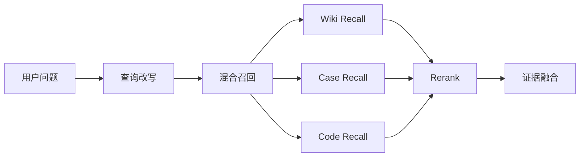

# 知识与代码检索子系统设计

## 1. 目标
为知识问答和问题分析提供统一的多源检索能力，覆盖 Wiki、历史案例和代码仓，确保召回结果既相关又可追溯。

## 2. 数据源分类

| 数据源 | 内容特点 | 主要用途 |
| --- | --- | --- |
| Wiki | 结构清晰、偏业务定义和规则 | 业务问答、术语解释、流程说明 |
| 历史案例 | 描述故障现象、原因、修复和验证 | 相似问题类比、修复经验复用 |
| 代码仓 | 实现细节、配置、调用关系 | 模块定位、实现分析、方案约束 |

## 3. 总体架构



## 4. 索引设计

### 4.1 Wiki 索引

- 切块粒度：按标题、二级标题、语义段落
- 元数据：文档标题、知识分类、标签、版本、更新时间
- 检索方式：向量 + BM25

### 4.2 历史案例索引

建议将案例拆为结构化字段：

- 问题现象
- 影响范围
- 根因
- 修复方案
- 验证步骤
- 关联模块

这样可以让“按现象找原因”和“按模块找案例”都具备较好效果。

### 4.3 代码索引

代码索引不能只做文本切块，至少应包含三层信息：

1. `文件级索引`：文件路径、目录、语言、模块归属
2. `符号级索引`：类、函数、方法、配置项、SQL、常量
3. `关系级索引`：调用链、引用链、导入关系、配置依赖

### 4.4 代码元数据建议

| 字段 | 说明 |
| --- | --- |
| `repo` | 仓库名 |
| `branch` | 分支或版本 |
| `path` | 文件路径 |
| `language` | 语言 |
| `module` | 业务模块 |
| `symbol_name` | 符号名 |
| `symbol_type` | class/function/config/sql |
| `signature` | 方法签名 |
| `neighbors` | 调用/引用邻居 |

## 5. 检索流程

### 5.1 查询改写

根据意图类型生成检索语句：

- 对知识问答，提取业务术语、限定条件、同义词。
- 对问题分析，提取报错关键词、模块名、配置项、关键日志。
- 对代码检索，补充类名、函数名、文件名、异常码等特征。

### 5.2 混合召回

每类数据源至少同时进行：

- 向量召回
- 关键词召回
- 元数据过滤

### 5.3 重排策略

可按以下维度打分：

- 查询语义相似度
- 关键词精确命中度
- 与当前会话主题一致性
- 数据源权重
- 结构化字段匹配程度

### 5.4 融合策略

融合时遵循：

- 同一文件、同一案例去重
- 同模块证据聚类
- 优先保留高信息密度片段
- 控制最终注入上下文长度

## 6. 针对问题分析的增强检索

### 6.1 症状驱动召回

从用户问题中提取：

- 报错信息
- 现象描述
- 影响对象
- 发生时机
- 最近变更

再分别映射到案例与代码中。

### 6.2 模块驱动召回

如果输入中出现模块名、接口名、任务名、作业名，则优先做模块过滤，缩小搜索空间。

### 6.3 调用链扩展

当代码命中某个关键函数后，应自动扩展其上下游调用点，帮助分析“问题在哪里触发”和“影响会传到哪里”。

## 7. 结果输出结构

```json
{
  "wiki_hits": [],
  "case_hits": [],
  "code_hits": [],
  "top_modules": [
    {
      "module": "pricing",
      "score": 0.88
    }
  ]
}
```

## 8. 性能设计

- 热门问题与高频模块结果可做缓存
- 长文档切块后离线计算 embedding，避免在线阻塞
- 重排只处理 TopK 候选，避免成本失控
- 代码邻接扩展限制深度，避免上下文爆炸

## 9. 风险与对策

| 风险 | 表现 | 对策 |
| --- | --- | --- |
| 代码文本噪声高 | 召回片段无效 | 增加符号级索引和模块元数据 |
| Wiki 口径过旧 | 回答与现网不一致 | 保留更新时间和版本，优先新版本 |
| 案例结构不统一 | 类比效果差 | 建立案例结构化模板，补录关键字段 |
| 检索结果过长 | 模型无法聚焦 | 做聚类压缩和 evidence packing |

## 10. 验收标准

- 三类数据源均可独立召回
- 问题分析场景能返回候选模块
- 检索结果附带完整来源信息
- 支持增量更新与版本标识
