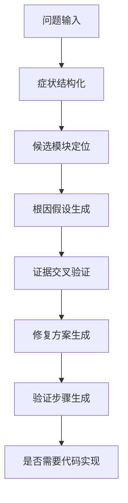

# 问题分析与修复方案子系统设计

## 1. 目标
在用户输入具体问题时，基于文档、历史案例和代码上下文，给出模块定位、根因分析、修复方案、验证建议，并决定是否进入代码实现阶段。

## 2. 输入与输出

### 2.1 输入

- 用户问题描述
- 会话历史与澄清信息
- Wiki 证据
- 历史案例证据
- 代码证据

### 2.2 输出

- 候选问题模块
- 根因判断
- 修复方案
- 风险提示
- 验证步骤
- 是否建议生成代码实现

## 3. 分析流程



## 4. 关键步骤说明

### 4.1 症状结构化

从用户输入中提取以下信息：

- 现象
- 报错信息
- 影响对象
- 发生环境
- 时间条件
- 触发动作
- 最近变更

如果这些字段缺失严重，则回退到澄清节点补问。

### 4.2 候选模块定位

定位逻辑建议同时参考：

- 代码检索结果中的高分文件和符号
- 历史案例中的关联模块
- Wiki 中的业务流程归属
- 用户输入中的模块词、接口名、任务名

输出不应只有一个模块，而应保留 TopN 候选，并给出置信度和理由。

### 4.3 根因假设生成

根因推理时可构建如下框架：

- 输入是否非法或边界值未覆盖
- 配置是否缺失或错误
- 状态流转是否异常
- 并发/幂等/重试是否导致脏状态
- 调用链上下游是否存在契约变化
- 历史修复中是否出现过同类问题

### 4.4 证据交叉验证

只有当根因假设与以下至少两类证据吻合时，才应输出高置信结论：

- 代码实现
- 历史案例
- 业务规则文档

如果只命中单一证据，应降低置信度并显式说明。

### 4.5 修复方案生成

修复方案至少应包含：

- 修复点位置
- 修改原则
- 兼容性影响
- 回归测试建议
- 发布注意事项

### 4.6 验证步骤生成

验证不应只写“测试一下”，而要拆成：

- 单元测试
- 集成测试
- 业务回归验证
- 关键日志与指标观察点

## 5. 输出模板

```json
{
  "target_modules": [
    {
      "module": "inventory-lock",
      "score": 0.91,
      "reason": "命中锁库存入口函数和相似历史案例"
    }
  ],
  "root_cause": "库存解锁分支未处理重复回调导致状态被覆盖",
  "fix_plan": [
    "在回调入口增加幂等校验",
    "补充状态转换保护",
    "为重复回调场景补充单测"
  ],
  "risks": [
    "可能影响补偿任务的重复执行逻辑"
  ],
  "verification_steps": [
    "验证重复回调时库存状态不被错误覆盖"
  ]
}
```

## 6. 置信度机制

建议从以下维度综合计算置信度：

- 检索证据一致性
- 候选模块集中度
- 与历史案例相似度
- 根因解释完整性
- 是否经过用户补充确认

输出可划分为：

- `high`
- `medium`
- `low`

并在前端显示。

## 7. 与代码生成的边界

问题分析子系统只负责回答：

- 问题在哪个模块
- 为什么发生
- 该怎么修

只有在用户明确确认后，才由代码生成子系统给出实现细节，避免在分析阶段直接越界生成代码。

## 8. 风险与约束

- 不允许凭单个代码片段做强因果判断
- 对跨服务问题要显式指出边界与未知项
- 对证据不足的情况必须保守输出

## 9. 验收标准

- 能输出模块、原因、方案、验证项四类核心结果
- 能解释每个结论来自哪些证据
- 能在证据不足时主动追问或降置信
