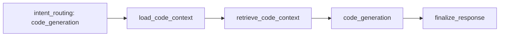

# 05-代码实现建议子系统设计（按当前实现）

> 文件名沿用历史命名；当前实现已移除“确认阶段”。

## 1. 子系统职责

- 根据当轮意图进入 `code_generation` 分支
- 装载可用分析上下文
- 补充代码上下文证据
- 输出实现建议（当前为 mock 结果）

## 2. 当前链路

## 3. 节点说明

- `load_code_context`
  - 优先读取 `last_analysis_result` / `last_analysis_citations`
  - 产出 `module_name`、`module_hint`、`analysis`、`citations`
- `retrieve_code_context`
  - 补充目标文件与测试文件等代码证据
- `code_generation`
  - 生成实现建议文本
  - 输出建议文件、patch 摘要、测试建议、示例片段

## 4. 关键变化（相对旧方案）

- 已移除 `confirm_code` 节点与确认状态机。
- 不再通过按钮或 `next_action` 推进代码分支。
- 是否进入代码建议由每轮输入意图直接决定。

## 5. 输出约定

`code_generation` 分支最终输出：

- `kind = code_generation`
- `intent = code_generation`
- `status = completed`
- `analysis` 中包含 `files`、`patch_summary`、`test_plan`、`snippet`

## 6. 后续可扩展点

- 接入真实补丁生成器
- 接入静态检查 / 单测执行 / 回归评估
- 增加补丁风险分级
