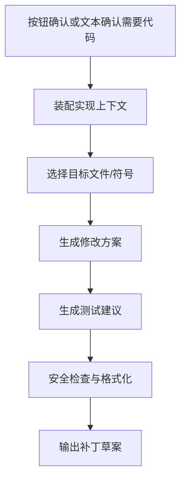

# 代码实现确认与生成子系统设计

## 1. 目标
在问题分析完成后，根据用户确认结果，为修复方案生成代码实现建议、补丁草案、测试建议和落地注意事项，同时保持可控、安全、可审查。

## 2. 触发条件

只有同时满足以下条件才进入本子系统：

1. 当前会话意图为 `issue_analysis`
2. 问题分析已经形成明确修复方案
3. 用户明确点击“需要代码实现”，或在后续消息中明确提出代码实现诉求

## 3. 输入与输出

### 3.1 输入

- 已确认的目标模块
- 根因分析结果
- 修复方案
- 高相关代码上下文
- 代码风格、框架约束、语言信息

### 3.2 输出

- 补丁建议或伪代码
- 涉及文件列表
- 修改说明
- 测试建议
- 风险提醒

## 4. 处理流程



## 5. 生成策略

### 5.1 实现上下文装配

生成前应收集：

- 相关文件与函数签名
- 相邻调用点
- 配置项定义
- 上一轮问题分析产出的模块定位、根因与修复方案
- 测试目录与现有测试风格
- 团队约束，如异常处理、日志规范、事务规范

### 5.2 输出形式

优先级建议如下：

1. `补丁 diff`
2. `关键代码片段`
3. `伪代码/实现步骤`

如果上下文不足以可靠生成 diff，则回退到“实现步骤 + 风险说明”。

### 5.3 结果结构

```json
{
  "files": [
    "services/inventory/lock_service.py",
    "tests/services/test_lock_service.py"
  ],
  "patch_summary": [
    "在重复回调分支增加幂等校验",
    "补充状态转换保护"
  ],
  "test_plan": [
    "新增重复回调单测",
    "新增解锁异常回归测试"
  ]
}
```

## 6. 安全控制

- 代码生成结果只作为建议，不自动提交仓库
- 必须附带修改原因与影响分析
- 对涉及高风险文件的修改应添加显著提示
- 若命中低置信度分析结果，则禁止生成直接补丁，只输出伪代码

## 7. 质量控制

建议增加以下检查：

- 语法/格式检查
- 是否与现有代码风格一致
- 是否遗漏异常处理和日志
- 是否提供对应测试建议

## 8. 与前端交互

前端展示应包括：

- 受影响文件
- 修改摘要
- 关键代码片段
- 测试建议
- 风险提示

并提供“复制补丁”“继续追问”“返回分析结论”三个动作。

对后端工作流来说，需要同时支持两种升级入口：

- `显式确认`：用户点击“需要代码实现”按钮，API 通过独立确认接口恢复图执行
- `自然语言确认`：用户下一轮直接输入“给我代码”“直接给 patch”，工作流从 `last_analysis_result` 恢复并继续

## 9. 风险与应对

| 风险 | 表现 | 应对 |
| --- | --- | --- |
| 上下文不足 | 生成错误补丁 | 回退为伪代码或实现步骤 |
| 影响范围判断不全 | 可能引入回归 | 强制输出影响分析与测试建议 |
| 多文件联动复杂 | 单点修改不完整 | 输出涉及文件列表并提示人工复核 |

## 10. 验收标准

- 只有用户确认后才生成代码建议
- 输出包含修改点、测试建议和风险提示
- 能根据上下文完整度自动选择 diff 或伪代码形式
