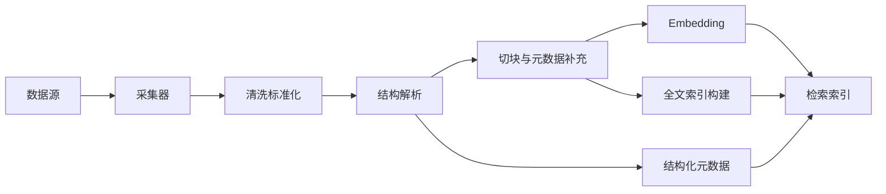

# 数据接入与索引构建子系统设计

## 1. 目标
将 Wiki、历史案例和代码仓持续同步到统一的检索体系中，并支持全量构建、增量更新、版本管理和索引质量校验。

## 2. 数据接入范围

- Wiki 文档
- 历史案例文档
- Git 代码仓
- 可选的配置中心、接口文档、SQL 说明文档

## 3. 架构设计

## 4. 处理流程

### 4.1 采集

- Wiki：从知识库导出 Markdown、HTML 或 API 拉取
- 案例：从文档库或工单系统导出
- 代码：通过 Git 仓库克隆或 webhook 增量同步

### 4.2 清洗

- 去除模板噪声、目录、导航、页脚
- 统一编码、换行、标题层级
- 对代码保留注释、签名与路径信息

### 4.3 解析

- 文档按章节解析
- 案例按固定模板提取字段
- 代码按语言做 AST 或至少符号级解析

### 4.4 切块

切块策略建议：

- Wiki：按语义段与标题边界切块
- 案例：按“现象/原因/方案”切块
- 代码：按函数、类、配置段切块

## 5. 增量更新

### 5.1 更新触发

- 定时任务
- 手工触发
- Git webhook
- 文档系统 webhook

### 5.2 增量规则

- 根据文档更新时间或 commit hash 判断变化
- 删除失效索引
- 重建受影响的文件、符号和关系

## 6. 版本管理

索引必须保留：

- 文档版本
- 代码 commit / branch
- 构建时间
- 构建批次

这样系统回答时才能说明依据来自哪个版本。

## 7. 质量校验

建议在构建后执行：

- 文档数量校验
- 切块数量波动校验
- 结构化字段缺失率校验
- embedding 失败率校验
- 索引抽样可检索性校验

## 8. 调度与执行

- 使用独立 worker 处理构建任务
- 通过队列控制并发，避免影响在线服务
- 支持全量与增量两种任务类型

## 9. 风险与应对

| 风险 | 表现 | 对策 |
| --- | --- | --- |
| 文档格式不统一 | 结构解析失败 | 建立标准模板与清洗规则 |
| 代码语言多样 | AST 支持不足 | 先覆盖主语言，其他语言退化到文本索引 |
| 增量漏更新 | 回答依据过期 | 用 webhook + 定时补偿双保险 |

## 10. 验收标准

- 支持三类核心数据源的全量接入
- 支持增量同步与版本追踪
- 索引构建失败可重试、可告警
- 回答可回溯到具体文档版本或代码提交
