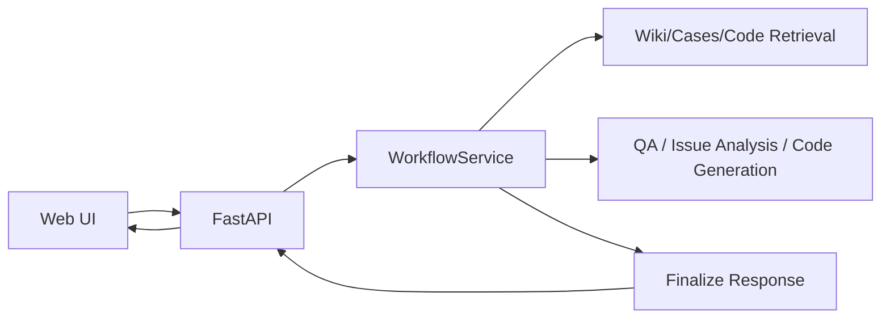
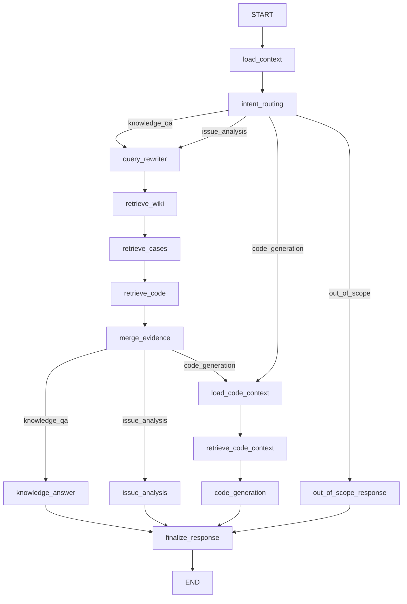

# 智能问答问题分析系统整体设计（按当前代码）

本文档与当前代码实现对齐，基准文件：

- `src/workflow/engine.py`
- `src/workflow/nodes/**`

## 1. 目标能力

系统支持四类输出：

1. 业务知识问答（`knowledge_qa`）
2. 故障问题分析（`issue_analysis`）
3. 代码实现建议（`code_generation`）
4. 领域外兜底（`out_of_scope`）

## 2. 总体架构

## 3. 工作流图

## 4. 路由策略

- `load_context`：从会话历史恢复模块与最近分析结果。
- `intent_routing`：基于领域相关性 + 输入语义，输出 `route`。
- 每轮输入都重新判定意图，不依赖“会话阶段机”。

## 5. 状态设计（WorkflowState）

当前状态仅保留必要字段：

- 会话基础：`trace_id`、`session_id`、`user_query`、`history`
- 路由结果：`route`、`status`、`response_kind`、`domain_relevance`
- 上下文记忆：`module_name`、`module_hint`、`active_module_name`、`active_topic_source`
- 最近分析：`last_analysis_result`、`last_analysis_citations`
- 检索结果：`retrieval_queries`、`retrieval_plan`、`wiki_hits`、`case_hits`、`code_hits`、`citations`
- 最终产物：`analysis`、`answer`、`assistant_message`、`node_trace`

## 6. 当前实现与历史方案差异

以下旧概念已移除：

- `confirm_code` 阶段
- `task_stage`、`transition_type`、`execution_path`、`next_action`
- `active_task_stage`、`pending_action`
- `source_message` 入口模式

当前是否生成代码由每轮输入决定：

- 用户直接提出代码需求 -> `code_generation`
- 用户提出排障/分析需求 -> `issue_analysis`
- 用户提出知识问答 -> `knowledge_qa`

## 7. API 行为（当前）

- 主入口：`POST /api/messages`
- 引用：`GET /api/references/{trace_id}`
- 反馈：`POST /api/messages/{message_id}/feedback`
- 观测：`GET /api/observability/summary`、`GET /api/observability/alerts`

> 当前 API 无 `confirm-code` 专用接口。

## 8. 观测与兼容说明

`observability/postgres_store.py` 仍保留旧调试字段列（如 `task_stage`、`transition_type`）用于历史数据兼容；
当前工作流逻辑不再维护这些字段。
