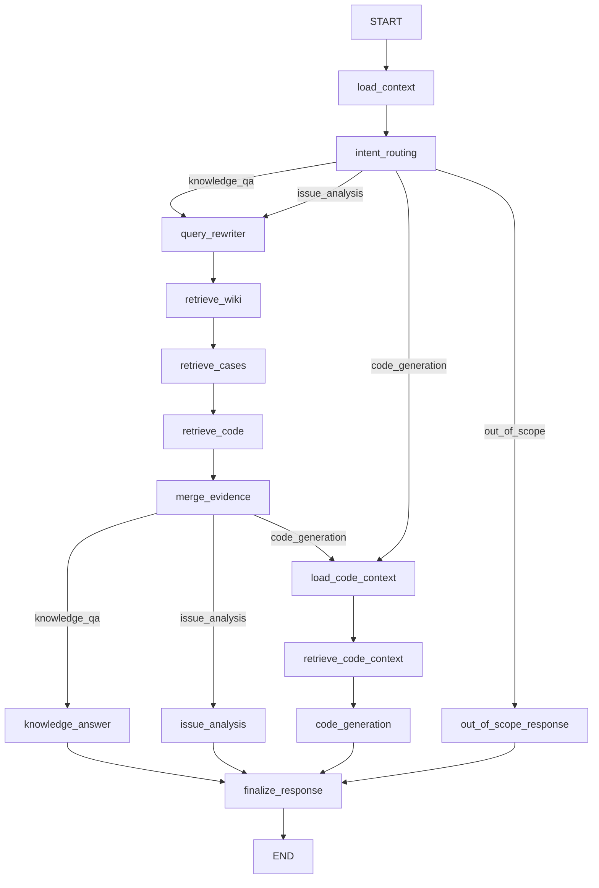

# Workflow 节点说明（当前实现）

本文档对应 `src/workflow/engine.py` 与 `src/workflow/nodes/` 的当前实现。

## 1. 图结构

## 2. 路由与上下文节点

- `load_context`
  - 从历史消息恢复模块上下文。
  - 产出：`module_name`、`module_hint`、`active_module_name`、`active_topic_source`、`last_analysis_result`、`last_analysis_citations`。
- `intent_routing`
  - 基于领域相关性和本轮输入分类意图。
  - 路由：`knowledge_qa` / `issue_analysis` / `code_generation` / `out_of_scope`。

## 3. 检索链路节点

- `query_rewriter`：按路由生成检索 query 与 `retrieval_plan`。
- `retrieve_wiki`：Wiki 检索。
- `retrieve_cases`：案例检索。
- `retrieve_code`：代码检索。
- `merge_evidence`：按计划融合多源证据，产出 `citations`。

## 4. 分析与生成节点

- `knowledge_answer`
  - 知识问答。
  - 优先使用 LLM，失败时回退规则答案。
- `issue_analysis`
  - 问题分析（模块定位、根因、修复建议、验证步骤）。
  - 节点内部集成了原先拆分的本地化、分析、根因、修复逻辑。
- `load_code_context`
  - 为代码生成准备上下文，优先复用 `last_analysis_result`。
- `retrieve_code_context`
  - 补充代码上下文证据。
- `code_generation`
  - 输出实现建议（当前仍为 mock 产物）。

## 5. 控制响应节点

- `out_of_scope_response`：领域外兜底回复。
- `finalize_response`：统一组装 assistant 输出。

## 6. 已移除的旧流程概念

当前实现不再使用以下流程字段/阶段：

- `confirm_code`
- `task_stage`
- `transition_type`
- `execution_path`
- `next_action`
- `active_task_stage`
- `pending_action`

当前是否生成代码由“每次用户输入”决定，`intent_routing` 每轮重判。
